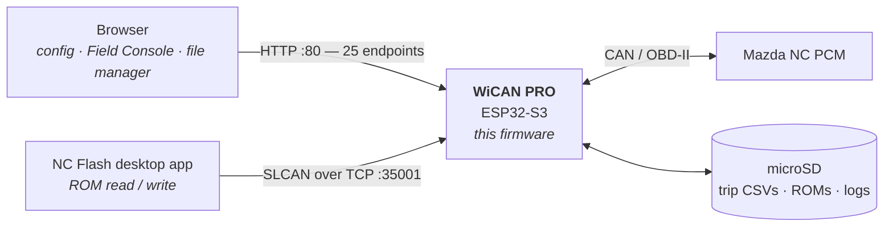
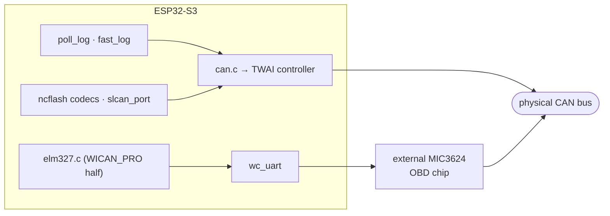
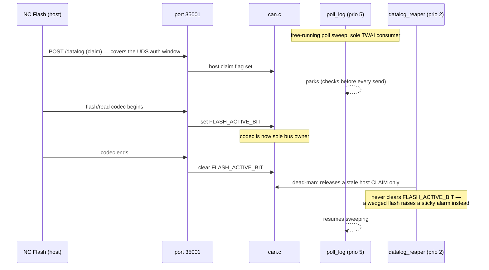
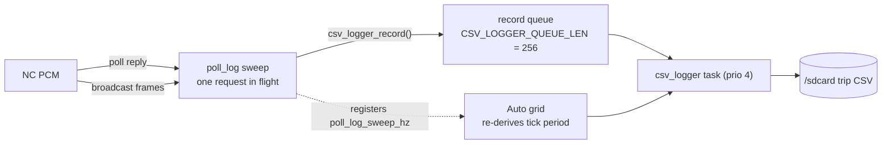
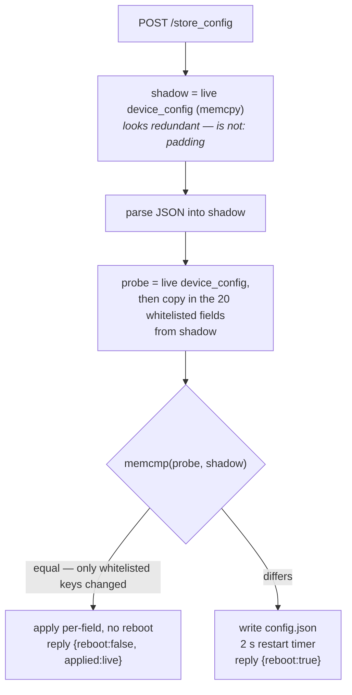

# Architecture — how this firmware is put together

**Read this first if you are new to the repo** (human or AI session). It is the
map: what the pieces are, which ones matter, how they talk, and which rules you
must not break. The other files in this directory go deep on one subsystem
each; this one exists so you know *which* one to open.

Everything here was checked against the source at the time of writing. Where a
claim is a measurement, the build or device it came from is named. If this file
and the code disagree, the code wins — fix this file in the same PR.

**If you came here to…**

| | Go to |
|---|---|
| add a config key | §8b, then the checklist in §9 |
| add a logged channel or PID | §9, then [poll_log.md](poll_log.md) |
| change what the web page shows | §4 (tree), §10 |
| debug a device in the field | §12 |
| delete something that looks dead | §2, §7, §11, and issue #28 |
| build, flash, and verify | §13 |
| touch CAN or the flash path | §6, §11 |
| know what to fix next | [audit-2026-07.md](audit-2026-07.md) |

---

## 1. What the product is

A meatPi **WiCAN PRO** (ESP32-S3) OBD-II dongle running custom firmware that
turns it into the wireless CAN endpoint for **NC Flash**, a ROM editor and ECU
flasher for the **Mazda MX-5 Miata (NC)**.

It does exactly two jobs:

1. **Datalog.** Poll the ECU for sensor values, decode broadcast CAN frames on
   the side, and write both to microSD as one wide CSV.
2. **Be the flash transport.** Let the NC Flash desktop app read and write the
   PCM's ROM over Wi-Fi, without interrupting job 1.

Everything else in the tree is either supporting infrastructure (Wi-Fi, config,
web UI, SD, logging) or inherited from upstream and no longer used.

**The shipped feature set**, as the user meets it — seven tabs in the embedded
web UI (`homepage_full.html:1087`), because "what the product does" is otherwise
surprisingly hard to reconstruct from the source:

| Tab | What it offers |
|---|---|
| **Console** | The Field Console — live gauges for the polled channels; the Trip Recorder (Start Trip, Mark Event); Recent Trips; a tail of the Event Log |
| **Files** | SD browser — new folder, download/delete selected, size/modified/type |
| **Logger** | The **sensor set**: Polled PIDs, Broadcast PIDs, Calculated PIDs, plus Export/Import Sensors and the engine-gating and low-voltage-protection options |
| **Settings** | Wi-Fi (AP mode, Station mode, Backup Networks, Scan), Sleep Mode, Battery Alert/MQTT, and the protocol selector (OBD App `elm327` / Bench SLCAN) |
| **Status** | Live device status |
| **System** | Firmware update (OTA) |
| **About** | Version and links |

> The **Logger** tab is the product. Everything else is either operating the
> recorder (Console, Files), configuring the device (Settings, System), or
> inherited (the Battery Alert/MQTT block, the protocol selector).

**Hidden UI is a much smaller story than issue #28 implies.** Of the 11 elements
carrying `style="display:none"` in `homepage_full.html`, nine are ordinary
conditional UI that `main.js` shows and hides at runtime (`ota_progress_row`,
`csv_grid_hz_row`, `console_mark_btn`, `sleep_warning_div`, `wifi_networks_row`,
`csv_require_engine_row`, `pid_polling_min_voltage_row`, and two file inputs).
Only **two are permanently hidden** — `ble_section` (`:1522`) and
`wakeup_every_row` (`:1334`) — with zero references anywhere in `main.js`. Those
two are the real "hide, don't delete" residue.

**Scope constraints that explain a lot of the design:**

- **One vehicle.** Mazda NC only. There is no vehicle-selection logic worth
  keeping; if you find some, it is upstream residue.
- **One board.** `CMakeLists.txt:54` hardcodes `set(HARDWARE_VER ${WICAN_PRO})`.
  The V210 / V300 / USB_V100 lines above it are commented out.
- **One protocol, in practice — but not out of the box.** A configured device
  runs `poll_log`. The **factory default is `elm327`** (`"protocol":"elm327"` in
  `device_config_default[]`, `config_server.c:197`), so a freshly flashed or
  factory-reset device runs the legacy front-end until someone configures it.
  Worth knowing before you conclude a bench device is broken. Other
  protocols still exist behind the `protocol` config key for bench use; the
  selector is hidden in the UI.
- **No serial console.** The USB-C port is a USB **host** at runtime. You cannot
  attach a PC and read logs the normal way. Every diagnostic has to arrive over
  Wi-Fi — which is why `/poll_status`, `/event_log` and the crash-report
  component exist and are as detailed as they are.

---

## 2. The most useful thing to know: three layers of code

This is a **fork**, and the fork/upstream split predicts almost everything about
code quality, style, and where bugs live. It diverged from `upstream/wican-pro`
at `77e1a19` (2026-04-12); since then it carries **180 commits** — 138 Charles
Dufresne, 29 NyxOne, 13 Claude — against 1,159 in the repo overall. Upstream has
4 commits on that branch we have not taken.

Every file is in one of three layers — **fork-written**, **inherited**, or
**generated** — and knowing which one you are looking at is worth more than any
other single fact in this document. Provenance, from `git log --reverse` on each
path:

| Path | First commit | Layer |
|---|---|---|
| `components/fast_log` | 2026-06-18 | **fork** — the Datalogger |
| `components/sd_filemgr` | 2026-06-17 | **fork** |
| `components/event_log` | 2026-06-24 | **fork** |
| `components/csv_logger` | 2026-06-11 | **fork** |
| `components/crash_report` | 2026-07-22 | **fork** |
| `main/ncflash_fastread.c` | 2026-06-21 | **fork** — NC Flash |
| `main/ncflash_fastwrite.c` | 2026-06-24 | **fork** |
| `main/slcan_port.c` | 2026-06-26 | **fork** |
| `main/datalog_lease_task.c` | 2026-06-26 | **fork** |
| `components/autopid` | 2025-09-09 | upstream (but load-bearing — §7) |
| `main/config_server.c` | 2022-02-21 | upstream |
| `main/main.c`, `can.c` | 2022-02-21 | upstream |
| `main/expression_parser.c` | 2024-06-23 | upstream |
| `main/safemode.c`, `multipart_upload.c` | 2025-08 | upstream (**guardrails — do not touch**) |
| `main/web/src/main.js` | 2025-09-13 | upstream origin, **fork-dominated**: 66 of 103 commits are the fork's |
| `main/web/homepage_full.html` | 2025-05-31 | upstream origin, same story |

**Why this matters in practice.** A census of `main/` + `components/`
(46,320 lines of `.c`/`.h`/`.cpp`; 73% code, 16% comment, 11% blank) finds 646
lines of *commented-out source*. Their distribution is the whole story:

| File | Commented-out lines | Layer |
|---|---|---|
| `main/elm327.c` | 140 | upstream |
| `main/main.c` | 97 | upstream |
| `components/autopid/autopid.c` | 59 | upstream |
| `main/config_server.c` | 48 | upstream |
| `main/sleep_mode.c` | 45 | upstream |
| `components/csv_logger/csv_logger.c` | 9 | fork |
| `components/fast_log/poll_log.c` | **0** | fork |

The fork's own code is clean and heavily commented with *reasons*. The
inherited code is not. **When you find something baffling, check which layer it
is in before assuming there is a subtle reason for it.**

---

## 3. System context



Two independent front doors, deliberately: the browser talks HTTP, NC Flash
talks a raw SLCAN socket on **port 35001**. The port number is a contract with
the desktop tool — it must match `constants.py` on the host side. NC Flash never
needs the device to reboot or switch protocols to do its job; that is what the
lease mechanism in §6 buys.

---

## 4. The tree

```
CMakeLists.txt              board select (WICAN_PRO), HW_PREF, partition table
sdkconfig                   committed; CI builds it as-is, no set-target
main/                       31,002 lines — app + most inherited subsystems
  main.c                    app_main: the boot order (§5)
  config_server.c           HTTP server, config store, 24 of the 29 registrations
  can.c                     TWAI driver ownership + the bus interlock (§6)
  elm327.c  obd.c  slcan.c  legacy protocol front-ends
  ncflash_*.c               NC Flash ROM read/write codecs        [fork]
  slcan_port.c              port 35001                            [fork]
  datalog_lease_task.c      dead-man reaper for the bus lease     [fork]
  safemode.c                recovery AP + OTA form                [GUARDRAIL]
  multipart_upload.c        the parser OTA depends on             [GUARDRAIL]
  expression_parser.c       PID expression evaluator (Bn/Sn/Fn tokens)
  wifi_mgr.c wifi_network.c smartconnect.c wc_mdns.c ble.c
  sleep_mode.c vehicle.c imu.c icm42670.c rtcm.c wusb3801.c
  web/
    homepage_full.html      SOURCE of the page structure — edit this
    src/main.js             SOURCE of the app JS — edit this
    src/homepage.html       GENERATED — never hand-edit
components/                 15,318 lines
  fast_log/poll_log.c       THE Datalogger protocol               [fork]
  csv_logger/               the wide-CSV grid + writer task       [fork]
  sd_filemgr/               SD file browser endpoints             [fork]
  event_log/                operational event ring + SD writer    [fork]
  crash_report/             panic backtrace via RTC_NOINIT        [fork]
  autopid/                  config parse + expression eval + CSV columns
                            ... AND a legacy scheduler that never runs (§7)
  restart_tracker/ cmdline/ wican_common/
tools/
  build_web.py              homepage_full.html -> src/homepage.html
  lint_web.py               3 mandatory web gates
  webtest/                  node --test unit tests for main.js
docs/internals/             you are here
```

Largest files, because size predicts where the work is:
`main.js` 4,359 · `config_server.c` 3,718 · `obd2_standard_pids.h` 3,654 ·
`elm327.c` 3,353 · `autopid.c` 3,204 · `homepage_full.html` 1,846.

---

## 5. Boot

`app_main()` at `main/main.c:558`. The order is load-bearing and several steps
carry comments saying why — do not reorder casually.

1. `sync_sys_time_apply_tz()` — **must** precede the RTC restore, `event_log`
   and the CSV logger.
2. `dev_status_init()`, button + SD-detect GPIO, `sd_card_init()`.
   - *if SD mounted **and** button held →* `sdcard_perform_ota_update("/wican.bin")`
     — an **un-brick path** (§11).
3. `i2c_master_init()` → `led_init()` → `safe_mode_check()`.
4. `nvs_flash_init()`, `esp_netif_init()`, `esp_event_loop_create_default()`.
5. `imu_init()`, `rtcm_init()`, `wusb3801_init()`, clock restored from the RTC.
6. `restart_tracker_init()`.
7. `event_log_init()` → emit `EVL_BOOT` → `crash_report_emit_pending()`.
8. Message queues allocated in SPIRAM, then **`config_server_start()`**.
9. `sleep_mode_init()`, `slcan_init()`, `can_init(rate)`.
10. `protocol = config_server_protocol()` → `poll_log_init()` or another
    front-end.

**Three things about `app_main` that break most people's mental model:**

1. **`app_main` runs at priority 1 — lower than almost every task it creates.**
   Each `xTaskCreate*` at priority ≥ 2 preempts it immediately, so the ~25 tasks
   spawned between `main.c:756` and `:1188` are already running and interleaving
   with the *remaining* init code. **Any reasoning of the form "init X finishes
   before task Y starts" is unsound** unless X is upstream of Y's create call.
   `csv_logger.c:1418-1430` documents having been burned by exactly this.
2. **`app_main` returns** (`main.c:1189`) — there is no trailing `while(1)`. IDF
   deletes the main task, so after boot nothing owns "the boot", and there is
   nowhere to add post-boot supervision without creating a task.
3. **Nothing is pinned to a core.** No project code calls
   `xTaskCreatePinnedToCore`; every application task is created with
   `tskNO_AFFINITY` on a dual-core build (`CONFIG_FREERTOS_UNICORE` unset). Only
   `main` is pinned, to CPU0. There is no core-partitioning strategy, so **any
   assumption that two tasks cannot run simultaneously is false.**

### Safe mode is not a mode — it is a hijacked boot

`safe_mode_check()` (`main.c:586`) runs *before* `nvs_flash_init`,
`esp_netif_init` and the event loop. When it triggers it calls `safemode_start()`
and then parks forever in `while(1) vTaskDelay(10000)` at `main.c:549-552`.
**None of the remaining ~600 lines of `app_main` ever execute** — no CAN, no
queues, no protocol, no `config_server` (safe mode runs its own httpd). There is
no persisted safe-mode flag; the only ways out are the two endpoints that reboot,
or a power cycle.

### One button, five seconds, three completely different outcomes

They live in three files and none of them references the others:

| When you press it | What happens |
|---|---|
| Held **at boot**, SD card holds `/wican.bin` | silent SD-card OTA via `sdcard_perform_ota_update()`, then reboot (`main.c:579-582`) |
| Held **at boot** 5 s, no such file | `safemode_start()` -> recovery AP (`main.c:539-553`) |
| Held 5 s **any time after boot** | `config_mode_task()`: BLE off, Wi-Fi forced to AP+STA, LED alternating **yellow**/blue until reboot — `led_set_level(MAX, MAX, 0)` then `(0, 0, MAX)` (`config_mode.c:62-66`) |

### `config_server_start()` is not just "start a web server"

It mounts LittleFS on the internal `storage` partition, creates
`/littlefs/config.json` from a hardcoded default if missing, parses the entire
device configuration, and creates the 2-second restart timer — all inside
`config_server_init()` (`config_server.c:3139-3200`).

> **Every `config_server_get_*()` call before `main.c:815` reads a zeroed
> struct** and silently returns the *caller's* fallback default, with no
> indication the real config was never consulted.

Other things worth knowing:

- **`event_log_init()` is placed deliberately** (comment at `main.c:665`): the SD
  mount and the reset reason are both ready by then, and it is upstream of httpd
  and every logger hot path, so it can never stall them. It emits `EVL_BOOT`
  carrying the *previous* boot's reason, so a reboot is recorded without adding
  any code to the reset path.
- **`crash_report_emit_pending()` runs right after**, replaying a panic backtrace
  the previous boot stashed in `RTC_NOINIT` RAM into the event log. This is the
  only way to see a crash on a device with no serial console.
- **A second un-brick path exists and is under-documented**: SD card mounted +
  button held at boot flashes `/wican.bin` from the card via
  `sdcard_perform_ota_update()` (`main.c:579-582`). That is a genuine recovery
  route and it is *not* in the
  guardrail list in `REFACTOR_PLAN.md` or the regression runbook.
- **Queue allocation failure just `return`s** from `app_main` — both the
  `xMsg_*_Queue_Storage` malloc check and the `xQueueCreateStatic` result check
  (`main.c:779`, `:791`) — leaving a
  half-initialised device rather than rebooting into a known state.
- **`esp_ota_mark_app_valid_cancel_rollback()` at `main.c:796` is currently a
  no-op** — `sdkconfig:424` has `CONFIG_BOOTLOADER_APP_ROLLBACK_ENABLE` unset, so
  there is no rollback state machine to cancel. It also runs *before* Wi-Fi,
  httpd and CAN come up, so even with rollback enabled it would mark the image
  good before anything proved it works. The real recovery net is the button-hold
  safe-mode AP.

---

## 6. Runtime: tasks, and who owns the CAN bus

### Task ladder

There are 35 live `xTaskCreate*` call sites across `main/` and `components/`
(6 more are commented out; most live ones are `xTaskCreateStatic`). In the
shipping (`poll_log`) configuration the ones that matter are:

| Prio | Task | Created at | Stack | Role |
|---|---|---|---|---|
| 5 | `polllog_rx` | `poll_log.c:1292` | 8 KB **internal RAM** | the poll sweep; **sole TWAI consumer** |
| 5 | `can_rx_task` / `can_tx_task` / `obd_rx_task` | `main.c:1104-1108` | shared | legacy front-end paths |
| 4 | `csv_logger` | `csv_logger.c:1433` | 6 KB | drains the record queue, writes SD |
| 3 | `sync_sys_time`, `csv_defer` | | | deferred startup |
| 2 | `led_ind_task`, `datalog_reaper` | | | housekeeping |

`POLLLOG_RX_TASK_PRIO` is 5 with the comment *"== can_rx_task; sole TWAI
consumer in POLL_LOG"*. The 5-over-4 relationship is real and load-bearing: a
yield-free prio-5 loop starves both IDLE and the CSV writer, which is why
`poll_log`'s empty-sweep path must explicitly drain RX and yield.

Two traps when adding a task:

- **Priority 5 is crowded** — `can_rx`, `can_tx`, `obd_rx`, `smartconnect`,
  `wifi_reconnect`, `uart_tx_task`, `uart_rx_task`, `autopid_task`,
  `config_mode_task` all sit there. Most are inert under `poll_log`, so the
  effective ladder is clean, but **the number 5 by itself tells you nothing
  about importance.** (`adc_task` is *not* on this list: its only creation,
  `sleep_mode.c:581`, is inside `#if HARDWARE_VER != WICAN_PRO` — compiled out,
  not merely inert. The same dead half holds the MQTT client handle, which is
  why the battery-alert feature cannot work on this board.)
- **Stack depth is in *bytes*, and the in-code comments that say otherwise are
  wrong.** ESP-IDF documents `usStackDepth` / `ulStackDepth` as "the NUMBER OF
  BYTES. Note that this differs from vanilla FreeRTOS"
  (`freertos/FreeRTOS-Kernel/include/freertos/task.h:315`, `:428`). Two call
  sites in this repo carry comments claiming *words* —
  `can_task_stack_depth_words` (`main.c:1093`) and `sync_sys_time.c:200`.
  > **They are harmless here, and only here.** On the Xtensa port
  > `portSTACK_TYPE` is `uint8_t` (`portable/xtensa/include/freertos/portmacro.h:88`),
  > so `sizeof(StackType_t) == 1` and words and bytes coincide. `main.c:1095`'s
  > `depth_words * sizeof(StackType_t)` is a no-op multiply, and
  > `StackType_t s_rx_task_stack[POLLLOG_RX_STACK_BYTES]` (`poll_log.c:196`) is
  > exactly 8,192 bytes, as intended. Nothing is over-allocated.
  >
  > The hazard is **portability and review**: the same reasoning on a port where
  > `StackType_t` is 4 bytes gives you a silent 4x error, and a reviewer who
  > believes the comments will "fix" correct code. Trust the IDF header, not the
  > comment.

### There are TWO paths to the CAN bus, and `can.c` only knows about one

This is the single most surprising fact in the codebase and it is invisible
unless you evaluate the preprocessor.



`elm327.c` is 3,353 lines split by `#if HARDWARE_VER != WICAN_PRO` at line 65
with its `#else` at `:1297` and `#endif` at `:3353`. **On this board the first
1,232 lines (`:65-1296`, 37% of the file) are dead**, and
the live half is a **UART bridge to an external MIC3624 OBD chip** — every
`can_send()` / `twai_*` call in that file is inside the compiled-out branch.

Consequences:

- In ELM327 and AutoPID modes the ESP32's own CAN controller is **not used at
  all**. Those modes reach the bus through the external chip.
- `can_bus_idle_ms()` therefore means *"the ESP32's TWAI controller saw no
  traffic"*, **not** *"the bus is quiet"*. In AutoPID mode the external chip can
  be polling the ECU continuously while this reports the bus fully idle.
- `/check_status` has two different health fields for two different things:
  `obd_chip_status` ("Ready"/"Sleep") is the external chip, read from
  `OBD_READY_PIN`; `ecu_status` is the broken legacy field from §7.

### The protocol selector is an if/else chain in `main.c`, not a dispatch table

It lives inside `can_tx_task` (`main.c:265-341`) and branches on **`dev_channel`
before `protocol`**. Frames tagged `DEV_SLCAN_PORT` are handled and `continue`d
at `main.c:279` so they never reach the protocol arms at all — **that five-line
early exit *is* the no-reboot coexistence feature.**

There is **no arm for `FAST_LOG` or `POLL_LOG`**. In the two datalogger modes the
stock TCP port still accepts connections, still `recv()`s, still queues buffers —
and `can_tx_task` silently drops every one of them by falling off the end of the
chain. That silent drop is precisely why port 35001 had to exist.

### Shared state: the config lock

The live sensor table (`autopid_config` — the parsed `pids[]`, `can_filters[]`,
calculated channels) is read by the poll task on every sweep and replaced
wholesale by a live hot-reload. It is guarded by `s_autopid_mutex`, reached
through `autopid_lock(timeout_ms)` / `autopid_unlock()` (`autopid.c:247`).

**The timeout is the contract, and callers pick it deliberately:**

| Caller | Timeout | Why |
|---|---|---|
| `poll_log` broadcast decode | **0 (try-lock)** | a multi-second HTTP Test-PID lock hold must skip broadcast decode, never stall the sweep |
| calculated channels | 20 ms | once per sweep, on the hot path |
| `/poll_status`-style readers | 100 ms | brief and bounded |
| HTTP Test PID / Test CAN filter | 6000 ms | a human-initiated one-shot may legitimately wait |

> **Do not "simplify" `autopid_lock(portMAX_DELAY)`.** It runs its argument
> through `pdMS_TO_TICKS`, which *overflows* `portMAX_DELAY` into a finite
> timeout. The swap-critical sites therefore take `s_autopid_mutex` directly
> with `portMAX_DELAY` and say so (`autopid.c:344-348`).

The hot-reload path also re-checks `csv_logger_session_active()` **under** the
mutex (issue #43): the safe-point check can pass, then the reload spends ~100 ms
parsing while the CSV writer opens a trip whose header is frozen from the *old*
table — which would mismatch every record for the whole trip.

### The bus interlock — the brick-safety guarantee

One CAN controller, several would-be users. The rule is enforced by
`FLASH_ACTIVE_BIT`, `BIT1` of `s_can_event_group` in `main/can.c:48`, written at
exactly four codec sites through `can_flash_active_set()` /
`can_flash_active_clear()` (`can.c:173`, `:179`). `can.h:70` calls it "the
brick-safety guarantee".



The two flags are deliberately separate. `FLASH_ACTIVE_BIT` is **codec-owned**
and covers the actual bus transfer. The host REST claim is **host-owned** and
covers the window the codec does not — the `0x10`/`0x27` security handshake NC
Flash runs *before* the codec starts. The dead-man reaper
(`datalog_lease_task.c`) can expire the host claim but **never** touches
`FLASH_ACTIVE_BIT`, so a stray or duplicate resume can never un-park a live
flash. Either flag alone keeps every producer parked.

> **Known limitation — the dead-man's switch cannot fire while the engine
> runs.** Both the claim-reap and the datalog-reap require
> `bus_idle` = `bus_idle_ms >= COEXIST_BUS_IDLE_QUIESCE_MS` (300 ms,
> `can.h:90`, tested at `datalog_lease_task.c:56, :95, :113`).
> `s_last_bus_activity_ms` is stamped on **every** TWAI RX and TX — the two
> chokepoints inside `can_receive()` and `can_send()` (`can.c:642`, `:675`) —
> and `can_rx_task` deliberately does *not* park during a
> coexist session (`main.c:379`) so it keeps draining and stamping. A running
> powertrain bus carries roughly 2,000 frames/s, so `bus_idle_ms` never
> approaches 300.
>
> Consequence: if the NC Flash host vanishes mid-session **with the engine
> running**, neither reap fires and the datalogger stays parked until a manual
> resume or a reboot. The behaviour is fail-safe (parked, not corrupt) and
> flashing is done key-on-engine-off in practice — but nothing in the firmware
> enforces or documents that assumption, and the automatic recovery is
> unavailable in exactly the state a driver would be in. The stuck-flash alarm
> is unaffected: it does not consult `bus_idle`.

---

## 7. The `autopid` trap

`components/autopid` is the one place where "inherited" and "load-bearing"
overlap, and it is a common source of wrong assumptions. Its locking contract —
which matters if you are planning the #28 split — is in §6.

**It is two things in one directory:**

| Still essential | Never runs |
|---|---|
| config parsing (`autopid_config.c`) — reads `auto_pid.json` into `pid_data_t` / `parameter_t` | `autopid_task` — the legacy ELM327-based scheduler |
| the **calculated-channel** evaluator (`calc_evaluate`, `autopid.c:674`) | `process_can_filter_frame` — its ATMA broadcast monitor |
| the CSV **column provider** (`autopid_collect_log_columns`) | `autopid_get_config()` JSON — built, cached, never served |
| the HTTP Test-PID / Test-CAN-filter endpoints | |

The legacy half only executes when `protocol == auto_pid`. The device ships
`poll_log`. So:

> **Do not delete the `autopid` component.** `poll_log` and `csv_logger` depend
> on its parser, its calculated-channel evaluator and its column provider. The
> removal in issue #28 is a *split*, not a delete.

The split already has a name in the code: **`autopid_load_config_only()`**
(`autopid.c:2967`) loads the channel config, creates the mutex, registers the
column provider and caches the JSON — and starts **no task and no ELM polling**.
It is called from exactly two places, `poll_log.c:1249` and `fast_log.c:217`.
That function *is* the boundary #28 should cut along: everything it touches is
the keep side, `autopid_init()`'s extra work is the discard side. Verified: the
task itself is created only at `autopid.c:3163`, reached solely via
`autopid_init()`, which `main.c` calls only inside `protocol == AUTO_PID`
branches (`main.c:916`, `:975`).

### There are two expression evaluators, deliberately

Worth knowing before you try to "unify" them — the comment at `autopid.c:507`
explains why that would be wrong:

| | `evaluate_expression()` | `calc_evaluate()` |
|---|---|---|
| Lives in | `main/expression_parser.c` | `components/autopid/autopid.c:674` |
| Operates on | **raw response bytes** — `B0`..`B7`, `S<n>`, `[Bx:By]`, `F<n>`, `V` | **decoded channel names** — `"MAP - BARO"`, `"EQ_RATIO * 14.64"` |
| Used by | `poll_log.c:417`, `fast_log.c:133`, `autopid.c:1449`, both HTTP test endpoints | calculated channels only, once per sweep |
| Shape | single-char sigils | recursive descent, `CALC_MAX_DEPTH` 32, allocation-free |

They are not redundant: the byte evaluator *cannot lex multi-letter channel
names*, and it "runs live on the car for PID/broadcast decode — and must not be
touched". The name evaluator resolves identifiers to another channel's latest
decoded value, failing the whole expression when an input is missing so the
column simply stays empty rather than logging a wrong number.

> **Undocumented limitation:** a calculated channel **cannot reference another
> calculated channel.** `calc_resolve_name()` (`autopid.c:533`) scans
> `cfg->pids[]` and `cfg->can_filters[]` and then returns false — there is no
> `cfg->calculated[]` loop. The reference silently fails, `calc_evaluate()`
> returns false, and the column simply stays empty (LOCF) forever with no log
> line. Nothing in the code or the UI says so.

> **Footgun:** `evaluate_expression()` does **not** bounds-check `B0`..`B7`.
> Every caller must hand it a full, zero-padded 8-byte buffer — `poll_log.c:417`
> and `fast_log.c:112` both carry this warning at the call site. `Fn` (the
> float32 token) is the one token that does bounds-check, because it consumes
> four bytes.

A concrete symptom of the split, and a good illustration of what dead code
costs: `/check_status` reports `"ecu_status"`, derived from
`autopid_get_ecu_status()` (`config_server.c:1506`), which reads
`ECU_CONNECTED_BIT`. The only three writers of that bit
(`autopid.c:2688`, `:2891`, `:2896`) all live inside `autopid_task`. Under
`poll_log` nothing ever sets it, so **the field reports `"offline"` forever** —
observed on the bench reading `offline` while `/poll_status` showed 468,488
successful polls and zero timeouts. Nothing in the web UI reads the field, so
no screen is wrong; but it is a published API field that states the opposite of
the truth.

---

## 8. Data paths

### 8a. The datalog path (the product's main job)



The sweep is **self-pacing**: send one request, wait for the reply, send the
next. The ECU sets the tempo, so the design cannot overload the bus. The only
brake is a 100 Hz floor on sweep duration. Details — divisors, quiesce, hybrid
capture, Mode 23 — are in **[poll_log.md](poll_log.md)**; the CSV grid and its
Auto rate are in **[csv_logger.md](csv_logger.md)**.

### 8b. Configuration

Two stores, two very different behaviours. Confusing them causes real damage.

> **There is no NVS in the config store.** Despite `#include <nvs_flash.h>` in
> `config_server.c` and parser comments referring to "a bad NVS value", a
> repo-wide grep for `nvs_open` / `nvs_set_*` / `nvs_get_*` returns **zero**
> hits. The only NVS calls anywhere are `nvs_flash_init()` and, for factory
> reset, `nvs_flash_erase()`. **All device configuration lives in
> `/littlefs/config.json`.** Wi-Fi credentials are not in NVS either —
> `esp_wifi_set_storage(WIFI_STORAGE_RAM)` (`wifi_mgr.c:600`) forces the driver
> to keep them in RAM only.

| | `config.json` | `auto_pid.json` |
|---|---|---|
| Written by | `POST /store_config` | `POST /store_auto_data` |
| Read back by | `GET /load_config` (raw stored) | `GET /load_auto_pid` |
| Contains | Wi-Fi, CAN, sleep, logger settings — **and credentials** | the sensor set: polled PIDs, CAN filters, calculated channels |
| On save | reboots, **usually** — see below | **no reboot** — hot-swaps the live PID table |

- `GET /check_status` is the **built** JSON with defaults applied;
  `GET /load_config` is the **raw stored file**. Legacy configs may lack new
  keys. Don't confuse them.
- `POST /store_config` replaces the whole file, so changing one key means
  load → modify → post the full object.
- The `/store_auto_data` reply says which path ran: `"applied":"live"`, or
  `"applied":"deferred"` when a CSV trip was open (it retries when the trip
  closes).



**The reboot decision (issue #39), stated accurately.** `store_config_handler`
does *not* always reboot. It seeds a `probe` copy from the live struct, memcpy's
the 20 `LIVE_APPLY_WHITELIST` fields (`config_server.c:707-714`) in from the
parsed shadow, and `memcmp`s the two. If they match, only whitelisted fields
changed, so it applies them in place and replies `{"reboot":false,
"applied":"live"}`.

But note **which** 20 fields: `led_blink`, then `home_*` / `drive_*` (10 keys —
SmartConnect, not reachable from the UI) and `batt_alert_*` / `batt_mqtt_*`
(9 keys — battery-alert MQTT, compiled out on this board). So in practice
**every config change a user can make through the shipped UI still reboots,
except toggling the LED.** The live path is real, it is just aimed almost
entirely at features this fork hides.

> Two traps in that code. The `memcmp` is **whole-struct**, so it is sensitive
> to padding — which is why `memcpy(shadow, &device_config, sizeof *shadow)` at
> `:871` runs *before* parsing. It looks redundant next to a parser that fills
> every field; deleting it would make every save reboot. And the apply is
> **field-width per key, never a whole-struct copy**, which would rewrite reboot
> fields and transiently zero `sta_fallbacks`.
>
> `docs/internals/web_ui.md:40` and `:49` still say `/store_config` "always
> reboots". That is stale — fix it when you next touch that file.

Config keys are parsed in `config_server_parse_cfg_into()`
(`config_server.c:2158-2996`). Be warned: it is **839 lines** — 23% of the file — of
one repeated block per key. Adding a key today means editing the struct, the
parser, the status-JSON builder and the UI.

### 8c. HTTP surface

**25 distinct URI paths, 29 handler registrations** on the main server (some
paths are registered for more than one method), plus **3 more on the separate
safe-mode server** in `safemode.c`. Count them with
`grep -rn httpd_register_uri_handler main components`.

There are **two** registration patterns in the tree, and the difference is worth
knowing before you add an endpoint:

| Pattern | Who registers | Components using it |
|---|---|---|
| **Self-registering** — the component calls `httpd_register_uri_handler()` itself | the component | `autopid` (3), `event_log` (1), `restart_tracker` (1) |
| **Export-and-register** — the component defines the `httpd_uri_t` and exports it `extern const`; `config_server.c` registers it | `config_server.c` | `csv_logger` (6), `sd_filemgr` (2) |

`csv_logger.h:164` states the contract explicitly: *"HTTP endpoints (register in
config_server)"*.

So `config_server.c` makes 24 registration calls, but only **14 are its own**
(`/`, `/store_config`, `/check_status`, `/load_config`, `/logo.svg`,
`/upload/ota.bin`, `/system_reboot`, `/store_auto_data`, `/load_auto_pid`,
`/upload/sd/*`, `/system_commands`, `/scan_available_pids`, `/std_pid_info`,
`/poll_status`) plus the `/*` catch-all registered twice; the other 8 belong to
`csv_logger` and `sd_filemgr`.

**Either pattern is fine; the anti-pattern is putting the handler body in
`config_server.c`.** What matters is that the component owns its handler
*logic*, so `config_server.c` does not grow a function per feature. Both groups
above honour that. Prefer self-registration for new work — it removes the
`extern` declaration and the second edit site — but do not "fix" the existing
export-and-register components just for consistency.

> **There is no authentication on any of it.** `httpd_register_basic_auth()` is
> guarded by `#if CONFIG_EXAMPLE_BASIC_AUTH` (`config_server.c:3221-3222`) and
> that symbol does not appear in `sdkconfig` — so it is compiled out. Combined
> with `/check_status` returning every stored credential in plaintext (§15),
> anyone who can reach port 80 can read the Wi-Fi password, **including anyone
> associated to the device's own AP.** This is a design decision to be aware of,
> not a bug to fix casually: the device is meant to live on a private network
> and the UI has no login flow to build on.

---

## 9. Extension seams

The codebase has a registration pattern for crossing module boundaries without
creating a link-time dependency: producers register callbacks at init, so the
consumer never names the producer.

| Setter | Registered by | Purpose |
|---|---|---|
| `csv_logger_set_column_provider()` | autopid (at boot) | enumerate CSV columns at session open |
| `csv_logger_set_rate_fn()` | poll_log | live measured rate for the Auto grid |
| `csv_logger_set_engine_state_fn()` | poll_log | suppress logging while the engine is off |
| `event_log_set_sd_ready_fn()` | main | let the writer skip `fopen` churn with no card |

**Recipes:**

- *A new protocol that should drive the Auto grid* — implement
  `float fn(void)` returning measured Hz (0 = unknown) and register it. Nothing
  else changes.
- *A new logged channel type* — the pollability funnel is
  `polllog_req_bytes()`. It is the single gate used by the sweep, the scheduler
  and the live test, so one check excludes a bad row everywhere.
- *A new HTTP endpoint* — register it from the component that owns the feature.
- *A new config key* — six places, in order. This is the one path that is
  genuinely painful today (§8b explains why):

  1. Add the field to `device_config_t`.
  2. Parse it in `config_server_parse_cfg_into()` — and **use the
     `cJSON_IsString(key) && key->valuestring` guard**, not just a presence
     test, or you have added a thirteenth remote-panic site
     ([#68](https://github.com/cdufresne81/nc-flash-wican-fw/issues/68)).
  3. Add it to `device_config_default[]` (`config_server.c:197`, written at
     `:3011`) — otherwise a factory-recovered device will not have your key.
  4. Add a `config_server_get_*()` accessor, following the house contract:
     return `1` on success, `-1` on any parse/range failure, and let the caller
     supply its own literal default.
  5. Emit it from `config_server_get_status_json()` if the UI needs to read it
     back, and wire the UI field.
  6. Decide **explicitly** whether it belongs in `LIVE_APPLY_WHITELIST`
     (`config_server.c:707-714`). Not listed ⇒ changing it forces a reboot.
     That is the safe default; adding it means proving the change is safe to
     apply to a running system.

  **Acceptance is the round-trip invariant** (§11): load → save → revert must
  leave `/load_config` byte-identical.

### …but the seam only holds on the column side

`csv_logger.md` says *"csv_logger never links against protocol components."*
That is true of the **record/column path**, and it is why hybrid capture and
Mode 23 landed without touching the writer. It is **not** true of the component
as a whole:

```c
#include "can.h"   /* can_flash_active / can_park_lease_* / can_host_bus_claim_* */
#include "vehicle.h"
```
`csv_logger.c:46-47`, with `REQUIRES main` in its `CMakeLists.txt`

It does not merely include them — it **drives bus arbitration**:
`can_park_lease_arm()` (`:1241`), `can_park_lease_release()` (`:1252`),
`can_host_bus_claim_arm()` (`:1269`), plus `vehicle_ignition_state()` (`:594`)
and `sleep_mode_get_voltage()`.

The reason is historical rather than architectural: `csv_logger` **hosts the
`/datalog` coexistence endpoints** (§8c), so the lease logic ended up where the
endpoint was convenient. The result is a generic storage component reaching up
into the CAN driver and the vehicle-state layer.

This produces **five two-node dependency cycles** in the CMake graph — `main` ↔
each of `autopid`, `csv_logger`, `fast_log`, `sd_filemgr`, `cmdline` — because
each declares `REQUIRES main` while `main` requires it back. ESP-IDF tolerates
this; it still means no component here can be built or reasoned about alone. If
one boundary is worth fixing, it is this one: move the `/datalog` lease
endpoints into a small coexistence module that owns the `can_*` lease API, and
let `csv_logger` go back to being a writer.

---

## 10. Conventions

Observed, not aspirational. The fork's own code follows these consistently; the
inherited code often does not.

- **Module prefix on every public symbol**: `poll_log_*`, `csv_logger_*`,
  `event_log_*`, `config_server_*`. File-locals are `static` with an `s_` prefix
  (`s_sweep_ms`, `s_engine_running`, `s_park`).
- **One `TAG` per file** for `ESP_LOG*`. Level discipline matters on the hot
  path: a per-sweep warning firing 45x/second on the prio-5 task was demoted to
  `DEBUG` in #51.
- **Constants are named and grouped at the top of the file** with a table in the
  matching doc — `POLLLOG_MIN_SWEEP_MS`, `POLLLOG_BCAST_PERIOD_MS`,
  `CSV_GRID_HZ_DEFAULT`. Magic numbers in the fork's code are rare and usually a
  bug.
- **Comments explain *why*, and record what was tried and rejected.** This is
  the strongest habit in the fork's code and worth continuing: `poll_log.c` and
  `csv_logger.c` explain the reasoning behind non-obvious choices at the site of
  the choice.
- **Derive, don't duplicate.** `PID_MODES` in `main.js` is one table from which
  `MODE_IDENT_LEN`, `MODE_ECHO_BYTES`, `EXPRESSIBLE_MODES` and `PID_TEXT_MAX`
  are all computed, replacing three hand-maintained lists.
- **Web UI**: edit `homepage_full.html` and `src/main.js`; run
  `python tools/build_web.py`; run `python tools/lint_web.py`; commit all three.
  **Never hand-edit `src/homepage.html`.** See [web_ui.md](web_ui.md).

---

## 11. Invariants — do not break these

1. **The un-brick path.** `safe_mode_check()` and all of `main/safemode.c`
   (recovery AP, `POST /upload_firmware`, `POST /factory_reset`);
   `POST /upload/ota.bin`; `main/multipart_upload.c`; the 5-second button hold;
   dual OTA slots in both partition CSVs; and the SD `/wican.bin` boot path
   (§5).
2. **The NC Flash contract.** `WICAN_DEDICATED_SLCAN_PORT` = **35001**
   (`main/main.c:115`) must match `src/ecu/constants.py` in the desktop tool —
   the comment at that line says so explicitly. Also `slcan_port.c`,
   `ncflash_fastread.c` / `ncflash_fastwrite.c`, `/upload/sd/*`, the
   `POST/GET /datalog` lease, `datalog_lease_task.c`, and the
   `FLASH_ACTIVE_BIT` interlock (§6).
   > **`NCFW_ALLOW_LIVE` is `1`** (`ncflash_fastwrite.c:32`, gate at `:439`) —
   > this build can perform **real ECU writes**. Routine regression uses NC
   > Flash **dry-run (mode 'D')** only.
3. **One TWAI owner at a time.** Never add a second CAN consumer. Hybrid
   broadcast capture is done *inside* the existing poll drain loop precisely to
   avoid this.
4. **`can_tx_task` is the flash codecs' execution context.** The NC Flash
   read/write codecs run **inline on it** (`main.c:265-280`), and `can.c:648-658`
   documents that SLCAN and ELM producers are serialised *because the task is
   blocked inside the codec*. When #28 removes the legacy protocol arms, that
   if/else chain will look like dead code wrapping five live lines — and
   somebody will delete or repurpose the task. **It is load-bearing. Do not.**
5. **`poll_log`'s task stack stays in internal RAM.** Marked "brick invariant"
   at `poll_log.c:118`.
6. **Config round-trips byte-identically.** A browser load → save → revert must
   leave `/load_config` and `/load_auto_pid` unchanged. Documented exceptions
   are listed in [web_ui.md](web_ui.md); anything else is a regression.
7. **The build stays green at every commit.** `main/CMakeLists.txt` hard-links
   every component; delete a component directory and remove its `requires` entry
   in the *same* commit.

---

## 12. Debugging a device you cannot plug into

The USB-C port is a **USB host** at runtime, so there is no serial console to a
PC. Do not go looking for the cable — everything you need arrives over Wi-Fi,
and the fork has invested heavily in making that true. In rough order of use:

| Endpoint | Answers |
|---|---|
| `GET /poll_status` | Is it polling, how fast, and is anything failing? `ok` / `timeout` / `txfail`, `sweep_hz`, `pids_unpollable`, the divisor fields. **`pids_unpollable` must be 0**; non-zero means a channel you configured is silently not being polled. |
| `GET /event_log` | Plain-text timeline: boot reason, engine start/stop, trip open/close, errors. Human-readable, with uptime stamps. |
| `GET /restart_tracker` | Boot history (8 deep): reset reason, **planned vs unexpected**, who asked, and whether the firmware changed. `unexpected_reset_count` is the number to watch. |
| `GET /csv_status`, `GET /csv_list` | Is a trip open, how many rows, are any being dropped? |
| `GET /check_status` | Version, Wi-Fi state, SD state, voltage. **Contains credentials in plaintext — never paste a raw response anywhere.** |

A real example of the whole chain working, from the bench right after an OTA:

```
2026-07-25 15:13:42 up=160ms  BOOT         reason=software planned=ota_apply src=web_ui fw=v1.17.0 sd=mounted
2026-07-25 15:13:44 up=3108ms ENGINE_START engine running (ECU answering)
```

The boot line carries the *previous* boot's reason, which is what makes an
unattended reboot diagnosable after the fact (§5). If the previous boot ended in
a panic, `crash_report_emit_pending()` replays the stashed backtrace into this
same log — the only way to see a crash on this hardware.

**Caveat worth knowing:** `CONFIG_ESP_COREDUMP_ENABLE_TO_NONE=y`
(`sdkconfig:1816-1818`), so there is no coredump partition. The `crash_report`
component's `RTC_NOINIT` backtrace is the substitute, and it is narrower than a
real coredump — but it is enough, and it closed the one open panic on this
hardware. The bench took a single `interrupt_wdt` reset on 2026-07-21 with no
backtrace; PR **#59** addressed the leading hypothesis (I2C churn from the
datalog LED blink contending with the SD write path) by moving the blink onto
the AW2023's hardware pattern engine, and `crash_report` landed the day after so
a recurrence would now be diagnosable. No recurrence has been observed — treat
it as *addressed*, not *proven fixed*.

> [poll_log.md](poll_log.md):191-195 still says "root cause unknown" and names
> coredump-to-flash as the prerequisite. Both are stale post-#59 and
> post-`crash_report`; fix them when you next touch that file.

**Polling fine but nothing logging?** Check `/event_log` for `ENGINE_STOP`
before assuming a fault. CSV logging is deliberately suppressed while the engine
is off (engine-off quiesce — see [poll_log.md](poll_log.md)), and that is by far
the most common benign explanation.

Do **not** trust `ecu_status` from `/check_status` (§7) — it reports `"offline"`
on every shipping device. Trust the `/poll_status` counters.

---

## 13. Build, CI, and size

```powershell
# Windows / Claude Code sessions: two env fixes are required first.
$env:MSYSTEM = $null      # idf_tools refuses to run under MSys/Mingw
$env:PATH = "…\Python310;…\Python310\Scripts;" + $env:PATH   # venv is py3.10
. C:\esp\esp-idf-v5.5.3\export.ps1
idf.py build
```

ESP-IDF **v5.5.3**, target `esp32s3`, using the committed `sdkconfig` as-is (no
`set-target`). Firmware version comes from `git describe`, so only `v*` tags
produce clean version strings. The default branch is **`wican-pro`** — there is
no `main`.

### Getting it onto the device, and proving it took

**There is no `idf.py flash` here.** The USB-C port is a host at runtime (§12),
so you deploy over Wi-Fi:

```bash
curl -F "file=@build/wican-fw_obd_pro_<ver>.bin" http://<device>/upload/ota.bin
```

It must be **`multipart/form-data`** — the handler is a multipart parser, and a
raw `--data-binary` body fails with "OTA upload failed". The device reboots
itself on success.

Then confirm it took: `git_version` in `GET /check_status`, or the `fw=` field
on the `BOOT` line in `GET /event_log`, should match the build you just sent.

> **"My change isn't showing up."** The web UI is **embedded in the firmware
> image**, so a JS or HTML change still needs a full build + OTA. And
> `src/homepage.html` is generated — if you edited it directly, your change will
> be overwritten (§10).

Keep the previous known-good `.bin` before every OTA; that is the rollback path.
The full pre-merge drill is
[../TRIM_REGRESSION_RUNBOOK.md](../TRIM_REGRESSION_RUNBOOK.md).

### Before you merge

Nothing below is enforced by CI today — that gap is
[audit-2026-07.md](audit-2026-07.md) §7.1.

1. `idf.py build` exits 0.
2. `python tools/build_web.py` (if you touched the UI), then
   `python tools/lint_web.py` — all three gates pass.
3. `node --test tools/webtest/*.test.mjs` — all green.
4. Config round-trip: load → save → revert leaves `/load_config` and
   `/load_auto_pid` byte-identical (§11, exceptions in
   [web_ui.md](web_ui.md)).
5. OTA to the bench device, then the runbook checklist.

CI (`.github/workflows/build-firmware.yml`) builds on pushes to `wican-pro`, on
`v*` tags, and on PRs; a `v*` tag additionally publishes a GitHub Release with
five assets. **CI runs no tests and no lint** — `tools/lint_web.py` and
`tools/webtest/` are local-only today.

Budget on the v1.17.0 baseline, from `idf.py size` / `size-components`. App image
**2,743,616 B** with **47% of the app partition free**; DIRAM **227,779 / 341,760
used (66.7%)**, 113,981 B remaining. Flash is not the constraint here — internal
RAM is.

| Archive | Flash | DIRAM | Note |
|---|---:|---:|---|
| `libmain.a` | 901,075 | 46,088 | 794 KB of it is `.rodata`: the embedded chip firmware (`V2.3.22.txt`, **494,260 B**), the web assets (`main.js` 210,571, `homepage.html` 44,450, `lucide_icons.js` 14,840) and the standard-PID tables. All of `main/`'s **C compiles to just 107,247 B** of flash code |
| `libbt.a` + `libbtdm_app.a` | 319,977 | 15,111 | **BLE** — 12% of the image, on a build the README calls Wi-Fi-only |
| `libnet80211.a` + `liblwip.a` + `libpp.a` + `libwpa_supplicant.a` | 381,485 | 22,250 | Wi-Fi + TCP/IP |
| `libautopid.a` | 51,513 | 1,228 | |
| `libfast_log.a` | 8,442 | **17,573** | almost all `.bss` (17,567) — the capture ring. The fork's own components are the RAM story, not the flash story |

**The lesson for anyone planning a deletion:** removing source removes very
little flash. `elm327.c` is 3,353 lines and the *entire* `main/` directory
compiles to 107 KB of code. The wins are in the `.rodata` blobs and in RAM.

---

## 14. State of the code

The fork's own components are in good shape. The debt is inherited, and it is
tracked rather than hidden:

- **Issue #28** is the ledger of hidden UI and unreachable legacy code, with the
  reason each entry still exists and what blocks its deletion. Each hide site
  also carries an in-code comment explaining itself — those comments are the
  ground truth; the issue is the index.
- **Issue #30** is the documentation roadmap this file is part of.
- **Issue #35** is the datalogger improvement roadmap.

> **Read #28 with care, though.** A full re-verification against `ba2eaa1` found
> that six of its eight claims still hold, but: its MQTT claim is **wrong**
> (`esp-mqtt` links *zero* bytes — it costs build time, not flash); its
> "keep `Period` for issue #29" note is **obsolete** (#29 shipped `SampleEvery`
> instead); **every one of its file:line citations has drifted** by tens to
> hundreds of lines; and it **omits the single largest dead subsystem**,
> SmartConnect (§15 Tier 1). A ledger whose citations no longer resolve stops
> being trusted, which is how the debt it tracks becomes invisible. Fixing the
> ledger is part of the cleanup, not a prerequisite to it.

The same drift affects in-code comments: `autopid.c:396-397` asks the reader to
keep the column provider in sync with call sites it cites as "~4007/4065" in a
3,204-line file.

Four plan documents at the repo root — `REFACTOR_PLAN.md`,
`NC_DATALOGGER_PLAN.md`, `STREAM2_LOGGER_PLAN.md`, `LED_INDICATORS_GOAL.md` —
describe work that is **already done** and read as though it were current
intent. `REFACTOR_PLAN.md` in particular is verifiably 100% executed. Treat
them as history, not as the plan of record, and prefer this file plus the issue
tracker.

---

## 15. Assessment and open work

The evergreen map ends here. A dated, opinionated assessment of the codebase —
verified defects, dead weight with sizes, the refactor that would pay for
itself, sequencing, and an explicit **what not to do** list — lives in its own
file so it can go stale without dragging this one with it:

> **[audit-2026-07.md](audit-2026-07.md)** — July 2026 snapshot against
> `v1.17.0`. Start with its §1 (storage robustness) and §10 (what not to do).

Open issues it feeds: [#68](https://github.com/cdufresne81/nc-flash-wican-fw/issues/68)
(config parser panic), [#69](https://github.com/cdufresne81/nc-flash-wican-fw/issues/69)
(failed OTA leaves CAN disabled), [#70](https://github.com/cdufresne81/nc-flash-wican-fw/issues/70)
(dead-man's switch inoperative with the engine running),
[#71](https://github.com/cdufresne81/nc-flash-wican-fw/issues/71)
(SD reformats itself after a power-loss FAT corruption), plus the ledger in #28
and the roadmaps in #30 / #35.

One part of that assessment belongs here rather than there, because it describes
properties of the design that must survive any future change:

### What is already good, and should not be "improved"

Worth saying, because a refactor can easily destroy these:

- **The fork's own components are genuinely well built.** `poll_log.c` has zero
  lines of commented-out code and explains its reasoning — including what was
  tried and rejected — at the site of each decision. That habit is why issues
  #29, #51 and #56 could be built on it safely. Keep writing code this way.
- **The registration seams (§9) are the right abstraction.** `csv_logger` not
  linking against any protocol component is what let hybrid capture and Mode 23
  land without touching the CSV writer.
- **The bus interlock's two-flag design (§6) is subtle and correct.** The
  separation of codec-owned `FLASH_ACTIVE_BIT` from the host-owned claim, and
  the reaper's refusal to touch the former, is exactly right. Do not "simplify"
  it into one flag.
- **Measuring instead of estimating.** The Auto CSV grid tracks a measured
  sweep rate rather than a computed one, which is what makes it correct under
  hybrid capture and divisors. (The one place this discipline lapses is the
  UI's sweep predictor, which assumes uniform per-PID cost — issue #67.)

## 16. Where to go next

| Doc | Covers |
|---|---|
| [audit-2026-07.md](audit-2026-07.md) | Dated defect ledger: what is broken, what is dead weight, and in what order to fix it |
| [rewrite-vs-evolve-2026-07.md](rewrite-vs-evolve-2026-07.md) | Decision brief: keep evolving, trim, rebuild, or extract-then-grow-v2-beside-v1 — the measured numbers behind each, and the review that overturned the first answer |
| [poll_log.md](poll_log.md) | The Datalogger protocol: sweep model, divisors, quiesce, hybrid capture, Mode 23, `/poll_status` |
| [csv_logger.md](csv_logger.md) | The wide CSV: fixed-rate grid, Auto rate, registration seams, RTC crash guard |
| [web_ui.md](web_ui.md) | Web build pipeline, lint gates, the hide-don't-delete pattern, config round-trip gotchas, the sensor-set file |
| [../TRIM_REGRESSION_RUNBOOK.md](../TRIM_REGRESSION_RUNBOOK.md) | The on-device regression checklist |
| [../../tools/webtest/README.md](../../tools/webtest/README.md) | Unit tests for the web UI's pure logic |
