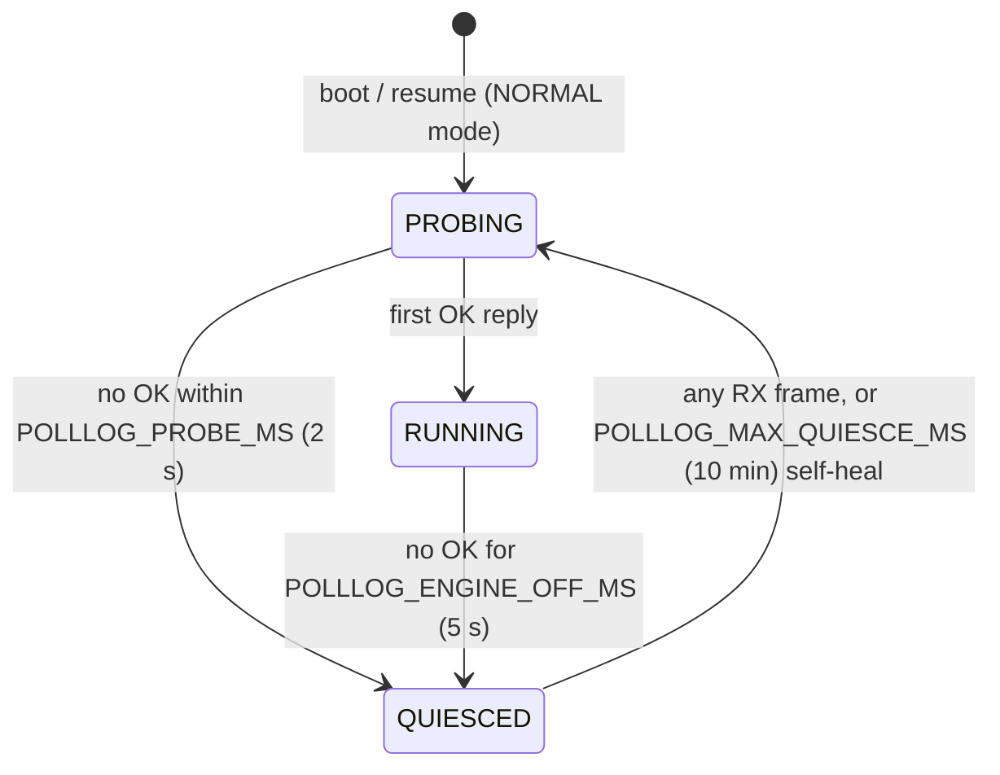

# poll_log — the Datalogger protocol

`components/fast_log/poll_log.c` implements the protocol this product always runs (`"protocol": "poll_log"`). It is the sole TWAI consumer while active: it polls OBD PIDs as fast as the ECU answers, decodes broadcast frames on the side (hybrid capture), measures its own real-world rate, and feeds everything to the CSV trip logger.

Verified on device build `v1.6.0-4-gf553d31` (bench PCM, 19 PIDs): 2.5 ms avg RTT, ~396 req/s, 0 timeouts over 24M+ requests, 20.9 Hz sweep.

## Polling model: free-running, one request in flight

The RX task runs a single-PID round-robin over every enabled PID in `s_cfg->pids`: send one request, wait for that reply (or timeout), immediately send the next. The ECU sets the tempo — a busy ECU answers slower and the poll rate drops with it, which is why the design cannot overload the ECU or the bus (self-pacing; a bench-measured sweep of 19 PIDs ≈ 10% of a 500 kbit/s bus).

The **only** pacing is the `POLLLOG_MIN_SWEEP_MS` floor at the end of each sweep (the 100 Hz cap below). There is no periodic timer, no tick source, and no per-PID delay — self-pacing plus one ceiling.

Key constants (top of `poll_log.c`):

| Constant | Value | Meaning |
|---|---|---|
| `POLLLOG_TX_ID` | `0x7E0` | **All** requests go physically to the PCM; works for both Mode 01 and Mode 22. The per-PID `Init` string that used to *look* like it controlled this was deleted in issue #31 — replaced by the declarative `Mode` key (`pid_data_t.mode`), which is derived from the PID text's leading service byte and is informational: poll_log still frames requests from `cmd` verbatim. |
| `POLLLOG_STATS_PERIOD_US` | 3 s | Rolling stats window (`win_*` fields in `/poll_status`). |
| `POLLLOG_BCAST_PERIOD_MS` | 20 ms | Per-broadcast-channel record throttle (~50 Hz/ch), hybrid capture only. |
| `POLLLOG_MIN_SWEEP_MS` | 10 ms | **Hard rate cap.** One request per PID per sweep, so a floor on sweep duration caps every channel at 100 Hz. Paced before the rate measurement, so the reported rate is the achieved one. |

Consequences:

- **PID count sets the rate**, up to the cap: sweep time ≈ max(N × avg RTT, `POLLLOG_MIN_SWEEP_MS`). 19 PIDs × 2.5 ms ≈ 48 ms → ~21 Hz; 10 PIDs → ~40 Hz; below ~4 PIDs the 100 Hz cap takes over. Removing PIDs — or slowing them with `SampleEvery` — speeds up *every* remaining channel.
- **Zero polled PIDs = nothing runs**: `poll_log_init` returns early when `pid_count == 0`, and hybrid decode lives inside the poll task — an all-broadcast config logs nothing. Keep at least one polled PID.
- After a full sweep, calculated channels are evaluated once (`autopid_eval_calculated_channels`).

## Engine-off quiesce (LISTEN_ONLY)

So the dongle never keeps a parked car's CAN bus awake, poll_log flips the controller to LISTEN_ONLY when the ECU goes silent, and resumes on the first frame of bus activity:



While QUIESCED the task never transmits, drains RX non-blocking on a ~20 ms cadence, and `s_engine_running=false` suppresses CSV logging (csv_logger asks via the registered `poll_log_engine_running` callback — see [csv_logger.md](csv_logger.md)). The 10-minute self-heal (`POLLLOG_MAX_QUIESCE_MS`) guarantees a stuck detector can never permanently strand the logger. State transitions emit `EVL_ENGINE_STOP`/start events to event_log.

Probe sweeps (no OK yet) are deliberately excluded from the sweep-rate measurement below, so cranking/parked periods can't poison the Auto rate.

## Hybrid broadcast capture (`POLLLOG_HYBRID`, issue #7)

Enabled since PR #27. Inside the existing poll drain loop, frames that are **not** the awaited poll response are matched against the configured `can_filters` (`polllog_decode_broadcast`): on a frame-ID match, each parameter's expression is evaluated against the frame bytes, clamped to min/max, and recorded via `csv_logger_record(..., "CANFLT")`. No new task, no second TWAI consumer — the brick-safety invariants are untouched.

Details that matter:

- **Throttle**: each broadcast channel records at most every `POLLLOG_BCAST_PERIOD_MS` (20 ms ≈ 50 Hz/ch). The otherwise-unused `parameter_t.timer` field is repurposed as the per-channel throttle timestamp.
- **Gating mirrors the CSV column provider**: filters with `is_vehicle_specific` are skipped when `pid_specific_en` is off — otherwise records would arrive for channels the wide CSV has no column for.
- **Locking**: the decode takes `autopid_lock(0)` as a *try-lock*. A multi-second HTTP Test-PID lock hold must skip broadcast decode, not stall polling.
- **Why hybrid wins** (issue #23 discussion): a polled channel costs ~2.5 ms of sweep per sample plus ECU diag-task work; a broadcast channel is free — the PCM transmits it anyway. Migrating a channel from the poll list to a CAN filter shortens the sweep (speeding up all remaining polled channels), reduces ECU load, and the channel arrives at broadcast rate (≥ grid rate). Only channels with no broadcast source (Mode 22s, MAF, trims…) need polling.

## Per-PID sweep divisors (`SampleEvery`, issue #29)

Not every channel deserves the same rate: coolant temp at 21 Hz is waste that costs every other channel sweep time. `SampleEvery: N` polls that PID on every **Nth sweep** — a divisor, not a millisecond period. The sweep is the only scheduling quantum poll_log has (there is no pacing timer), so counting sweeps is exact where a millisecond target would only ever be rounded to one.

- **The key is `SampleEvery`** in `auto_pid.json` (`pids` and `std_pids`). Absent / `0` / `1` all mean *every sweep* — the shipped default, so an existing config parses bit-identically. Deliberately **not** the legacy `Period` field: all 19 shipped PIDs carry `Period: "200"`, so reusing it would have silently capped every channel at 5 Hz.
- **Range 2..64** (`AUTOPID_MAX_SAMPLE_EVERY`). Clamped in the parser *and* in `polllog_prepare_schedule()` — the latter is authoritative because it indexes stack arrays with the value while running on the sole-TWAI-owner poll task. The UI validator uses the same 64.
- **Phasing**: `polllog_prepare_schedule()` gives each PID in a divisor group an even phase offset (2 PIDs at N=4 → sweeps 0 and 2, not 0 and 1) so same-divisor channels don't all fire on the same sweep and make sweep duration oscillate. Phases are **re-derived, never preserved**, on every config load and every live hot-reload — deterministic from the JSON, so an unrelated edit reproduces them exactly. Known and deliberate: this equalises *within* a divisor group, not across groups, so an N=2 and an N=4 group still co-fire every 4th sweep. Residual oscillation is directly measurable as `sweep_min_ms`/`sweep_max_ms`.
- **Rows that can never be polled** (disabled, no `cmd`, unparseable `cmd`) are excluded from the schedule entirely — they must not pin `sched_min_n` or consume a phase slot.

Two bypasses skip the gate completely, and while bypassed the counters do **not** tick, so phase resumes where it left off:

| Bypass | Condition | Why |
|---|---|---|
| Probing | `!s_confirmed` | Boot and every quiesce-resume run full sweeps, so an all-gated table can never starve `POLLLOG_PROBE_MS` of attempts and strand the logger in a quiesce loop. |
| Stale OK | no OK for `POLLLOG_GATE_STALE_MS` (2.5 s) | A long divisor on the only answering channel could otherwise push `now - s_last_ok_us` past `POLLLOG_ENGINE_OFF_MS` and fire a **false** `ENGINE_STOP`, closing the CSV require-engine gate mid-drive. With the engine genuinely off, un-gated sweeps still yield no OK and still quiesce at 5 s. |

`can_should_park()` and the QUIESCED branch both `continue` *above* the gate, so a 10 s flash session can't burn every PID's skip budget and then fire them all at once on the first unparked sweep.

**Empty sweeps.** With divisors, a sweep can request nothing (one PID at N=64 → 63 consecutive empty sweeps — a legal config). Every `vTaskDelay` and every `can_receive` in the sweep lives inside `polllog_poll_one`, so an empty sweep would neither yield nor drain. Both are fatal: a yield-free prio-5 loop starves IDLE (TWDT flood) and the prio-4 CSV writer; and poll_log is the sole TWAI consumer, so the 96-slot driver RX queue fills in ~48 ms on a busy powertrain bus. The empty path therefore drains RX (hybrid-decoding as it goes), evaluates calculated channels every 16th empty sweep, and yields.

## Sweep-rate measurement and the Auto grid (issue #23)

The Auto (fastest) logging rate is a **measurement, not an estimate** — this is what makes it correct in hybrid mode (broadcast channels are always at least as fresh as the polled sweep, so the polled sweep is the true freshness limiter).

- Each completed sweep's wall time (all PIDs + calculated channels) feeds an EMA with weight 1/8; results publish as `s_sweep_ms`/`s_sweep_hz` (volatile 32-bit floats — atomic on ESP32-S3; deliberately not 64-bit, which would tear).
- Only sweeps with ≥1 OK response are folded in (probe sweeps excluded) **or** any executed sweep while divisor gating is live. The second term is what keeps the number honest under #29: a PID with divisor *m* fires once every *m* **executed** sweeps, so averaging only the non-empty ones overstates its rate (a `{2,3}` mix reads 29% fast). Empty sweeps fold in *only* while gating is live, so the anti-poison guard keeps its exact behaviour otherwise. The EMA re-seeds (rather than decays) whenever the sweep shape flips, since an alpha-1/8 EMA needs ~8 sweeps to cross but the multiplier flips instantly.
- **`poll_log_sweep_hz()` returns the fastest channel's cadence**, `sweep_hz / sched_min_n` — not the mean sweep. With divisors, mean sweep time is no longer the rate at which *any* channel refreshes, and feeding the grid the sweep would make it oversample and emit duplicate rows. Identical to `sweep_hz` whenever nothing is gated. Returns 0 while inactive/unmeasured.
- `poll_log_init` registers that getter with `csv_logger_set_rate_fn()`; the CSV grid re-derives its tick period from it when `csv_grid_hz="auto"` (see [csv_logger.md](csv_logger.md)).
- Because the grid is slaved to the measured sweep, every grid row contains a value refreshed within the last sweep — no staircase artifacts in MegaLogViewer (each row is a full-width snapshot, and no channel repeats systematically).

## `/poll_status`

`GET /poll_status` (handler in `main/config_server.c`, safe in any protocol mode) returns the live JSON from `poll_log_get_status_json()`:

```json
{"active":true,"ok":19676,"timeout":0,"txfail":0,
 "rtt_avg_ms":2.48,"rtt_min_ms":0.72,"rtt_max_ms":9.97,"req_s":396.0,
 "sweep_ms":49.6,"sweep_hz":20.15,"pids":19,
 "pids_gated":4,"sched_min_n":1,"gating_active":true,
 "sweep_pids":15,"sweep_seq":40311,"sweep_empty":0,"gate_skips":12093,
 "pace_sweeps":0,"min_sweep_ms":10,
 "sweep_min_ms":38.2,"sweep_max_ms":52.7,"fast_ms":49.6,"fast_hz":20.15,
 "win_ok":1197,"win_timeout":0,"win_txfail":0,
 "engine_running":true,"quiesced":false,"bus_idle_ms":4294967295,
 "reload_ok":true,"reload_pending":false}
```

`ok/timeout/txfail` are cumulative; `win_*` are the last 3 s window; `bus_idle_ms` saturates at UINT32_MAX when no broadcast traffic is tracked.

The divisor fields (issue #29) are the whole diagnostic surface for the feature — no serial console needed:

| Field | Meaning |
|---|---|
| `pids_gated` | Pollable PIDs with `SampleEvery >= 2`. `0` ⇒ the gate is inert and every path below is today's shipped behaviour. |
| `sched_min_n` | Smallest divisor over pollable PIDs. `1` ⇒ at least one channel still runs every sweep. |
| `gating_active` | The gate is *actually* in effect right now (false while probing or during the stale-OK bypass). |
| `sweep_pids` | PIDs actually requested in the last sweep. Should equal `pids` when nothing is gated. |
| `sweep_seq` / `sweep_empty` | Executed sweeps / of those, how many requested nothing. **On an ungated config both `sweep_empty` and `gate_skips` must stay at 0** — that is the no-regression check. |
| `gate_skips` | Cumulative polls suppressed by the gate. |
| `pace_sweeps` / `min_sweep_ms` | Sweeps held back by the 100 Hz cap, and the cap itself in ms. `pace_sweeps` climbing means the config is asking for more than 100 Hz and getting 100. |
| `sweep_min_ms` / `sweep_max_ms` | Sweep-duration spread over the 3 s window — the phasing-quality readout. A wide spread means divisor groups are co-firing. |
| `fast_ms` / `fast_hz` | Fastest channel's cadence = mean executed sweep × `sched_min_n`. **This**, not `sweep_hz`, is what the Auto CSV grid tracks. |
| `reload_pending` | A live hot-reload is armed but not yet applied (deferred under an open trip). |

## Measured limits (bench, `v1.9.4-3-gd8b8180`, 2026-07-21)

Numbers from the NC bench PCM, 19 configured PIDs of which 16 are enabled (IAT/ECT/VSS are disabled — they come from broadcast filters instead). Recorded so nobody has to re-derive them.

| Configuration | Sweep rate | Note |
|---|---|---|
| 16 enabled, no divisors | **24.9 Hz** | the shipped baseline |
| 16 enabled, 5 slow channels gated (16/8/8/4/4) | **40.2 Hz** | +61% on every remaining channel, for free |
| 4 enabled every sweep + 12 at N=8 | **126 Hz** | |
| 5 enabled, 11 disabled, no divisors | **190 Hz** | reachable *today* without issue #29, just by disabling PIDs |
| all 16 at N=64 | 878 Hz loop / **13.7 Hz** per channel | 75% empty sweeps, exactly as phased |

Two things that surprise people reading `/poll_status`:

- **`pids` counts configured rows; `sweep_pids` counts rows actually requested.** 19 vs 16 here is disabled rows, not a fault.
- **The rate is capped at 100 Hz** (`POLLLOG_MIN_SWEEP_MS`, `min_sweep_ms` in `/poll_status`). The 190 Hz row above is pre-cap. A plateau at exactly 100 Hz with `pace_sweeps` climbing is the cap working, not the ECU saturating.

Divisor scheduling was verified arithmetically on device: over 924 sweeps with divisors {16,8,8,4,4}, predicted skips Σ(1−1/N)×924 = 3869, device reported **3869**.

**Auto grid at the clamp — verified (at the pre-#56 50 Hz ceiling).** With the sweep measured at 126 Hz (i.e. the grid pinned to its then-50 Hz / 20 ms ceiling), an 11m23s trip wrote **31,995 rows / 5.9 MB at 46.8 Hz with 0 dropped rows, 0 pending drops and 0 unmatched columns**. The SD writer and the 256-slot record queue keep up at that clamp with margin; record rate there was ~1100 rec/s (6 PID + 3 CALC per sweep). **#56 raised the ceiling to 100 Hz; re-validation at 100 Hz (0 dropped rows on a full trip) is pending — see the #56 acceptance check.**

## Known issue: one unreproduced `interrupt_wdt` panic

On 2026-07-21 the bench took a single `interrupt_wdt` reset (`INT_WDT_TIMEOUT_MS=300`, i.e. interrupts were disabled >300 ms) while running a 126 Hz gated config. **Root cause unknown — do not assume it is fixed.**

No backtrace was available: `CONFIG_ESP_COREDUMP_ENABLE_TO_NONE=y`, so nothing is captured on panic and the device has no serial attached on the bench. **Enabling coredump-to-flash is the prerequisite for ever diagnosing this**; without it a repeat is equally unactionable.

Three targeted reproduction runs afterwards, ~26 minutes total, were all clean:

| Run | Duration | Result |
|---|---|---|
| 190 Hz, **ungated** (gate provably inert: `pids_gated 0`) | 8m41s | clean |
| 126 Hz, gated, no CSV trip, no HTTP polling | 7m00s | clean |
| 126 Hz, gated, **with** a CSV trip | 11m23s | clean |

So it is neither "polling fast" (190 Hz ungated was fine) nor gating alone nor gating + CSV. The one condition present at the crash and absent from all three reruns was a client POSTing `/csv_logger?op=status` — an **invalid** op — every 5 s for ~3 minutes. That is a weak lead, not a diagnosis.

Note the 100 Hz cap makes the specific rate at which this was seen unreachable, but that is containment by coincidence, not a fix.

## Crash guard

`s_polllog_guard` (`RTC_NOINIT_ATTR`) detects boot-loops caused by poll_log itself and keeps it inactive after repeated warm crashes. Cleared on clean startup paths (e.g. the early-returns for missing config).

## Related

- Per-PID rate limiting: issue #29 — shipped as `SampleEvery` (above). The legacy `Period` field was deliberately left untouched.
- Per-PID `Mode` (issue #31): `Init` is deleted (one-time config migration, see `web_ui.md`); `Mode` is `01`/`22` today. Mode `23` (ReadMemoryByAddress — wire spec proven in `main/ncflash_fastread.c`) is **not** a poll channel yet: it needs an addr+size config schema, ISO-TP multi-frame reassembly, and a no-echo match — follow-up issue.
- Hidden/legacy fields (`Period`, `Class`) and what still consumes them: issue #28.
