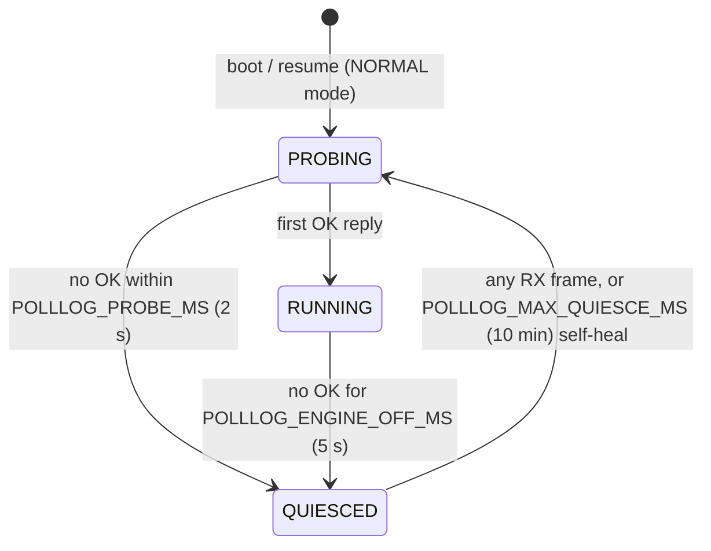

# poll_log — the Datalogger protocol

`components/fast_log/poll_log.c` implements the protocol this product always runs (`"protocol": "poll_log"`). It is the sole TWAI consumer while active: it polls OBD PIDs as fast as the ECU answers, decodes broadcast frames on the side (hybrid capture), measures its own real-world rate, and feeds everything to the CSV trip logger.

Verified on device build `v1.6.0-4-gf553d31` (bench PCM, 19 PIDs): 2.5 ms avg RTT, ~396 req/s, 0 timeouts over 24M+ requests, 20.9 Hz sweep.

## Polling model: free-running, one request in flight

There is **no pacing timer**. The RX task runs a single-PID round-robin over every enabled PID in `s_cfg->pids`: send one request, wait for that reply (or timeout), immediately send the next. The ECU therefore sets the tempo — a busy ECU answers slower and the poll rate drops with it, which is why the design cannot overload the ECU or the bus (self-pacing; a bench-measured sweep of 19 PIDs ≈ 10% of a 500 kbit/s bus).

Key constants (top of `poll_log.c`):

| Constant | Value | Meaning |
|---|---|---|
| `POLLLOG_TX_ID` | `0x7E0` | **All** requests go physically to the PCM. The per-PID `Init` string (e.g. `ATSH7E0;`) is **ignored** by poll_log — it only matters for the legacy ELM paths and the Test button. Physical 7E0 works for both Mode 01 and Mode 22. |
| `POLLLOG_STATS_PERIOD_US` | 3 s | Rolling stats window (`win_*` fields in `/poll_status`). |
| `POLLLOG_BCAST_PERIOD_MS` | 20 ms | Per-broadcast-channel record throttle (~50 Hz/ch), hybrid capture only. |

Consequences:

- **PID count sets the rate**: sweep time ≈ N × avg RTT. 19 PIDs × 2.5 ms ≈ 48 ms → ~21 Hz; 10 PIDs → ~40 Hz. Removing PIDs speeds up *every* remaining channel.
- **Zero polled PIDs = nothing runs**: `poll_log_init` returns early when `pid_count == 0`, and hybrid decode lives inside the poll task — an all-broadcast config logs nothing. Keep at least one polled PID.
- After a full sweep, calculated channels are evaluated once (`autopid_eval_calculated_channels`).

## Engine-off quiesce (LISTEN_ONLY)

So the dongle never keeps a parked car's CAN bus awake, poll_log flips the controller to LISTEN_ONLY when the ECU goes silent, and resumes on the first frame of bus activity:



While QUIESCED the task never transmits, drains RX non-blocking on a ~20 ms cadence, and `s_engine_running=false` suppresses CSV logging (csv_logger asks via the registered `poll_log_engine_running` callback — see [csv_logger.md](csv_logger.md)). The 10-minute self-heal (`POLLLOG_MAX_QUIESCE_MS`) guarantees a stuck detector can never permanently strand the logger. State transitions emit `EVL_ENGINE_STOP`/start events to event_log.

Probe sweeps (no OK yet) are deliberately excluded from the sweep-rate measurement below, so cranking/parked periods can't poison the Auto rate.

## Hybrid broadcast capture (`POLLLOG_HYBRID`, issue #7)

Enabled since PR #27. Inside the existing poll drain loop, frames that are **not** the awaited poll response are matched against the configured `can_filters` (`polllog_decode_broadcast`): on a frame-ID match, each parameter's expression is evaluated against the frame bytes, clamped to min/max, and recorded via `csv_logger_record(..., "CANFLT")`. No new task, no second TWAI consumer — the brick-safety invariants are untouched.

Details that matter:

- **Throttle**: each broadcast channel records at most every `POLLLOG_BCAST_PERIOD_MS` (20 ms ≈ 50 Hz/ch). The otherwise-unused `parameter_t.timer` field is repurposed as the per-channel throttle timestamp.
- **Gating mirrors the CSV column provider**: filters with `is_vehicle_specific` are skipped when `pid_specific_en` is off — otherwise records would arrive for channels the wide CSV has no column for.
- **Locking**: the decode takes `autopid_lock(0)` as a *try-lock*. A multi-second HTTP Test-PID lock hold must skip broadcast decode, not stall polling.
- **Why hybrid wins** (issue #23 discussion): a polled channel costs ~2.5 ms of sweep per sample plus ECU diag-task work; a broadcast channel is free — the PCM transmits it anyway. Migrating a channel from the poll list to a CAN filter shortens the sweep (speeding up all remaining polled channels), reduces ECU load, and the channel arrives at broadcast rate (≥ grid rate). Only channels with no broadcast source (Mode 22s, MAF, trims…) need polling.

## Sweep-rate measurement and the Auto grid (issue #23)

The Auto (fastest) logging rate is a **measurement, not an estimate** — this is what makes it correct in hybrid mode (broadcast channels are always at least as fresh as the polled sweep, so the polled sweep is the true freshness limiter).

- Each completed sweep's wall time (all PIDs + calculated channels) feeds an EMA with weight 1/8; results publish as `s_sweep_ms`/`s_sweep_hz` (volatile 32-bit floats — atomic on ESP32-S3; deliberately not 64-bit, which would tear).
- Only sweeps with ≥1 OK response are folded in (probe sweeps excluded). `poll_log_sweep_hz()` returns 0 while inactive/unmeasured.
- `poll_log_init` registers that getter with `csv_logger_set_rate_fn()`; the CSV grid re-derives its tick period from it when `csv_grid_hz="auto"` (see [csv_logger.md](csv_logger.md)).
- Because the grid is slaved to the measured sweep, every grid row contains a value refreshed within the last sweep — no staircase artifacts in MegaLogViewer (each row is a full-width snapshot, and no channel repeats systematically).

## `/poll_status`

`GET /poll_status` (handler in `main/config_server.c`, safe in any protocol mode) returns the live JSON from `poll_log_get_status_json()`:

```json
{"active":true,"ok":19676,"timeout":0,"txfail":0,
 "rtt_avg_ms":2.48,"rtt_min_ms":0.72,"rtt_max_ms":9.97,"req_s":396.0,
 "sweep_ms":49.6,"sweep_hz":20.15,"pids":19,
 "win_ok":1197,"win_timeout":0,"win_txfail":0,
 "engine_running":true,"quiesced":false,"bus_idle_ms":4294967295}
```

`ok/timeout/txfail` are cumulative; `win_*` are the last 3 s window; `sweep_*`/`pids` are the Auto-rate inputs; `bus_idle_ms` saturates at UINT32_MAX when no broadcast traffic is tracked.

## Crash guard

`s_polllog_guard` (`RTC_NOINIT_ATTR`) detects boot-loops caused by poll_log itself and keeps it inactive after repeated warm crashes. Cleared on clean startup paths (e.g. the early-returns for missing config).

## Related

- Per-PID rate limiting / sample groups (planned; would give `Period` new semantics under poll_log): issue #29.
- Hidden/legacy fields (`Init`, `Period`, `Class`) and what still consumes them: issue #28.
