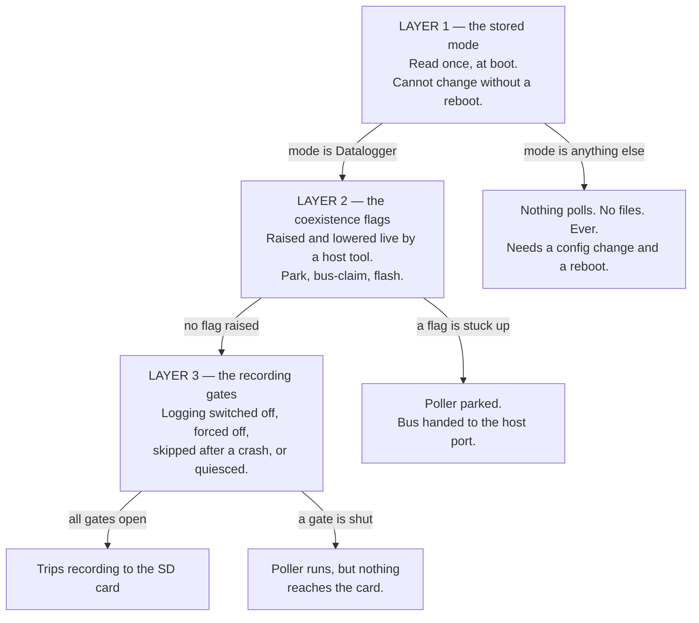
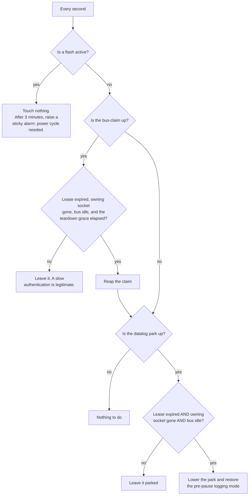

# Getting back to Datalogger mode

Everything that can stop this device running the Datalogger, and how to tell which one has it —
written in plain words, with no code names in the body. It is the companion to
[sleep-wake-cycle.md](sleep-wake-cycle.md), which describes the normal cycle when nothing is
blocking it. The last section says which files to open.

The Console page shows the running mode as a chip: **Datalogger**, **Passive Logger**, **OBD
App**, **Bench SLCAN**. "It went to Bench SLCAN and will not go back" is one of several
different failures that all look the same from that chip, so the first job is to work out which
layer is holding it.

> **Investigation in progress.** Issue #92 is a real occurrence of this and is not yet explained.
> See [bench-slcan-strand-2026-08.md](bench-slcan-strand-2026-08.md) for the hypothesis, what the
> logs do and do not prove, and the plan to reproduce it. Do not treat the cause named in Trap 4
> below as settled — the mechanism is proven to exist, but the incident is unattributed.

## There are three layers, and each can strand the logger on its own



Layer 1 explains a chip that says **Bench SLCAN**. Layers 2 and 3 explain a chip that says
**Datalogger** while nothing is being recorded — which is the more confusing failure, because
everything *looks* right.

## Layer 1 — the stored mode

The mode is read from stored configuration **once, during boot**, and the choice is then frozen
for the whole uptime. Every consumer reads the resolved value rather than asking again, so
there is no runtime path that switches modes.

| Stored mode | What starts | Records trips? |
|---|---|---|
| **Datalogger** | The native poller: it owns the CAN controller, sweeps the configured channels, and decodes broadcast frames on the side. The trip writer is started too, if logging is enabled. | Yes |
| **Passive Logger** | The bus is brought up listen-only and broadcast frames are decoded. No requests are ever sent. | Only broadcast and calculated channels |
| **OBD App** | Host traffic is routed to the OBD interpreter chip for phone apps. | **No** |
| **Bench SLCAN** | Host traffic is routed as raw CAN frames to the primary TCP port. | **No** |

In **Bench SLCAN** and **OBD App**, neither the poller nor the trip writer is ever started. This
is not a gate that might reopen — the code that would create them does not run at all on that
boot. Nothing self-heals, no timeout expires, and no amount of driving changes it.

### Trap 1 — the mode selector is hidden in the web UI

The product always runs the Datalogger, so the selector is deliberately hidden. It still exists
in the page, and this is what matters: **the page reads the device's current mode into that
hidden control, and sends it straight back on every Save.** So once the stored mode is Bench
SLCAN, every Save from the web UI faithfully re-writes Bench SLCAN, and there is no visible
control anywhere to set it back.

The UI does notice. A yellow banner appears on the Logger page saying the current protocol
cannot record PIDs, and it tells you the recovery: download the configuration, edit the mode,
upload it back. That banner is the intended path and it works — see Recovery below.

### Trap 2 — SmartConnect silently overrides the mode

If the stored Wi-Fi mode is SmartConnect, the boot path **discards the stored mode entirely**
and forces OBD App (or the retired legacy poller). It does this unconditionally, and the value
it forces can never be the Datalogger.

So a device with the mode correctly stored as Datalogger will still record nothing if
SmartConnect is on. SmartConnect is not offered in the Wi-Fi mode list in the UI, so this can
only be reached by editing the configuration file directly — but a restored backup from another
device is exactly that.

### Trap 3 — the device reports the *stored* mode, not the running one

The status endpoint reports the mode string straight out of stored configuration. The
SmartConnect override happens after that value is read and is never written back.

**So under SmartConnect the Console chip says "Datalogger" while the device is running OBD App
and recording nothing.** The chip is not evidence in that case. Check the Wi-Fi mode as well
before believing it.

### Trap 4 — the wireless flashing tool switches the mode, and only puts it back on a clean exit

**This is the usual answer to "how did it get into Bench SLCAN", and it is issue #92.**

Nothing in the *firmware* ever writes the mode — no flash session, no crash path, no lease. But
the desktop ROM editor's **wireless** path does, over the ordinary configuration endpoint:

1. On the first connect it reads the current mode, writes it to a crash-recovery file on the
   laptop, then saves Bench SLCAN to the device — a roughly six-second reboot.
2. It stays in Bench SLCAN for the whole session, deliberately, so an internal reconnect after a
   read does not reboot the adapter again.
3. It restores the original mode **only on an explicit disconnect or a clean app exit** — another
   reboot.

So the device is *supposed* to be in Bench SLCAN for the length of every wireless flash. It is
left there whenever step 3 never happens or fails:

- the app is force-quit, crashes, or the laptop sleeps or loses power mid-session
- the Wi-Fi link drops before the restore save lands
- the restore save itself throws — the tool catches that, logs a warning, and **clears the
  crash-recovery file anyway**, so the one record of the original mode is destroyed by the same
  failure that made it necessary

The breadcrumb is a small JSON file in the laptop's **temporary directory**, named after the
device's address, holding the true original mode. It is written before the switch precisely so a
hard kill is survivable — but it only ever helps on the **next run of the tool against the same
address**, and it has four ways to fail:

1. **A failed restore deletes it.** The delete sits in a cleanup block that runs whether the
   restore succeeded or threw. So the exact failure that strands the device also destroys the
   only record of what it should go back to.
2. **It is only read when a new session connects.** There is no start-up sweep for stranded
   devices. If the tool is never opened again, nothing restores anything.
3. **It lives in the OS temp directory**, so a disk cleanup or a reboot can remove it.
4. **It is keyed to the device's address.** If the device comes back on a different address, the
   breadcrumb no longer matches and is ignored.

Once it is gone, the device sits in Bench SLCAN indefinitely — and the hidden selector in Trap 1
re-writes that value on every subsequent Save from the web UI, so the ordinary way of fixing
settings actively keeps it there.

Two smaller ways in, both real: a configuration file uploaded from a backup that had it, or a
hand edit.

**Fixes worth considering, in the host tool:** only clear the breadcrumb when the restore
actually succeeded, and check for a stranded device at start-up rather than only on connect.
Both are one-line-ish changes and either alone would have prevented issue #92.

### What genuinely cannot cause it

- **A factory reset lands on Datalogger.** The built-in default mode is Datalogger, so a config
  the parser rejects — which restores defaults — comes back recording. (Old commented-out
  defaults in the source say OBD App; they are dead and not used.)
- **Mode changes always reboot.** The mode is not on the list of settings that can be applied
  without one, so a save that changes it always schedules a reboot. There is no state where the
  stored mode and the running mode disagree, except the SmartConnect override above.

### Trap 5 — the event log does not record which mode the device booted into

Every boot line carries the reset reason, the plan, the source and the firmware version — but not
the mode. So a device that flipped to Bench SLCAN looks identical in the log to one that did not,
and the flip can only be dated by correlating a `config_apply` boot with something else. This is
why the log attached to issue #92 cannot say when it happened. Worth fixing: one field on the
boot line would make this diagnosable from the log alone.

## Layer 2 — the coexistence flags

This layer exists so a host tool (the ROM editor / NC Flash) can take the bus **without
rebooting the device**. It raises flags; the poller and the trip writer park on them. Three
separate flags, and they are deliberately not the same thing:

| Flag | Raised by | Lowered by | Lifetime |
|---|---|---|---|
| **Datalog park** | The host asking to pause the logger | The host resuming, or the reaper | 12-second lease, renewed by keepalives |
| **Host bus-claim** | The host opening a session, to fence the authentication window | The host releasing, or the reaper | 75-second lease (longer than a worst-case slow ECU reply) |
| **Flash active** | The flash/read codec itself, while it owns the bus | **The codec only** | No lease. No timeout. Never reaped. |

While any of them is up, the poller parks at the top of its loop and the main task takes over
the bus to forward frames to the host's port. Recording stops.

### The dead-man's reaper — and every reason it may refuse

A background task checks once a second whether it can safely put the logger back. It is
deliberately hard to satisfy, because resuming at the wrong moment can leave an engine computer
half-written.



Four conditions must hold together before a park is lifted automatically, and **any one of them
can hold the logger parked indefinitely**:

1. **The lease must have expired.** Twelve seconds without a keepalive. A host that keeps
   sending keepalives holds the park forever, by design.
2. **The owning socket must be gone.** This is the one that bites. The park remembers *which
   host connection* raised it, and while that same connection is still open the reaper treats
   the host as alive — no matter how long it has been silent. **A host tool that pauses the
   logger and then just sits there with its socket open, or a half-open connection the device
   never noticed dropping, parks the logger for as long as the socket lives.** The TTL does not
   save you here; both conditions must be true.
3. **The bus must be idle** for 300 milliseconds — and **this is unreachable with the engine
   running** (issue #70). The idle clock is stamped on every frame the device sends *or*
   receives, and the main task deliberately keeps draining the bus during a coexist session, so
   on a powertrain bus carrying roughly 2000 frames a second the idle time never approaches
   300 ms. **The dead-man's switch is therefore inoperative in exactly the state a driver is
   in:** if the host vanishes mid-session with the engine running, the park is never lifted
   automatically. It is fail-safe rather than dangerous — nothing writes to the ECU — but the
   logger stays parked until someone resumes it or the device reboots.
4. **For a claim only:** a 3-second teardown grace after expiry, so the ECU has dropped its
   programming session first.

Issue #109 is this shape seen from the outside: after a wireless ROM flash the device would not
start logging again across two full ignition cycles, and only a manual reboot fixed it.

### The flash flag is the one with no way out

The flash-active flag is the brick-safety guarantee, and **nothing clears it except the codec
that raised it**. Not the reaper, not the REST layer, not a lease expiry. That is intentional:
auto-clearing it could un-park the poller into the middle of an ECU write.

If a flash session dies with the flag up, the reaper waits three minutes, then raises a sticky
alarm and logs that a power cycle is required. The device will not resume logging until it is
power-cycled. The alarm is visible in the coexistence status.

### Trap 6 — the logger can come back with the bus but stay switched off

Pausing does two separate things: it raises the park flag **and** it forces the trip writer off,
remembering what mode it was in. Only the winner of the resume — either the host's resume call
or the reaper — restores that remembered mode.

If the park flag goes down some other way, the forced-off state can be left behind: the poller
sweeps normally, the Console looks healthy, and no file is ever opened.

This one **does** self-heal, but only on a specific condition: a forced-off writer reverts to
automatic once the **ignition is off** and the park flag is down. So it clears itself at the end
of the drive and the next key-on records normally — but it will not clear while you sit there
with the key on wondering why nothing is recording.

## Layer 3 — the recording gates

With the right mode and no flags up, these can still stop files being written:

- **Logging switched off.** The Logger page's master switch. The trip writer is never started at
  boot. The poller still runs, so live values look fine on the Console.
- **The engine gate.** With "require engine running" on, files only open while the engine is
  actually turning. On a bench PCM that reports zero rpm, this never opens — a manual Start from
  the Console is the intended way to record there.
- **Bring-up skipped after a crash.** The poller and the writer each arm a flag before their
  risky start-up and clear it once stable. If a boot finds the flag still armed, that subsystem
  is **skipped for the whole boot** and the flag is disarmed so the next boot retries. A device
  that crashed once during start-up therefore runs with the logger silently dead until it
  reboots — observed live, for hours. This is also why a wake from sleep reboots instead of
  resuming when any of these flags is set: see [sleep-wake-cycle.md](sleep-wake-cycle.md),
  block C step 0.
- **The bus is quiesced.** With the ECU silent the poller drops to listen-only and stops
  transmitting. This self-heals: any received frame resumes it, and after ten minutes of total
  silence it flips back once anyway.
- **The sleep fence never dropped.** The fence is raised on the way into sleep and lowered by the
  resume. A resume that fails hands over to a reboot, which clears it — so this should not
  persist, but a fence that is up with the device awake would park every bus producer exactly
  like a host park.
- **A firmware upload failed** (issue #69). The upload endpoint switches the CAN controller off
  *before* it reads the request, and **only the success path reboots**. Every failure path returns
  an error with the controller still off, so the device keeps serving the web UI, still answers
  status, and has silently stopped talking to the car until someone reboots it. Confirmed still
  present in the current code, and it is wider than the issue describes: even a malformed
  filename trips it, because the switch-off happens above that check. The realistic trigger is
  the documented one — posting the image as a raw body instead of a multipart form — which
  returns a plain 500 and looks like nothing else happened.

## Diagnosing it

Ask the device three questions, in this order.

**1. What mode does it think it is in, and is SmartConnect on?**

```sh
curl -s http://<device-ip>/check_status
```

Read `protocol` and `wifi_mode`. If `protocol` is anything but `poll_log`, it is Layer 1. If
`wifi_mode` is `SmartConnect`, it is Layer 1 regardless of what `protocol` says.

**2. Is a coexistence flag holding it?**

```sh
curl -s "http://<device-ip>/datalog?op=status"
```

| Field | What it means when set |
|---|---|
| `flash_active` | A flash owns the bus. Nothing else can run. Only the codec can clear it. |
| `stuck_flash_alarm` | The flash has been stuck over three minutes. **Power-cycle the device.** |
| `host_bus_claimed` | A host session is fencing the bus |
| `datalog_parked` | The logger is parked for a host session |
| `manual_mode` | `off` means the writer is forced off — the trap above |
| `park_token` / `claim_token` | Non-null means that lease is armed |
| `bus_idle_ms` | Must reach 300 before the reaper will act |

**3. Is the poller running, and is anything reaching the card?**

```sh
curl -s http://<device-ip>/poll_status
curl -s http://<device-ip>/csv_status
```

The event log is usually faster than any of this: a park, a claim, an auto-resume, an
ignition/engine edge and every file open and close all write a line.

## Recovery

**Stuck in Bench SLCAN or OBD App** — the only fix is a configuration change plus a reboot:

1. System page → download the configuration (or `GET /load_config`).
2. Edit `"protocol"` to `"poll_log"`. While you are in there, confirm `"wifi_mode"` is not
   `"SmartConnect"`.
3. Upload it back (System page, or `POST /store_config`). The device reboots itself, because the
   mode is not a setting that can be applied live.

Do not try to fix this from the Settings page — the hidden control will just re-send the wrong
value.

**Parked with a live host socket** — release it explicitly. A resume with **no token** is
accepted unconditionally, which is the manual override:

```sh
curl -s -X POST "http://<device-ip>/datalog?op=resume"
curl -s -X POST "http://<device-ip>/datalog?op=bus_release"
```

The first lowers the park and restores the remembered logging mode; the second drops a stuck
bus-claim. Then close whatever is still connected to the host port, or the next pause will hold
just as long.

**Stuck flash flag** — power-cycle. There is no software path, deliberately.

**Bring-up skipped after a crash** — reboot. The flag was already disarmed, so the next boot
retries the subsystem.

**Nothing recording but the poller is fine** — check the Logger master switch and the
`manual_mode` field. A forced-off writer clears itself once the ignition goes off.

## Everything that can prevent the return, ranked

| # | Cause | Self-heals? | Fix | Issue |
|---|---|---|---|---|
| 1 | Flash-active flag stuck up | Never | Power cycle | — |
| 2 | Flashing tool left the mode in Bench SLCAN | Never | Edit config, reboot | #92 |
| 3 | SmartConnect forcing the mode at boot | Never | Edit config, reboot | — |
| 4 | Failed firmware upload left the bus switched off | Never | Reboot | #69 |
| 5 | Park or claim stuck — engine running, so the reaper can never fire | Only at engine-off, and only if the socket also closed | Resume with no token | #70, #109 |
| 6 | Park or claim held by a still-open host socket | Only when that socket closes | Resume with no token | #70 |
| 7 | Bring-up skipped after a crash | Next reboot only | Reboot | — |
| 8 | Writer left forced off after a pause | At the next ignition-off | Resume, or turn the key off | — |
| 9 | Logging master switch off | Never | Logger page | — |
| 10 | Engine gate never opens (bench) | Never on a bench | Manual Start, or turn the gate off | — |
| 11 | Bus quiesced | Yes, on any frame or after 10 min | Nothing | — |

## Where this lives in the code

| Layer | File |
|---|---|
| The stored mode, the SmartConnect override, and what each mode starts | `main/main.c` |
| Mode strings, the live-apply whitelist, defaults, and the status report | `main/config_server.c` |
| The park and claim leases, the flags every producer parks on | `main/can.c` |
| The reaper: when a park or claim may be lifted automatically | `main/datalog_lease_task.c` |
| The pause/resume endpoint and the remembered logging mode | `components/csv_logger/csv_logger.c` |
| The forced-off self-heal rule | `components/csv_logger/csv_bringup_logic.c` |
| The poller's own park check and quiesce | `components/fast_log/poll_log.c` |
| The always-on host port and its connection generation | `main/slcan_port.c` |

## Appendix: the whole thing as one picture

```
================================================================================================
  WHY IS THIS DEVICE NOT RECORDING?          top-down: first layer that fails is your answer
================================================================================================

                         [ device is powered and awake ]
                                        |
                                        v
================================================================================================
  LAYER 1 - THE STORED MODE          read ONCE at boot, frozen for the whole uptime
================================================================================================
                                        |
                                        v
   +----------------------------------------------------------------------------------------+
   | WHAT DOES STORED CONFIG SAY THE MODE IS?                                                |
   |                                                                                          |
   |   Datalogger      -> poller owns the bus, sweeps channels, trip writer starts    OK      |
   |   Passive Logger  -> listen-only, broadcast frames only, never sends a request  PARTIAL  |
   |   OBD App         -> traffic routed to the OBD chip for phone apps           NO POLLING  |
   |   Bench SLCAN     -> traffic routed as raw CAN to the TCP port               NO POLLING  |
   +----------------------------------------------------------------------------------------+
                    |                                              |
          (Bench SLCAN / OBD App)                            (Datalogger)
                    |                                              |
                    v                                              |
   +---------------------------------------------+                 |
   | DEAD END. The poller and the trip writer    |                 |
   | are NEVER CREATED on this boot. No gate     |                 |
   | reopens, no timeout expires, driving does   |                 |
   | not help.                                   |                 |
   |                                             |                 |
   | FIX: download config -> set the mode to     |                 |
   |      poll_log -> upload -> it reboots       |                 |
   +---------------------------------------------+                 |
                                                                   |
                                        +--------------------------+
                                        |
                                        v
   +----------------------------------------------------------------------------------------+
   | IS THE STORED WIFI MODE "SmartConnect"?                                                 |
   |   YES -> the boot path THROWS THE STORED MODE AWAY and forces OBD App. It can never     |
   |          resolve to Datalogger. DEAD END, same fix: edit config, reboot.                 |
   |   NO  -> carry on                                                                        |
   +----------------------------------------------------------------------------------------+
                                        |
                                        v

   ---- FIVE TRAPS IN THIS LAYER ---------------------------------------------------------
   |                                                                                      |
   |  TRAP 1: THE MODE SELECTOR IS HIDDEN IN THE UI, BUT STILL ROUND-TRIPS.                |
   |    The page reads the device's current mode into the hidden control and sends it      |
   |    back on EVERY Save. So once the stored mode is Bench SLCAN, every Save from the    |
   |    Settings page re-writes Bench SLCAN, and no visible control sets it back.          |
   |                                                                                      |
   |  TRAP 2: THE STATUS ENDPOINT REPORTS THE *STORED* MODE, NOT THE RUNNING ONE.          |
   |    The SmartConnect override happens after that value is read and is never written    |
   |    back. So the Console chip says "Datalogger" while the device runs OBD App and      |
   |    records nothing. The chip is not evidence unless you also check the wifi mode.     |
   |                                                                                      |
   |  TRAP 3: THE WIRELESS FLASHING TOOL WRITES THE MODE.  <-- issue #92, the usual cause  |
   |    The desktop ROM editor switches the device to Bench SLCAN on its FIRST connect     |
   |    (a ~6 s reboot), keeps it there for the whole session on purpose, and restores     |
   |    the original ONLY on a clean disconnect or app exit. Force-quit, a crash, a laptop |
   |    sleeping, or a Wi-Fi drop before the restore lands = the device stays in SLCAN.    |
   |                                                                                      |
   |  TRAP 4: A FAILED RESTORE DESTROYS ITS OWN RECOVERY RECORD.                           |
   |    The tool writes a breadcrumb file with the true original mode BEFORE switching.    |
   |    But if the restore throws, it logs a warning and CLEARS THE BREADCRUMB ANYWAY --   |
   |    so the one record of the original mode is deleted by the same failure that made    |
   |    it necessary. The breadcrumb only ever helps on the NEXT run of the tool.          |
   |                                                                                      |
   |  TRAP 5: THE EVENT LOG NEVER RECORDS WHICH MODE THE DEVICE BOOTED INTO.               |
   |    Boot lines carry the reset reason, plan, source and firmware -- not the mode. So   |
   |    a flip to Bench SLCAN is invisible in the log and can only be dated by guessing at  |
   |    a config_apply boot. One extra field would make this diagnosable.                   |
   |                                                                                      |
   |  NOT A CAUSE: a factory reset lands on Datalogger (the built-in default), so a config |
   |    the parser rejects comes back RECORDING. And a mode change always reboots, so the  |
   |    stored and running mode never disagree except under SmartConnect.                  |
   ----------------------------------------------------------------------------------------
```
```

```
================================================================================================
  LAYER 2 - THE COEXISTENCE FLAGS      raised/lowered live by NC Flash, no reboot needed
================================================================================================
                                        |
                                        v
   +----------------------------------------------------------------------------------------+
   | THREE SEPARATE FLAGS. While ANY is up, the poller parks and recording stops.            |
   |                                                                                          |
   |   FLASH ACTIVE   raised by: the flash/read codec itself                                  |
   |                  lowered by: THE CODEC ONLY. no lease, no timeout, never reaped.         |
   |                                                                                          |
   |   HOST BUS-CLAIM raised by: host opening a session (fences the auth window)              |
   |                  lowered by: host release, or the reaper. 75-second lease.               |
   |                                                                                          |
   |   DATALOG PARK   raised by: host asking to pause the logger                              |
   |                  lowered by: host resume, or the reaper. 12-second lease.                |
   +----------------------------------------------------------------------------------------+
                                        |
                                        v
                        +---------------------------------+
                        | Is a flash active?              |
                        +---------------------------------+
                           |                        |
                         YES                       NO
                           |                        |
                           v                        v
   +--------------------------------------+   +----------------------------------+
   | TOUCH NOTHING. After 3 minutes,      |   | Is the bus-claim up?             |
   | raise a sticky alarm saying a power  |   +----------------------------------+
   | cycle is required.                   |      |                    |
   |                                      |     YES                  NO
   | *** THE ONLY WAY OUT IS A POWER      |      |                    |
   |     CYCLE. BY DESIGN - auto-clearing |      v                    |
   |     this could un-park the poller    |   +--------------------------+       |
   |     into a half-written ECU. ***     |   | Lease expired AND socket |       |
   +--------------------------------------+   | gone AND BUS IDLE AND    |       |
                                              | 3s teardown grace?       |       |
                                              +--------------------------+       |
                                                 |            |                  |
                                                NO           YES                 |
                                                 |            |                  |
                                                 v            v                  |
                                    +------------------+  +---------+            |
                                    | Leave it. A slow |  | Reap    |            |
                                    | auth is legit.   |  | the     |            |
                                    +------------------+  | claim   |            |
                                                          +---------+            |
                                                               |                 |
                                                               +--------+--------+
                                                                        |
                                                                        v
                                              +------------------------------------------+
                                              | Is the datalog park up?                  |
                                              +------------------------------------------+
                                                    |                        |
                                                   NO                       YES
                                                    |                        |
                                                    |                        v
                                                    |    +----------------------------------+
                                                    |    | ALL THREE must hold together:    |
                                                    |    |   1. lease expired (12 s)        |
                                                    |    |   2. OWNING SOCKET GONE          |
                                                    |    |   3. BUS IDLE 300 ms             |
                                                    |    +----------------------------------+
                                                    |          |                  |
                                                    |     any one NO           all YES
                                                    |          |                  |
                                                    |          v                  v
                                                    |  +---------------+  +--------------------+
                                                    |  | STAYS PARKED  |  | Lower the park and |
                                                    |  | indefinitely  |  | restore the        |
                                                    |  +---------------+  | remembered mode    |
                                                    |                     +--------------------+
                                                    |                                |
                                                    +--------------------------------+
                                                                     |
                                                                     v

   ---- THREE TRAPS IN THIS LAYER --------------------------------------------------------
   |                                                                                      |
   |  TRAP 6: "BUS IDLE" IS UNREACHABLE WITH THE ENGINE RUNNING.   <-- issue #70          |
   |    The idle clock is stamped on every frame the device sends OR receives, and the    |
   |    main task deliberately keeps draining the bus during a coexist session. On a       |
   |    powertrain bus at ~2000 frames/s the idle time never gets near 300 ms.             |
   |    SO THE DEAD-MAN'S SWITCH IS INOPERATIVE IN EXACTLY THE STATE A DRIVER IS IN.       |
   |    Fail-safe, not dangerous -- nothing writes to the ECU -- but the logger stays      |
   |    parked until someone resumes it or the device reboots. Issue #109 is this seen     |
   |    from outside: no logging after a wireless flash across two ignition cycles.        |
   |                                                                                      |
   |  TRAP 7: THE TTL ALONE NEVER RELEASES A PARK.                                         |
   |    The park remembers WHICH host connection raised it. While that same socket is      |
   |    open, the reaper treats the host as alive no matter how long it has been silent.   |
   |    MANUAL OVERRIDE: a resume with NO TOKEN is accepted unconditionally.               |
   |                                                                                      |
   |  TRAP 8: PAUSING ALSO FORCES THE TRIP WRITER OFF.                                     |
   |    Only the winner of the resume restores it. If the park drops another way, the      |
   |    poller sweeps normally and everything LOOKS healthy while no file is ever opened.  |
   |    Self-heals -- but only once the IGNITION GOES OFF.                                 |
   ----------------------------------------------------------------------------------------
```

```
================================================================================================
  LAYER 3 - THE RECORDING GATES        right mode, no flags up, still no files
================================================================================================
                                        |
                                        v
   +----------------------------------------------------------------------------------------+
   | Logging master switch off  -> writer never started at boot. Poller still runs, so the   |
   |                               Console live values look perfectly fine.                   |
   |                                                                                          |
   | Engine gate never opens    -> with "require engine running" on, files open only while    |
   |                               the engine turns. A bench PCM reports 0 rpm, so this        |
   |                               never opens. Manual Start is the intended bench path.       |
   |                                                                                          |
   | Bring-up skipped           -> a subsystem that crashed during start-up is skipped for     |
   |                               THE WHOLE BOOT and only retries on the next one. Observed   |
   |                               live: hours of answering HTTP with the logger silently dead.|
   |                                                                                          |
   | FAILED FIRMWARE UPLOAD     -> issue #69. The upload endpoint switches the CAN controller  |
   |                               OFF before it even reads the request, and ONLY THE SUCCESS  |
   |                               PATH REBOOTS. Every failure path returns an error with the  |
   |                               bus still off: the web UI still answers, status still       |
   |                               answers, and the device has silently stopped talking to     |
   |                               the car until someone reboots it. Wider than the issue      |
   |                               says -- even a malformed filename trips it. The realistic   |
   |                               trigger is posting the image as a raw body instead of a     |
   |                               multipart form, which just returns a plain 500.             |
   |                                                                                          |
   | Bus quiesced               -> ECU silent, poller listen-only. SELF-HEALS on any frame,    |
   |                               and after 10 minutes flips back once anyway.                |
   |                                                                                          |
   | Sleep fence still up       -> parks every bus producer exactly like a host park. Should   |
   |                               not persist (a failed resume reboots, clearing it).         |
   +----------------------------------------------------------------------------------------+
                                        |
                                    (all clear)
                                        v
                         ****  TRIPS RECORDING TO THE SD CARD  ****
```

```
================================================================================================
  DIAGNOSE IN THIS ORDER
================================================================================================

   1.  curl -s http://<ip>/check_status
         protocol   -> anything but poll_log  = LAYER 1
         wifi_mode  -> SmartConnect           = LAYER 1 whatever protocol says

   2.  curl -s "http://<ip>/datalog?op=status"
         flash_active       true -> layer 2, codec owns the bus
         stuck_flash_alarm  true -> POWER CYCLE, no software path exists
         host_bus_claimed   true -> a host session is fencing the bus
         datalog_parked     true -> parked; check whether the host socket is still open
         manual_mode        off  -> writer forced off (trap 8)
         bus_idle_ms        must reach 300 before the reaper will act -- and with the
                                 engine running it never will (trap 6)

   3.  curl -s http://<ip>/poll_status     (is the poller sweeping?)
       curl -s http://<ip>/csv_status      (is anything reaching the card?)

   Faster than all of it: the event log. Park, claim, auto-resume, ignition and engine
   edges, and every file open/close each write a line. A host claim or park with NO
   matching release/resume line after it is the signature of a dead host session.
   What the log will NOT tell you is the boot mode -- see trap 5.


================================================================================================
  RANKED - EVERYTHING THAT CAN PREVENT THE RETURN
================================================================================================

   #   CAUSE                                        SELF-HEALS?           FIX              ISSUE
   --  -------------------------------------------  --------------------  ---------------  -----
   1   Flash-active flag stuck up                   NEVER                 power cycle        -
   2   Flashing tool left the mode in Bench SLCAN   NEVER                 edit cfg, reboot  #92
   3   SmartConnect forcing the mode at boot        NEVER                 edit cfg, reboot   -
   4   Failed firmware upload left the bus off      NEVER                 reboot            #69
   5   Park stuck, engine running (reaper blind)    only at engine-off    resume, no token  #70
                                                                                           #109
   6   Park held by a still-open host socket        when it closes        resume, no token  #70
   7   Bring-up skipped after a crash               next reboot only      reboot             -
   8   Writer left forced off after a pause         at next ignition-off  resume / key off   -
   9   Logging master switch off                    NEVER                 Logger page        -
   10  Engine gate never opens (bench)              never on a bench      manual Start       -
   11  Bus quiesced                                 yes, frame or 10 min  nothing            -
```
