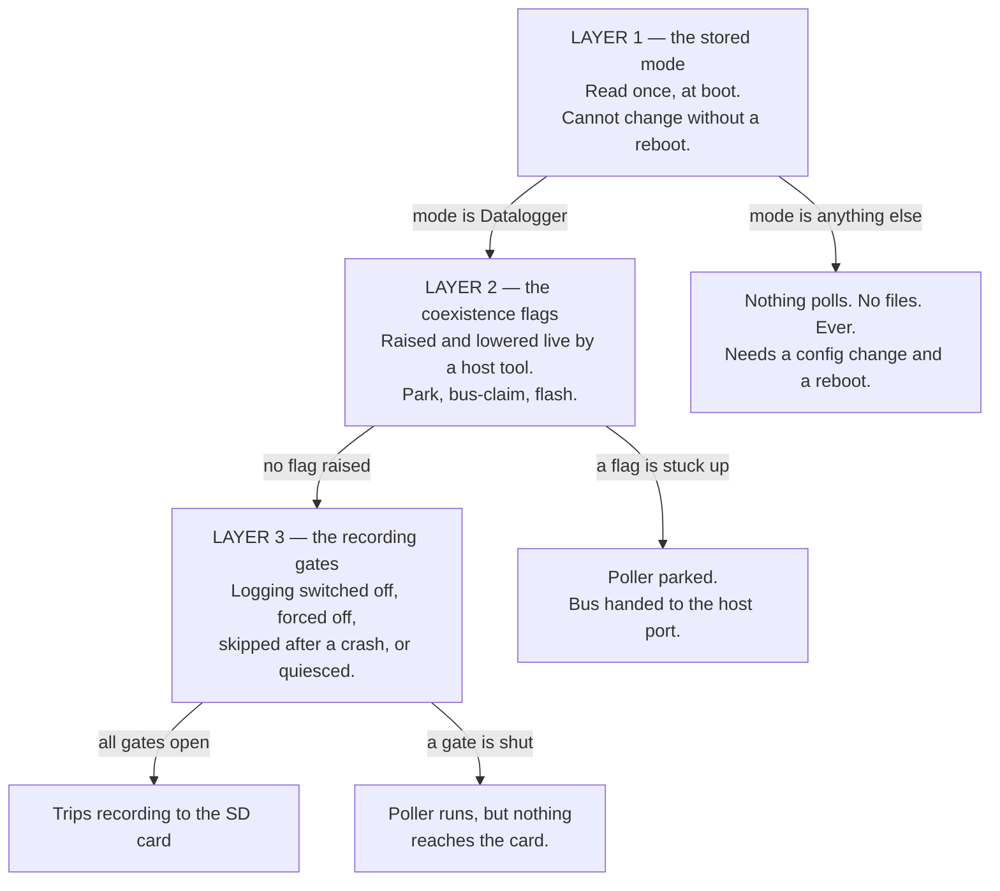
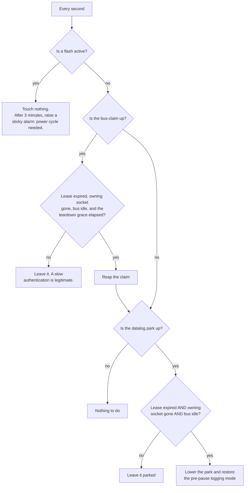

# Getting back to Datalogger mode

Everything that can stop this device running the Datalogger, and how to tell which one has it —
written in plain words, with no code names in the body. It is the companion to
[sleep-wake-cycle.md](sleep-wake-cycle.md), which describes the normal cycle when nothing is
blocking it. The last section says which files to open.

The Console page shows the running mode as a chip: **Datalogger**, **Passive Logger**, **OBD
App**, **Bench SLCAN**. "It went to Bench SLCAN and will not go back" is one of several
different failures that all look the same from that chip, so the first job is to work out which
layer is holding it.

## There are three layers, and each can strand the logger on its own



Layer 1 explains a chip that says **Bench SLCAN**. Layers 2 and 3 explain a chip that says
**Datalogger** while nothing is being recorded — which is the more confusing failure, because
everything *looks* right.

## Layer 1 — the stored mode

The mode is read from stored configuration **once, during boot**, and the choice is then frozen
for the whole uptime. Every consumer reads the resolved value rather than asking again, so
there is no runtime path that switches modes.

| Stored mode | What starts | Records trips? |
|---|---|---|
| **Datalogger** | The native poller: it owns the CAN controller, sweeps the configured channels, and decodes broadcast frames on the side. The trip writer is started too, if logging is enabled. | Yes |
| **Passive Logger** | The bus is brought up listen-only and broadcast frames are decoded. No requests are ever sent. | Only broadcast and calculated channels |
| **OBD App** | Host traffic is routed to the OBD interpreter chip for phone apps. | **No** |
| **Bench SLCAN** | Host traffic is routed as raw CAN frames to the primary TCP port. | **No** |

In **Bench SLCAN** and **OBD App**, neither the poller nor the trip writer is ever started. This
is not a gate that might reopen — the code that would create them does not run at all on that
boot. Nothing self-heals, no timeout expires, and no amount of driving changes it.

### Trap 1 — the mode selector is hidden in the web UI

The product always runs the Datalogger, so the selector is deliberately hidden. It still exists
in the page, and this is what matters: **the page reads the device's current mode into that
hidden control, and sends it straight back on every Save.** So once the stored mode is Bench
SLCAN, every Save from the web UI faithfully re-writes Bench SLCAN, and there is no visible
control anywhere to set it back.

The UI does notice. A yellow banner appears on the Logger page saying the current protocol
cannot record PIDs, and it tells you the recovery: download the configuration, edit the mode,
upload it back. That banner is the intended path and it works — see Recovery below.

### Trap 2 — SmartConnect silently overrides the mode

If the stored Wi-Fi mode is SmartConnect, the boot path **discards the stored mode entirely**
and forces OBD App (or the retired legacy poller). It does this unconditionally, and the value
it forces can never be the Datalogger.

So a device with the mode correctly stored as Datalogger will still record nothing if
SmartConnect is on. SmartConnect is not offered in the Wi-Fi mode list in the UI, so this can
only be reached by editing the configuration file directly — but a restored backup from another
device is exactly that.

### Trap 3 — the device reports the *stored* mode, not the running one

The status endpoint reports the mode string straight out of stored configuration. The
SmartConnect override happens after that value is read and is never written back.

**So under SmartConnect the Console chip says "Datalogger" while the device is running OBD App
and recording nothing.** The chip is not evidence in that case. Check the Wi-Fi mode as well
before believing it.

### What does *not* put it in Bench SLCAN

Worth stating, because it narrows the search:

- **Nothing in the firmware ever writes the mode.** No host tool, no flash session, no crash
  path, and no lease sets it. The only writer is a configuration save.
- **A factory reset lands on Datalogger.** The built-in default mode is Datalogger, so a config
  the parser rejects — which restores defaults — comes back recording. (Old commented-out
  defaults in the source say OBD App; they are dead and not used.)
- **Mode changes always reboot.** The mode is not on the list of settings that can be applied
  without one, so a save that changes it always schedules a reboot. There is no state where the
  stored mode and the running mode disagree, except the SmartConnect override above.

That leaves three realistic ways the stored mode became Bench SLCAN: a configuration file
uploaded from a backup that had it, a hand-edited configuration, or a Save made while the hidden
control was already holding that value from an earlier state.

## Layer 2 — the coexistence flags

This layer exists so a host tool (the ROM editor / NC Flash) can take the bus **without
rebooting the device**. It raises flags; the poller and the trip writer park on them. Three
separate flags, and they are deliberately not the same thing:

| Flag | Raised by | Lowered by | Lifetime |
|---|---|---|---|
| **Datalog park** | The host asking to pause the logger | The host resuming, or the reaper | 12-second lease, renewed by keepalives |
| **Host bus-claim** | The host opening a session, to fence the authentication window | The host releasing, or the reaper | 75-second lease (longer than a worst-case slow ECU reply) |
| **Flash active** | The flash/read codec itself, while it owns the bus | **The codec only** | No lease. No timeout. Never reaped. |

While any of them is up, the poller parks at the top of its loop and the main task takes over
the bus to forward frames to the host's port. Recording stops.

### The dead-man's reaper — and every reason it may refuse

A background task checks once a second whether it can safely put the logger back. It is
deliberately hard to satisfy, because resuming at the wrong moment can leave an engine computer
half-written.



Four conditions must hold together before a park is lifted automatically, and **any one of them
can hold the logger parked indefinitely**:

1. **The lease must have expired.** Twelve seconds without a keepalive. A host that keeps
   sending keepalives holds the park forever, by design.
2. **The owning socket must be gone.** This is the one that bites. The park remembers *which
   host connection* raised it, and while that same connection is still open the reaper treats
   the host as alive — no matter how long it has been silent. **A host tool that pauses the
   logger and then just sits there with its socket open, or a half-open connection the device
   never noticed dropping, parks the logger for as long as the socket lives.** The TTL does not
   save you here; both conditions must be true.
3. **The bus must be idle** for 300 milliseconds.
4. **For a claim only:** a 3-second teardown grace after expiry, so the ECU has dropped its
   programming session first.

### The flash flag is the one with no way out

The flash-active flag is the brick-safety guarantee, and **nothing clears it except the codec
that raised it**. Not the reaper, not the REST layer, not a lease expiry. That is intentional:
auto-clearing it could un-park the poller into the middle of an ECU write.

If a flash session dies with the flag up, the reaper waits three minutes, then raises a sticky
alarm and logs that a power cycle is required. The device will not resume logging until it is
power-cycled. The alarm is visible in the coexistence status.

### Trap 4 — the logger can come back with the bus but stay switched off

Pausing does two separate things: it raises the park flag **and** it forces the trip writer off,
remembering what mode it was in. Only the winner of the resume — either the host's resume call
or the reaper — restores that remembered mode.

If the park flag goes down some other way, the forced-off state can be left behind: the poller
sweeps normally, the Console looks healthy, and no file is ever opened.

This one **does** self-heal, but only on a specific condition: a forced-off writer reverts to
automatic once the **ignition is off** and the park flag is down. So it clears itself at the end
of the drive and the next key-on records normally — but it will not clear while you sit there
with the key on wondering why nothing is recording.

## Layer 3 — the recording gates

With the right mode and no flags up, these can still stop files being written:

- **Logging switched off.** The Logger page's master switch. The trip writer is never started at
  boot. The poller still runs, so live values look fine on the Console.
- **The engine gate.** With "require engine running" on, files only open while the engine is
  actually turning. On a bench PCM that reports zero rpm, this never opens — a manual Start from
  the Console is the intended way to record there.
- **Bring-up skipped after a crash.** The poller and the writer each arm a flag before their
  risky start-up and clear it once stable. If a boot finds the flag still armed, that subsystem
  is **skipped for the whole boot** and the flag is disarmed so the next boot retries. A device
  that crashed once during start-up therefore runs with the logger silently dead until it
  reboots — observed live, for hours. This is also why a wake from sleep reboots instead of
  resuming when any of these flags is set: see [sleep-wake-cycle.md](sleep-wake-cycle.md),
  block C step 0.
- **The bus is quiesced.** With the ECU silent the poller drops to listen-only and stops
  transmitting. This self-heals: any received frame resumes it, and after ten minutes of total
  silence it flips back once anyway.
- **The sleep fence never dropped.** The fence is raised on the way into sleep and lowered by the
  resume. A resume that fails hands over to a reboot, which clears it — so this should not
  persist, but a fence that is up with the device awake would park every bus producer exactly
  like a host park.

## Diagnosing it

Ask the device three questions, in this order.

**1. What mode does it think it is in, and is SmartConnect on?**

```sh
curl -s http://<device-ip>/check_status
```

Read `protocol` and `wifi_mode`. If `protocol` is anything but `poll_log`, it is Layer 1. If
`wifi_mode` is `SmartConnect`, it is Layer 1 regardless of what `protocol` says.

**2. Is a coexistence flag holding it?**

```sh
curl -s "http://<device-ip>/datalog?op=status"
```

| Field | What it means when set |
|---|---|
| `flash_active` | A flash owns the bus. Nothing else can run. Only the codec can clear it. |
| `stuck_flash_alarm` | The flash has been stuck over three minutes. **Power-cycle the device.** |
| `host_bus_claimed` | A host session is fencing the bus |
| `datalog_parked` | The logger is parked for a host session |
| `manual_mode` | `off` means the writer is forced off — the trap above |
| `park_token` / `claim_token` | Non-null means that lease is armed |
| `bus_idle_ms` | Must reach 300 before the reaper will act |

**3. Is the poller running, and is anything reaching the card?**

```sh
curl -s http://<device-ip>/poll_status
curl -s http://<device-ip>/csv_status
```

The event log is usually faster than any of this: a park, a claim, an auto-resume, an
ignition/engine edge and every file open and close all write a line.

## Recovery

**Stuck in Bench SLCAN or OBD App** — the only fix is a configuration change plus a reboot:

1. System page → download the configuration (or `GET /load_config`).
2. Edit `"protocol"` to `"poll_log"`. While you are in there, confirm `"wifi_mode"` is not
   `"SmartConnect"`.
3. Upload it back (System page, or `POST /store_config`). The device reboots itself, because the
   mode is not a setting that can be applied live.

Do not try to fix this from the Settings page — the hidden control will just re-send the wrong
value.

**Parked with a live host socket** — release it explicitly. A resume with **no token** is
accepted unconditionally, which is the manual override:

```sh
curl -s -X POST "http://<device-ip>/datalog?op=resume"
curl -s -X POST "http://<device-ip>/datalog?op=bus_release"
```

The first lowers the park and restores the remembered logging mode; the second drops a stuck
bus-claim. Then close whatever is still connected to the host port, or the next pause will hold
just as long.

**Stuck flash flag** — power-cycle. There is no software path, deliberately.

**Bring-up skipped after a crash** — reboot. The flag was already disarmed, so the next boot
retries the subsystem.

**Nothing recording but the poller is fine** — check the Logger master switch and the
`manual_mode` field. A forced-off writer clears itself once the ignition goes off.

## Everything that can prevent the return, ranked

| # | Cause | Self-heals? | Fix |
|---|---|---|---|
| 1 | Flash-active flag stuck up | Never | Power cycle |
| 2 | Stored mode is Bench SLCAN or OBD App | Never | Edit config, reboot |
| 3 | SmartConnect forcing the mode at boot | Never | Edit config, reboot |
| 4 | Park or claim held by a live host socket | Only when that socket closes | Resume with no token |
| 5 | Bring-up skipped after a crash | Next reboot only | Reboot |
| 6 | Writer left forced off after a pause | At the next ignition-off | Resume, or turn the key off |
| 7 | Logging master switch off | Never | Logger page |
| 8 | Engine gate never opens (bench) | Never on a bench | Manual Start, or turn the gate off |
| 9 | Bus quiesced | Yes, on any frame or after 10 min | Nothing |

## Where this lives in the code

| Layer | File |
|---|---|
| The stored mode, the SmartConnect override, and what each mode starts | `main/main.c` |
| Mode strings, the live-apply whitelist, defaults, and the status report | `main/config_server.c` |
| The park and claim leases, the flags every producer parks on | `main/can.c` |
| The reaper: when a park or claim may be lifted automatically | `main/datalog_lease_task.c` |
| The pause/resume endpoint and the remembered logging mode | `components/csv_logger/csv_logger.c` |
| The forced-off self-heal rule | `components/csv_logger/csv_bringup_logic.c` |
| The poller's own park check and quiesce | `components/fast_log/poll_log.c` |
| The always-on host port and its connection generation | `main/slcan_port.c` |
