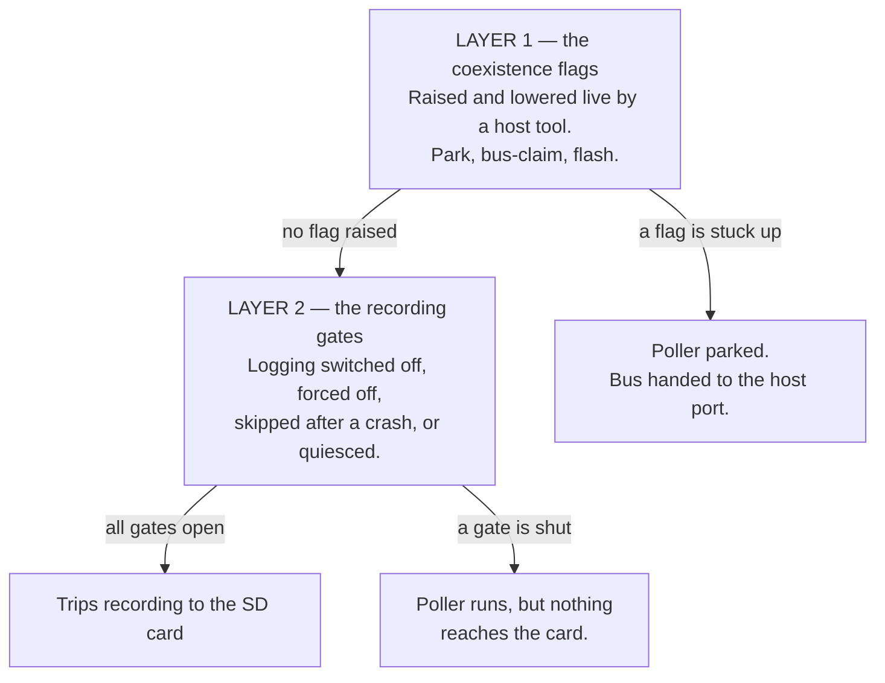
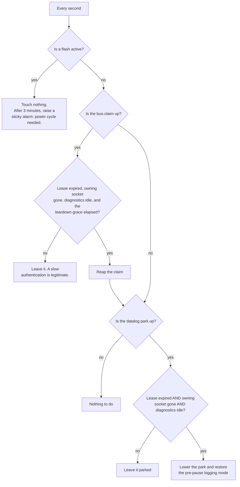

# Why is this device not recording?

Everything that can stop this device writing trips to the SD card, and how to tell which one has
it — written in plain words, with no code names in the body. It is the companion to
[sleep-wake-cycle.md](sleep-wake-cycle.md), which describes the normal cycle when nothing is
blocking it. The last section says which files to open.

The Console page shows a mode chip. It always says **Datalogger**, because that is the only mode
this device has. It is a label, not a reading — so it tells you nothing about why recording
stopped. Everything below is what can actually stop it.

## One thing that used to be here is gone

The device used to have a stored *mode*, chosen by a `protocol` key in the configuration file.
It could be left in Bench SLCAN, OBD App or Passive Logger, and in three of those four modes the
logger never started at all. That was issue #92, and the usual cause was a wireless flash session
that never put the mode back.

**That whole failure class no longer exists.** The mode field was removed in v1.23.0. The device
compiles in the Datalogger and nothing — no config file, no backup restore, no host tool, no hand
edit — can select anything else. The SmartConnect override that used to force a different mode at
boot is gone with it. `main/main.c` and the comment beside the parse site in `main/config_server.c`
both spell this out.

### Do not try to "fix" the device by editing `protocol`, `port` or `port_type`

Those three keys are still written into `config.json`, at fixed values (`poll_log`, `35000`,
`tcp`). **They do nothing on this firmware.** The parser does not read them and no code looks them
up. They are written for exactly one reason: if this device is ever rolled back to v1.22.x or
older, that older parser *requires* all three, and a missing required key makes it delete
`config.json` and factory-reset the device — Wi-Fi credentials gone, device off the owner's
network. Keeping the words there means a rollback is survivable.

A downloaded backup also carries a `_deprecated` note saying the same thing. Both halves of this
shim — the reply side in `main/config_server.c` and `PASSTHROUGH_KEYS` in `main/web/src/main.js` —
are scheduled for deletion in v1.25.0, together.

Editing any of them changes nothing. If the device is not recording, the cause is below.

[bench-slcan-strand-2026-08.md](bench-slcan-strand-2026-08.md) is the dated record of the #92
investigation. It is history now: the bug was removed rather than repaired.

## Two layers, and each can stop the logger on its own



Both layers look the same from the outside: the Console says Datalogger, live values may even look
fine, and no file is ever written.

## Layer 1 — the coexistence flags

This layer exists so a host tool (NC Flash on the PC) can take the bus **without rebooting the
device**. It raises flags; the poller and the trip writer park on them. Three separate flags, and
they are deliberately not the same thing:

| Flag | Raised by | Lowered by | Lifetime |
|---|---|---|---|
| **Datalog park** | The host asking to pause the logger | The host resuming, or the reaper | 12-second lease, renewed by keepalives |
| **Host bus-claim** | The host opening a session, to fence the authentication window | The host releasing, or the reaper | 75-second lease (longer than a worst-case slow ECU reply) |
| **Flash active** | The flash/read codec itself, while it owns the bus | **The codec only** | No lease. No timeout. Never reaped. |

While any of them is up, the poller parks at the top of its loop and the main task takes over the
bus to forward frames to the host. Recording stops.

The host reaches the device on a fixed, always-on listener on port 35001 (`main/slcan_port.c`).
That port is not configurable and is never switched off. NC Flash v2.9.0 and newer use it; v2.8.0
and older cannot reach this firmware at all.

### The dead-man's reaper — and when it refuses

A background task checks once a second whether it can safely put the logger back. It is
deliberately hard to satisfy, because resuming at the wrong moment can leave an engine computer
half-written.



Three conditions must hold together before a park is lifted automatically, and **any one of them
can hold the logger parked**:

1. **The lease must have expired.** Twelve seconds without a keepalive. A host that keeps sending
   keepalives holds the park forever, by design.
2. **The owning socket must be gone.** This is the one that bites. The park remembers *which host
   connection* raised it, and while that same connection is still open the reaper treats the host
   as alive — no matter how long it has been silent. **A host tool that pauses the logger and then
   just sits there with its socket open, or a half-open connection the device never noticed
   dropping, parks the logger for as long as the socket lives.** The lease expiring does not save
   you here; both conditions must be true.
3. **The diagnostic conversation must be quiet** for 300 milliseconds. Note *diagnostic*, not
   *bus*. This used to be raw bus idle, which on a running powertrain bus is essentially never —
   so the reaper could never fire while driving, which was issue #70. It now measures only our own
   requests and the ECU's replies (`can_diag_idle_ms()`), so a busy bus with no diagnostics in
   flight counts as quiet and the reaper works with the engine running. Fixed in v1.22.2, issues
   #131 and #70.

For a bus-claim there is a fourth condition: a 3-second teardown grace after expiry, so the ECU
has dropped its programming session first.

Both reaps are compare-and-act: if the host renews or re-arms the lease in the gap between the
check and the reap, the reap aborts. A live session is never destroyed by a race.

### The flash flag is the one with no way out

The flash-active flag is the brick-safety guarantee, and **nothing clears it except the codec that
raised it**. Not the reaper, not the web layer, not a lease expiry. That is intentional:
auto-clearing it could un-park the poller into the middle of an ECU write.

If a flash session dies with the flag up, the reaper waits three minutes, then raises a sticky
alarm and logs that a power cycle is required. The device will not resume logging until it is
power-cycled. The alarm is visible in the coexistence status as `stuck_flash_alarm`.

### Trap — the logger can come back with the bus but stay switched off

Pausing does two separate things: it raises the park flag **and** it forces the trip writer off,
remembering what mode it was in. Only the winner of the resume — either the host's resume call or
the reaper — restores that remembered mode.

If the park flag goes down some other way, the forced-off state can be left behind: the poller
sweeps normally, the Console looks healthy, and no file is ever opened.

This one **does** self-heal, but only on a specific condition: a forced-off writer reverts to
automatic once the **trip is over** (ECU silent, voltage ignition off, or going to sleep) and the
park flag is down (`csv_manual_mode_next()`). So it clears itself at the end of the drive and the
next key-on records normally — but it will not clear while you sit there with the key on
wondering why nothing is recording.

## Layer 2 — the recording gates

With no flags up, these can still stop files being written:

- **Logging switched off.** The Logger page's master switch. The trip writer is never started at
  boot. The poller still runs, so live values look fine on the Console.
- **The engine gate.** "Require engine running" is on by default, so files only open while the
  engine is actually turning — the ECU answering, not just voltage. On a bench PCM that reports
  zero rpm, this never opens; a manual Start from the Console is the intended way to record there.
- **Bring-up skipped after a crash.** The poller and the writer each arm a flag before their risky
  start-up and clear it once stable. If a boot finds the flag still armed, that subsystem is
  **skipped for the whole boot** and the flag is disarmed so the next boot retries. A device that
  crashed once during start-up therefore runs with the logger silently dead until it reboots —
  observed live, for hours. This is also why a wake from sleep reboots instead of resuming when any
  of these flags is set: see [sleep-wake-cycle.md](sleep-wake-cycle.md), block C step 0.
- **The bus is quiesced.** With the ECU silent the poller drops to listen-only and stops
  transmitting. This self-heals: any received frame resumes it, and after ten minutes of total
  silence it flips back once anyway.
- **The sleep fence never dropped.** The fence is raised on the way into sleep and lowered by the
  resume. A resume that fails hands over to a reboot, which clears it — so this should not persist,
  but a fence that is up with the device awake would park every bus producer exactly like a host
  park.
- **A firmware upload failed** (issue #69). The upload endpoint switches the CAN controller off
  *before* it reads the request, and **only the success path reboots**. Every failure path returns
  an error with the controller still off, so the device keeps serving the web UI, still answers
  status, and has silently stopped talking to the car until someone reboots it. Still present:
  `can_disable()` runs at `main/config_server.c:1962`, above the filename checks that return
  `ESP_FAIL` without rebooting. Even a malformed filename trips it. The realistic trigger is the
  documented one — posting the image as a raw body instead of a multipart form — which returns a
  plain 500 and looks like nothing else happened.

## Diagnosing it

Ask the device two questions, in this order.

**1. Is a coexistence flag holding it?**

```sh
curl -s "http://<device-ip>/datalog?op=status"
```

| Field | What it means when set |
|---|---|
| `flash_active` | A flash owns the bus. Nothing else can run. Only the codec can clear it. |
| `stuck_flash_alarm` | The flash has been stuck over three minutes. **Power-cycle the device.** |
| `host_bus_claimed` | A host session is fencing the bus |
| `datalog_parked` | The logger is parked for a host session |
| `manual_mode` | `off` means the writer is forced off — the trap above |
| `park_token` / `claim_token` | Non-null means that lease is armed |
| `diag_idle_ms` | What the reaper gates on. Must reach 300. |
| `bus_idle_ms` | Raw bus traffic. Kept for compatibility — the reaper does **not** use it. |

**2. Is the poller running, and is anything reaching the card?**

```sh
curl -s http://<device-ip>/poll_status
curl -s http://<device-ip>/csv_status
```

The event log is usually faster than either: a park, a claim, an auto-resume, an ignition/engine
edge and every file open and close all write a line. A host claim or park with no matching
release/resume line after it is the signature of a dead host session.

## Recovery

**Parked with a live host socket** — release it explicitly. A release with **no token** is accepted
unconditionally, and is idempotent if the lease was already gone. This is the manual override:

```sh
curl -s -X POST "http://<device-ip>/datalog?op=resume"
curl -s -X POST "http://<device-ip>/datalog?op=bus_release"
```

The first lowers the park and restores the remembered logging mode; the second drops a stuck
bus-claim. Then close whatever is still connected to port 35001, or the next pause will hold just
as long.

**Stuck flash flag** — power-cycle. There is no software path, deliberately.

**Bring-up skipped after a crash** — reboot. The flag was already disarmed, so the next boot
retries the subsystem.

**Failed firmware upload** — reboot. Nothing brings the CAN controller back without one.

**Nothing recording but the poller is fine** — check the Logger master switch and the `manual_mode`
field. A forced-off writer clears itself once the ignition goes off.

## Everything that can stop it, ranked

| # | Cause | Self-heals? | Fix | Issue |
|---|---|---|---|---|
| 1 | Flash-active flag stuck up | Never | Power cycle | — |
| 2 | Failed firmware upload left the bus switched off | Never | Reboot | #69 |
| 3 | Park or claim held by a still-open host socket | Only when that socket closes | Resume with no token | — |
| 4 | Bring-up skipped after a crash | Next reboot only | Reboot | — |
| 5 | Writer left forced off after a pause | At the next ignition-off | Resume, or turn the key off | — |
| 6 | Logging master switch off | Never | Logger page | — |
| 7 | Engine gate never opens (bench) | Never on a bench | Manual Start, or turn the gate off | — |
| 8 | Sleep fence left up | Should not persist (a failed resume reboots) | Reboot | — |
| 9 | Bus quiesced | Yes, on any frame or after 10 min | Nothing | — |

## Where this lives in the code

| Thing | File |
|---|---|
| One mode, compiled in; what bring-up starts | `main/main.c` |
| The deprecated-key shim, the status report, the upload endpoint | `main/config_server.c` |
| The park and claim leases, the flags every producer parks on, the sleep fence | `main/can.c`, `main/can.h` |
| The reaper: when a park or claim may be lifted automatically | `main/datalog_lease_task.c` |
| The pause/resume endpoint and the remembered logging mode | `components/csv_logger/csv_logger.c` |
| The forced-off self-heal rule and the crash-guard decision | `components/csv_logger/csv_bringup_logic.c` |
| The poller's own park check and quiesce | `components/fast_log/poll_log.c` |
| The always-on host port and its connection generation | `main/slcan_port.c` |
