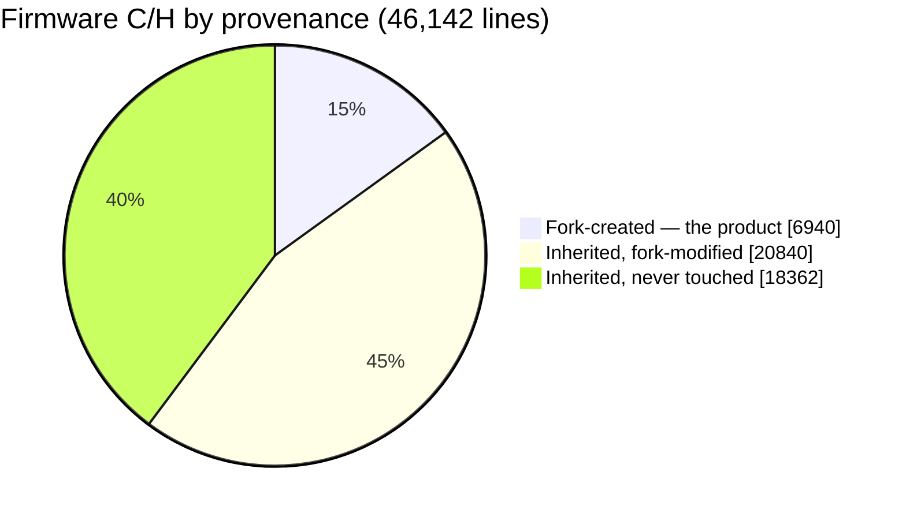
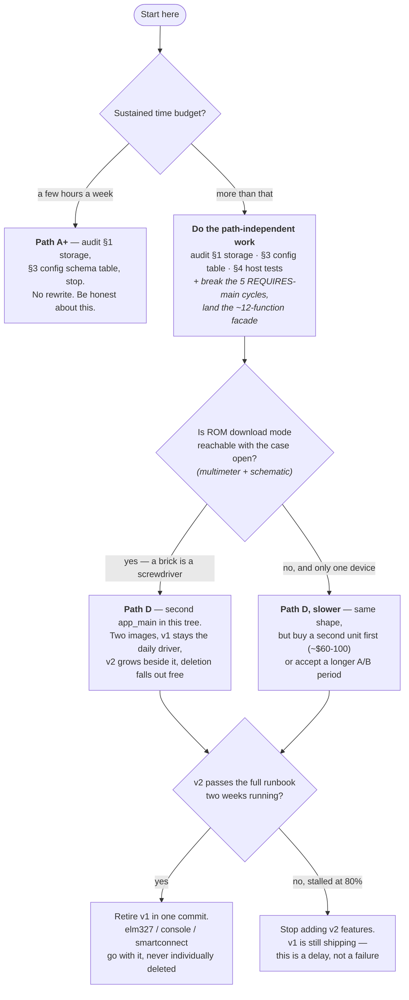

# Keep, trim, or rebuild? — a decision brief

**Dated 2026-07-26. Measured against `chore/28-architecture-map` (v1.17.0 build).**
Read [architecture.md](architecture.md) first for how the system works, and
[audit-2026-07.md](audit-2026-07.md) for the defect ledger. This document answers a
different question: **is the right next move to keep evolving this tree, or to design
v2 from scratch now that we know what the product actually is?**

This is a brief, not a verdict. It ends with a recommendation and — more usefully — a
list of the specific facts that would change that recommendation.

---

> **Revised 2026-07-26 after adversarial review.** The first draft of this brief
> recommended "path B — subtractive rebuild in place." That recommendation does
> not survive its own evidence, and §9 records exactly what broke and why. The
> recommendation is now **path D** (§4). Three of the first draft's load-bearing
> claims were wrong: the deletion target, the PPSW experiment design, and the
> ordering — which contradicted [audit-2026-07.md](audit-2026-07.md):197-198,
> my own document. I have left the errors visible rather than quietly editing
> them out, because the *reasons* they were wrong are the most useful content
> here.

---

## 0. The short version

The instinct behind "maybe rebuild" is correct, but it is aimed at the wrong target.

The pain in this codebase is **not** distributed across 46,000 lines, and it is **not**
mostly the dead code:

| Where it hurts | Lines | Who wrote it | What actually fixes it |
|---|---|---|---|
| **Coupling** — 5 components declare `REQUIRES main`, so no firmware logic can be tested off-device at all | structural | fork + inherited | Break the cycles behind a **~12-function facade** (§4, path D) |
| The config model (839-line hand-rolled parser, 51 flat keys, 12 remote-panic sites) | ~900 | inherited, fork-extended | A schema table — audit §3 |
| The web UI (one 4,359-line `main.js`) | ~4,400 | ~59% fork | Modules with real boundaries |
| **Interleaving** — `can.c` 42% fork, `autopid.c` 44%, `config_server.c` 21%: you need `git blame` to know if a line is trustworthy | ~12,000 | mixed | Only a rewrite of those files |
| Dead product surface (ELM327, console, SLCAN, IMU, SmartConnect…) | **~8-10k realistically**, not the ~26k I first claimed | inherited | Falls out free when v1 retires |

The first four are what cost you. **Deletion is last**, which is also exactly where
[audit-2026-07.md](audit-2026-07.md):197-198 puts it — a fact the first draft of this
brief managed to contradict.

**Recommendation: path D — extract the product, then grow v2 beside v1** (§4).

1. **Now, and independent of the decision:** fix storage (audit §1 — the defect that
   eats the product's only deliverable), replace the config parser with a schema table
   (audit §3), and build host tests (audit §4). While doing the tests, **break the five
   `main` dependency cycles and land a platform facade** — measured below at *four call
   sites, three functions*, plus the `can_*` lease API and a voltage peek. The tests
   force that boundary into existence anyway.
2. **Then:** a second `app_main` in the same repo. Two images from one tree — v1 stays
   the daily driver while v2 grows: designed task topology, a dispatch table, the
   guardrail files ported verbatim, the fork's components running on the facade. The
   bench A/Bs them by OTA. v2 ships when it passes the runbook two weeks running.
3. **Deletion happens implicitly.** v2 never references `elm327`, `console`,
   `smartconnect`. When v1 retires, one commit removes it. Nobody bench-tests two dozen
   janitorial PRs.

**Why not the subtractive rebuild I first recommended.** Three reasons, all of them
things my own documents already said:

- **The deletion target was wrong.** I claimed ~46,000 → ~20,000 lines. The honest
  ledger is **~8-10k**, i.e. ~20%, not 55% — `obd2_standard_pids.h` (3,654 lines) is
  *live*, `sleep_mode.c` is partly live, BLE contradicts a recorded keep decision, and
  ELM327 is entangled with PPSW. See §4, path B.
- **It leads with the work my own audit ranks last.**
  [audit-2026-07.md](audit-2026-07.md):197-198 says dead code is the *"Lowest-value
  tier... **Do this after §1, §3 and §4**, not before."* The decision brief promoted it
  to stage 1. That contradiction is the clearest evidence of motivated reasoning in this
  document, and I did not spot it myself.
- **Deletion doesn't touch what actually costs.** The comprehension tax is in the
  *interleaved* files — `can.c` 42% fork, `autopid.c` 44%, `config_server.c` 21%,
  `main.js` 59% — where you need `git blame` to know whether a line is trustworthy.
  Stage 1 deletes inert lines and leaves every one of those.

**The PPSW experiment as I first designed it does not work** — see §3. It is also
unnecessary: carry a ~40-line "ensure PPSW=10, sleep the chip" shim into v2 and delete
the other ~3,300 lines plus the 494 KB blob without answering the scary question.

The honest counter-argument is in §6, and §9 records what the review changed.

---

## 1. What we actually own — measured, not estimated

Provenance, computed against `upstream/wican-pro` (divergence point `77e1a19`,
2026-04-12; upstream has 4 commits since that we have not taken):

```
180 fork commits    138 Charles Dufresne · 29 NyxOne · 13 Claude
```

Firmware C/H under `main/` + `components/` — **46,142 lines across 133 files**:

| Bucket | Lines | % | Files |
|---|---:|---:|---:|
| **Fork-created** (does not exist upstream) | 6,940 | 15.0% | 22 |
| **Inherited, fork-modified** | 20,840 | 45.2% | 27 |
| **Inherited, never touched** | 18,362 | 39.8% | 84 |



Plus the web UI: `main/web/src/main.js` is 4,359 lines, of which the fork rewrote most
(+2,556 / −3,687 against upstream), and `homepage_full.html` 1,847 lines (+1,335 / −1,719).

### The 6,940 lines that *are* the product

Everything in this list was written for this fork and exists nowhere upstream. It is
also, not coincidentally, the code the Datalogger cannot run without:

```
1,476  components/csv_logger/csv_logger.c    wide-CSV trip logger, fixed-rate grid
1,423  components/fast_log/poll_log.c        POLL_LOG: free-running polling + broadcast capture
  575  components/sd_filemgr/sd_filemgr.c    SD file manager HTTP surface
  573  main/ncflash_fastwrite.c              NC Flash write codec
  538  components/event_log/event_log.c      on-device event log
  419  main/ncflash_fastread.c               NC Flash read codec
  298  main/slcan_port.c                     SLCAN port
  271  main/led_indicator.c                  LED state machine
  263  components/fast_log/fast_log.c        ring buffer behind poll_log
  151  main/datalog_lease_task.c             coexistence lease / dead-man's switch
  145  components/crash_report/crash_report.c panic backtrace over Wi-Fi
  ...  + headers
```

### The "modified" bucket is not homogeneous

"Inherited, fork-modified" spans everything from a two-line tweak to a near-rewrite.
Fork share of current content, by churn:

| File | Now | Fork churn vs upstream | Fork share |
|---|---:|---|---:|
| `main/web/src/main.js` | 4,359 | +2,556 / −3,687 | ~59% |
| `components/autopid/autopid.c` | 3,204 | +1,400 / −2,817 | ~44% |
| `main/can.c` | 700 | +291 / −2 | ~42% |
| `main/config_server.c` | 3,718 | +767 / −1,320 | ~21% |
| `main/main.c` | 1,190 | +238 / −225 | ~20% |

So the practical picture is: **~12,000 lines of firmware are effectively ours**
(fork-created plus the fork-written share of the heavily-modified files), sitting inside
a ~34,000-line general-purpose OBD-dongle firmware we inherited and mostly do not use.

### Where the defects actually live — and why that is a weaker argument than it looks

Attributing every defect in [audit-2026-07.md](audit-2026-07.md) by `git blame` on the
offending line:

| Defect | File | Line authored by |
|---|---|---|
| 2.1 parser NULL panic (#68) | `config_server.c` | upstream |
| 2.2 failed OTA leaves CAN off (#69) | `config_server.c:1698, :1743` | upstream (`92b769e6`, `1878aec3`) |
| 2.4 `ecu_status` always offline | `autopid.c` | upstream |
| 2.5 credentials logged at INFO | `config_server.c` | upstream |
| 2.6 `app_main` returns on alloc failure | `main.c` | upstream |
| 2.7 rollback theatre | `main.c` | upstream |
| §1 SD reformats on FAT corruption (#71) | `sdcard.c:198` | upstream (`b0b4038d`) |
| **2.3 dead-man's switch inoperative (#70)** | `datalog_lease_task.c` | **fork** |
| **#67 sweep predictor assumes uniform PID cost** | `main.js` | **fork** |

Eight of ten in inherited code. That looks like a clean argument for "the inherited code
is the problem" — **and I do not think you should lean on it**, for two reasons.

First, **the audit was not uniformly distributed.** It concentrated on the code that
actually runs. The 18,362 untouched inherited lines score well on defect count mostly
because nobody looked at them, and nobody looked because they never execute. That is a
selection artifact, not a quality signal.

Second, **the two fork-authored defects are the more serious kind.** The upstream ones
are mostly sloppiness — a missing NULL check, a log line with a password in it, an early
return. Each is a local fix. The fork's two are *design* errors: a dead-man's switch
whose triggering condition can never occur on a running engine, and a scheduler
predictor built on an assumption (uniform per-PID cost) that mode 22/23 violates by ~7x.
Those are the failures a rewrite does **not** protect you from, because you would carry
the same reasoning into v2. Writing the code again does not make you think differently
about it.

---

## 2. What the hardware budget says

This matters because "we're running out of room" is the classic reason to rebuild, and
here it is simply **not true**.

From `idf.py size` on the v1.17.0 build:

| Resource | Used | Total | Headroom |
|---|---:|---:|---|
| App image | 2,743,616 B | 5,169,152 B (partition) | **47% free** |
| DIRAM (static) | 227,779 B | 341,760 B | 113,981 B free (66.7% used) |
| Flash code | 1,359,402 B | — | — |
| Flash data | 1,252,548 B | — | — |

Where the flash actually goes:

| Item | Flash | Note |
|---|---:|---|
| `obd_fw/V2.3.22.txt` (MIC3624 chip firmware, embedded) | 494,260 | **18% of the whole image** |
| Web UI (`main.js` 210,571 + `homepage.html` 44,450 + `lucide_icons.js` 14,840) | 269,861 | 10% |
| `libnet80211.a` + `liblwip.a` + `libpp.a` + `libwpa_supplicant.a` | 381,485 | Wi-Fi + TCP/IP, load-bearing |
| `libbt.a` + `libbtdm_app.a` (Bluetooth) | 319,977 | BLE, kept deliberately |
| `libmain.a` flash **code** — *all* of `main/` | 107,247 | see below |
| `libautopid.a` | 51,513 | |
| `libfast_log.a` | 8,442 | but 17,573 B of DIRAM |

**Read that fifth row again.** Every line of C in `main/` — all 31,002 of them —
compiles to 107 KB of flash code. Deleting ELM327, SLCAN, sleep mode, the IMU and the
console would recover a *fraction* of that. **Source deletion is not a flash-budget
argument.** The flash is spent on embedded blobs, and the two biggest blobs are the OBD
chip firmware and the web UI.

The real budget pressure is **internal RAM**: 114 KB of DIRAM free, and the top
consumers are *ours*, not upstream's — `libfast_log.a` alone holds 17,573 B (17,567 of
it `.bss`, the capture ring), `event_log` ~12.9 KB, `ncflash_fastwrite` ~6.2 KB. A
rewrite would not shrink those; they are the product.

**Conclusion: the hardware is not asking for a rewrite.** A rewrite would be for
human reasons — comprehension, maintainability, velocity — not machine ones. That is a
legitimate reason, but it should be named honestly.

---

## 3. What the product actually is

Worth stating plainly, because it is the thing the inherited code disagrees with.

- **One vehicle.** Mazda NC Miata. No vehicle profiles, no car-model dispatch.
- **One protocol on the wire.** POLL_LOG. Not ELM327, not SLCAN, not MQTT.
- **One job.** Log PIDs to CSV on an SD card, fast and without bricking the PCM; plus
  read/write the PCM ROM (NC Flash).
- **One UI.** A web page served off the device.

Against that, the inherited firmware ships: an ELM327 emulator (3,353 lines), a
BLE serial bridge (1,563), an SLCAN bridge (645), a WebSocket/TCP comm server (549),
MQTT, SmartConnect (733), a duplicate serial console (1,166), an IMU driver
(729 + 606 header), sleep-mode voltage management (1,246), and a 3,654-line generic
OBD-II PID table. Most of that has been true dead weight since the product became a
single-vehicle datalogger.

**51 config keys** live in `/littlefs/config.json`. Of those, 20 are live-appliable
(`LIVE_APPLY_WHITELIST`); at least 9 (`batt_alert_*`) are inert because the parser
force-disables the feature; and a large block (`ble_*`, `sta_*`, `ap_*`, `home_*`,
`drive_*`, `periodic_wakeup`, `sleep_*`) describes a multi-protocol dongle rather than a
datalogger.

**25 HTTP endpoints** are registered. Roughly two-thirds serve the datalogger; the rest
are upstream's dongle-configuration surface.

**The UI is in better shape than the ledger suggests.** Of 11 elements marked
`display:none` in `homepage_full.html`, nine are ordinary runtime-conditional UI. Only
**two** are permanently hidden dead surface: `ble_section` and `wakeup_every_row`, with
zero references in `main.js`. Whatever else is wrong with a 4,359-line `main.js`, it is
not carrying a graveyard — which weakens the "the UI has accreted beyond saving" version
of the rewrite argument. Its problem is structure, not dead weight.

### The one that is not dead: the MIC3624 / ELM327 path

I went in expecting to find this deletable. It is the single largest deletion candidate
in the tree — and it is the one place where "unused by the product" and "safe to remove"
come apart. Worth its own subsection, because it dominates the cleanup arithmetic.

**The datalogger does not use it.** `poll_log` polls over the ESP32's own TWAI
controller — `can_send()` / `can_receive()` throughout `poll_log.c` — and so do the NC
Flash codecs. TWAI has its own transceiver on its own pins (`TX_GPIO_NUM`,
`RX_GPIO_NUM`, `CAN_STDBY_GPIO_NUM`, `hw_config.h:57-63`). The external chip serves the
ELM327 emulation for third-party apps, which this product does not ship.

**But it initialises unconditionally on every boot** — `elm327_init()` is called from
`app_main` on `HARDWARE_VER == WICAN_PRO` (`main.c:898`), outside any protocol check —
and the measured cost is not small:

| Cost | Amount | Where |
|---|---:|---|
| UART1 RX + TX ring buffers (`UART_BUF_SIZE` = 18 KB each) | ~36 KB internal RAM | `obd.h:21`, `elm327.c:3270` |
| Two task stacks, explicitly `MALLOC_CAP_INTERNAL` | 16 KB internal RAM | `elm327.c:3310-3313` |
| Embedded chip firmware `V2.3.22.txt` | 494,260 B flash | `main/CMakeLists.txt:100` |
| Boot latency: hard reset, firmware version check, readiness poll | up to ~2 s | `elm327.c:3280-3301` |
| Source | 3,353 lines | `main/elm327.c` |

**~52 KB of internal RAM** — against 114 KB of DIRAM headroom — plus 18% of the flash
image, for a subsystem the product never polls through.

**And yet I cannot tell you it is safe to delete.** `elm327_init()` calls
`elm327_powerpin_commands()`, which sets the chip's **PPSW** ("programmable power
switch") to `10` (`elm327.c:1392-1432`). `PPSW` is a MIC3624 vendor command and it is
**undocumented anywhere in this tree** — seven occurrences, all in that one function, no
comment explaining what it switches. On multi-protocol dongles a programmable pin switch
typically routes OBD-II connector pins to a transceiver. If PPSW=10 is what connects
CAN-H/CAN-L to the TWAI transceiver, then removing this "dead" subsystem silently kills
the datalogger.

> ### ⚠️ The obvious experiment does not work — and this is the interesting part
>
> My first draft proposed: comment out `elm327_powerpin_commands()`, flash, see whether
> polling still works. **That experiment is invalid**, and the code says why.
>
> Read `elm327.c:1415-1436`. It is **check-then-set**: send `VTPPSWS`, and write
> `VTPPSW10` *only if the readback isn't already 10* — then hard-reset the chip. A
> check-then-set with an "already 10" fast path only makes sense if **the setting
> persists inside the MIC3624**. The bench unit has booted the writing firmware
> hundreds of times, so its chip already holds 10.
>
> Therefore skipping the call and observing that polling still works proves **nothing**.
> It would report "safe to delete" even if PPSW=10 were strictly required, because
> nothing reset it. It measures the state of one already-configured chip, not the
> dependency.
>
> A valid experiment needs either a **factory-fresh unit**, or a deliberate PPSW reset
> to a non-10 value first — writing an undocumented vendor register on the one device
> that works, which is exactly the kind of thing that turns a bench into a paperweight.

**So do not gate anything on it.** The question decouples from the deletion entirely:

**Keep a ~40-line shim** — take the UART, `VTPPSWS`, write `VTPPSW10` if needed,
hard-reset, then put the chip to sleep — and delete the other ~3,300 lines of
`elm327.c` and the 494,260 B firmware-update blob. You get essentially the whole win
without answering the scary question, and the shim is small enough to read in one
sitting and comment properly at the call site.

Settle the register question opportunistically, on a fresh unit, if one ever exists. It
is a curiosity, not a blocker. **My first draft made it "the top recommendation" and
said "everything else waits on it" — that was wrong, and conveniently so: it put a fun
one-hour bench experiment in front of the grinding config-parser rewrite that the audit
actually ranks first.**

It is also the perfect illustration of why path C is riskier than it looks: a greenfield
would have to *rediscover* PPSW from scratch, on a device with no serial console, with
the symptom "CAN doesn't work" and no obvious cause.

---

## 4. The four paths

### Path A — Evolve as-is

Work the defect ledger ([audit-2026-07.md](audit-2026-07.md)), leave the structure alone.

- **Cost:** low. Days, incremental, always shippable.
- **Buys:** the security and correctness fixes. Nothing structural.
- **Leaves:** 18,000 lines of dead surface, the 839-line parser, the 4,359-line `main.js`.
- **Failure mode:** every future feature keeps paying the comprehension tax. This is the
  status quo, and the status quo is why the question is being asked.

### Path B — Subtractive rebuild in place *(first draft's recommendation — withdrawn)*

Delete the unshipped surface first, then rewrite the config model and the web UI in
place. Stages 2 and 3 survive into path D; **stage 1 is what fails.**

**The deletion ledger does not sum to what I claimed.** I wrote "target ~46,000 →
~20,000." Actually counting, with each item's real status:

| Candidate | Lines | Reality |
|---|---:|---|
| `elm327.c` | 3,353 | PPSW-entangled — a ~40-line shim must stay (§3) |
| `obd2_standard_pids.h` | 3,654 | **NOT DEAD.** Included by `config_server.c`, `autopid.c`, `autopid_config.c`, `autopid_http_test_pid.c`, `obd2_standard_pids.c` — it feeds the #61 standard-form authoring path |
| `sleep_mode.c` | 1,245 | **Only ~524 deletable** (the non-PRO half, `:61-584`). `csv_logger.c:388` calls `sleep_mode_get_voltage()` for the BATT_V column |
| `ble.c` | 1,562 | Contradicts the keep decision recorded in `README.md:76-79` |
| `console.c` | 1,166 | Genuinely deletable |
| IMU (`icm42670.c` + `imu.c`) | 1,101 | Genuinely deletable |
| `smartconnect.c` (+ header) | 819 | Genuinely deletable |
| `slcan.c` | 645 | Genuinely deletable — verified `slcan_port.c` includes only `types.h`, never `slcan.h` |
| `comm_server.c` | 549 | Genuinely deletable |
| `obd.c` | 386 | Partial — `obd.h` is included by `sleep_mode.c` and `wc_uart.c` |
| autopid legacy half | ~1,700 | A split, not a delete (§7 of architecture.md) |

Generous gross: **~13-16k**. Realistic near-term: **~8-10k**, i.e. 46k → ~36-38k.
**~20%, not the 55% I claimed.** Two of the three biggest line items are entangled or
live, and a third contradicts a recorded decision.

- **Cost:** medium — but the bench cost was never priced. One PR per deletion, each with
  an OTA and a runbook pass, is *dozens* of cycles of the scarcest resource here: one
  person, one bench, one car.
- **Buys:** ~20% fewer lines, none of them the lines that cost comprehension.
- **Why it's withdrawn:** it leads with the work [audit-2026-07.md](audit-2026-07.md)
  ranks last, it doesn't touch the interleaved god files where the defects and the
  comprehension tax actually live, and its terminal state still contains every trap in
  architecture.md §11 — including the one that document *predicts* someone will trip
  ("`can_tx_task`… will look like dead code wrapping five live lines — and somebody will
  delete or repurpose the task").

### Path C — Greenfield v2

New ESP-IDF project, port the fork-created components, design the rest fresh.

- **Cost:** high, and the expensive part is not the part you would enjoy.
- **Buys:** total design freedom. A clean task topology, a config model designed for the
  product, a UI designed rather than accreted, and no inherited macro soup.
- **Re-earns from zero** (this is the real bill):

  | Must re-earn | Currently | Risk |
  |---|---|---|
  | Board + platform glue: LED/AW2023, SD/FATFS, LittleFS, RTC, time sync, USB-PD, dev_status — **~3,900 lines measured** (§7) | works, undocumented | **high** — no tests, no console (USB is host-mode) |
  | OTA + partition layout + the SD-card `/wican.bin` unbrick path + safe mode | works | **high** — a bad OTA path on a console-less device is a brick |
  | MIC3624 external OBD chip bring-up + its 494 KB firmware updater | works | **high** — vendor chip, little documentation |
  | Wi-Fi manager: AP+STA, home/drive switching, reconnect | works | medium |
  | TWAI driver config + the CAN interlock (`FLASH_ACTIVE_BIT`, producer-parks contract) | works, now documented | medium — the *knowledge* survives, the implementation does not |
  | SD/FATFS + LittleFS mount, corruption behaviour | works, has known bug #71 | medium |

- **Ports cleanly:** the 6,940 fork-created lines, essentially as-is. That is the good news.
- **Failure mode:** the classic one. Six weeks in, v2 logs PIDs but cannot OTA reliably,
  the LED means nothing, and the bench device is bricked once. Meanwhile v1 is still the
  only thing that drives the car.

### Path D — Extract the product, then two mains in one tree *(recommended)*

The option the first draft missed entirely, because I framed the question as
evolve/trim/rebuild and never asked whether the *coupling* could be fixed independently
of either.

**Stage 1 — extract (path-independent; do this whatever you decide later).**

Work [audit-2026-07.md](audit-2026-07.md) in its own stated order: §1 storage, §3 the
config schema table, §4 host tests. While building the tests, break the five
`main` dependency cycles and define a platform facade — because host tests cannot exist
until you do, which is precisely why they don't exist today.

**The facade is small, and this is measurable rather than hopeful.** Across all four
fork components (`csv_logger`, `fast_log`, `sd_filemgr`, `event_log`) there are exactly
**four `config_server_*` call sites covering three functions**:

```
2x  config_server_get_can_rate()
1x  config_server_get_csv_grid_hz()
1x  config_server_get_csv_require_engine()
```

plus the `can_*` lease/bus API and one `sleep_mode_get_voltage()` peek. That is roughly
a dozen functions, not an abstraction project.

**And the tree already proves it works:** `components/event_log` has **no `main` in its
`REQUIRES`** at all (`freertos fatfs vfs esp_timer log esp_http_server`), and neither
does `crash_report`. The other four declare `REQUIRES main` out of convenience, not
necessity. Move the `/datalog` lease endpoints out of `csv_logger` while you are there —
architecture.md §9 already calls that "the one boundary worth fixing."

**Stage 2 — grow v2 beside v1.**

A second, thin `app_main` in the same repo: one protocol, one board, a dispatch table
instead of an if/else chain, designed task topology, real post-boot supervision. The
guardrail files (`safemode.c`, `multipart_upload.c`) come across **verbatim** — they are
self-contained and contract-documented, so that is a copy plus a CMake entry, not a
rewrite. The extracted components come across on the facade.

Build **both images from one tree**. The bench A/Bs them by OTA. v1 remains the daily
driver until v2 passes the full runbook two weeks running.

**Stage 3 — deletion happens by itself.** v2 never references `elm327`, `console`,
`smartconnect`, `comm_server`, `slcan`. When v1 retires, one commit removes it. Nobody
bench-tests two dozen janitorial PRs.

- **Cost:** the same total work as B, in a different order, with the janitorial part
  free at the end instead of expensive at the front.
- **Buys:** host-testability (the thing that unblocks everything else on a device you
  cannot plug into), a genuine redesign, and — critically — the B-vs-C decision becomes
  *cheap and reversible* instead of a commitment made now on incomplete evidence.
- **Preserves the one constraint that is non-negotiable:** there is never a moment
  without a shippable image.
- **Failure mode:** v2 stalls at 80% and you maintain two firmwares. Mitigate with a
  hard rule — v2 does not get a second feature until it passes the runbook once.

**This is the strangler fig adapted to firmware.** You cannot strangle at runtime on a
single MCU, so you strangle at the *build system*.

---

## 5. Why I first said B not C — and what was wrong with it

Three arguments. Each has a real core, and each was pushed further than it supports.

**1. "The risk is inverted from where it feels."** The 46,000 lines *do* currently boot,
flash a PCM without bricking it, and survive a power cut. That part stands.

> **But the conclusion doesn't follow.** Week-one bring-up — LED, SD mount, LittleFS,
> Wi-Fi AP — is the most example-saturated, most-portable code in embedded. The
> genuinely subtle code is the fork's own: the two-flag interlock, sweep self-pacing,
> the lock-timeout contract, hot-reload-under-mutex. That is already written,
> bench-proven over 25M polls, and **ports with the product**. And the things that
> actually bit this project — the `interrupt_wdt` from I2C/SD contention (#59),
> init-order preemption (`csv_logger.c:1418-1430`), RAM placement
> (`poll_log.c:118`) — are *integration* hazards, which every path-B deletion PR
> also reshuffles, on the same console-less device.

**2. "You cannot test your way out of a big bang here."** True, and I used it only
against C.

> **Follow it one step further and it argues for C.** The more expensive on-device
> verification is, the more valuable it is to run logic *off-device*. This tree cannot:
> five components declare `REQUIRES main`; `poll_log.c:70-75` includes `can.h`,
> `autopid.h`, `config_server.h` and `expression_parser.h`; `csv_logger` drives bus
> arbitration. My own audit §4 calls host tests "a hard prerequisite" and they don't
> exist **because the structure forbids them**. A design with a hardware seam gets
> host-testability by construction — worth more here than on a device you *can* plug
> into. I wielded the console-less constraint in one direction only.

**3. "The flash budget removes the pro-rewrite argument."** 47% free, no forcing
function — correct.

> **But it cuts against path B's stage 1 just as hard.** If deletion buys neither flash
> nor RAM, its only product is comprehension — and comprehension cost per line is
> wildly non-uniform. `obd2_standard_pids.h`'s 3,654 lines are a passive table nobody
> reads. `elm327.c`'s dead half sits behind one `#if` that architecture.md now explains
> in a paragraph. The lines that actually cost are the interleaved ones, which stage 1
> never touches. **I measured line counts because they are measurable, not because they
> are the cost.**

**And the one I never repriced.** The expensive part of a rewrite here was always the
undocumented couplings — boot order, the priority ladder, config reads before
`main.c:815`, PPSW. I have just spent this whole exercise documenting exactly those.
*The document written to justify not rewriting is the artifact that makes rewriting
affordable.* The brief priced path C at its pre-documentation cost and never went back.

## 6. The strongest case *against* the recommendation

Path D is not free of objections either. The honest ones:

- **Deletion is not design.** Path B ends with a smaller version of a structure that was
  never designed for this product. `main.c` still creates 40-odd tasks by hand; the
  config is still a JSON blob in LittleFS; `config_server.c` is still one file doing
  HTTP routing, config parsing, OTA, and business logic. You would have removed the
  noise without ever getting the architecture you would have chosen.
- **Sunk-cost dressed as risk-management.** "It works today" is exactly what every team
  says right before spending three more years in a codebase they hate. And the bring-up
  bill can be paid by *porting verbatim first, cleaning later* — the 3,900 lines in §7
  are lines to **move**, not lines to **invent**. (I counted them expecting to defend
  path C's cheapness and ended up documenting the opposite; the count is the honest
  version, but the porting mitigation is real and I do not want to overstate the risk.)
- **The 18,000 dead lines may already be nearly free.** They cost ~0 flash pressure and
  the compiler already discards most of them. If the real cost is comprehension, a
  greenfield removes that cost *permanently and by construction*, whereas deletion is a
  one-time cleanup that the next inherited merge can partially undo.
- **You have already proven you can build the hard parts.** `poll_log`, `csv_logger`,
  the NC Flash codecs and the coexistence lease are the genuinely difficult pieces, and
  they were written here, from scratch, and they work. That is direct evidence that the
  greenfield estimate should be revised *down*.
- **Path C composes with B.** Nothing stops you doing stage 1 of B and then deciding.
  Deletion makes the v2 port easier either way, because it tells you exactly which
  ~20,000 lines a v2 would have to account for.

## 7. What would change my answer

Concrete, checkable facts — not vibes:

1. ~~**If board bring-up turns out to be small.**~~ **Answered — and the answer does not
   favour path C.** Counted:

   | Group | Lines | v2 needs it? |
   |---|---:|---|
   | LED (`led.c` 355 + `led_indicator.c` 271, AW2023 over I2C) | 626 | yes |
   | SD / FATFS mount (`sdcard.c`) | 460 | yes |
   | OTA multipart parser (`multipart_upload.c`) **[guardrail]** | 770 | yes |
   | Safe-mode recovery AP (`safemode.c`) **[guardrail]** | 350 | yes |
   | LittleFS mount (`filesystem.c`) | 251 | yes |
   | RTC (`rtcm.c`) + time sync (`sync_sys_time.c`) | 584 | yes |
   | `dev_status.c`, `wc_uart.c`, `wc_timer.c`, `hw_config`, `vehicle.c`, `config_mode.c` | 775 | yes |
   | USB-PD (`wusb3801.c`) | 88 | yes |
   | **Subtotal — unavoidable** | **3,904** | |
   | IMU (`icm42670.c` 728 + `imu.c` 373) | 1,101 | optional |
   | Sleep / ADC voltage thresholds (`sleep_mode.c`) | 1,245 | optional (issue #4) |
   | **Total** | **6,250** | |

   So a v2 must account for **~3,900 lines minimum** of board and platform glue before
   it logs a single PID — roughly 2.6x the 1,500-line threshold I set. The mitigation is
   real (most of it *ports* rather than gets rewritten), but "port 3,900 lines of
   undocumented driver and recovery code onto a console-less device" is the honest
   description of path C's first milestone, and two of those files are marked
   **guardrail** precisely because breaking them costs you the device.
2. ~~**If the MIC3624 chip's `PPSW` setting is not load-bearing.**~~ **Withdrawn as a
   gate.** The experiment I proposed is invalid (§3 — check-then-set implies the
   register persists, so the bench unit's chip already holds 10 and would report "safe"
   either way), and the question decouples from the deletion anyway via the ~40-line
   shim. Answer it opportunistically on a fresh unit or not at all.

3. **⭐ Is a bad image actually recoverable — i.e. is "brick" real?** This is the
   question neither the first draft nor its critique asked, and it is worth more than
   PPSW. Both paths' risk models rest on "a bad OTA can cost you the device." From the
   tree, the firmware side shows **no barrier to ROM recovery**:

   - `CONFIG_SECURE_BOOT is not set` (`sdkconfig:493`) — the ROM will accept an unsigned
     image.
   - No efuse config here disables ROM download mode or UART download.
   - `CONFIG_SOC_USB_SERIAL_JTAG_SUPPORTED=y`, `CONFIG_USJ_ENABLE_USB_SERIAL_JTAG=y` —
     and the ROM's USB-Serial-JTAG sits *below* the application, so the runtime USB
     host role does not govern it.
   - `wusb3801_init()` only reads the device ID and CC status; the `CTRL_REG` write is
     commented out (`wusb3801.c:78-79`), so the USB role is chip-default/strap-level,
     not something the firmware asserts.

   **What I cannot determine from source:** whether the board physically exposes
   GPIO0/BOOT, and whether USB-C D+/D− actually reach the ESP32-S3's native USB pins.
   That is a schematic question, answerable with a multimeter and the case open.

   **If download mode is reachable, "brick" means "screwdriver and ten minutes."** The
   guardrail files stop being existential, every risk rating in §4 drops a tier, and the
   single largest argument for staying inside v1's structure evaporates. **Answer this
   before anything else.** Related and cheaper: a second WiCAN PRO is roughly $60-100,
   and the entire console-less-risk edifice is downstream of owning exactly one device.
4. ~~**If upstream is now genuinely abandoned.**~~ **Already answered by the data, and
   presenting it as an open question was deferral.** `main.js` churn is +2,556/−3,687 —
   a merge there *is* a rewrite of the merge. 180 fork commits, 4 behind, nothing taken
   in three and a half months. The decision was made in April; only the admission is
   outstanding.

5. **If your sustained time budget is a few hours a week.** Then neither rewrite. Do
   audit §1, §3 and §4 and stop — path A plus the config table is the right answer for
   that budget, and both the brief and its critique should stop dressing it up as
   anything more ambitious. **This is the single most decision-relevant fact and only
   you have it.**

6. **If de-cycling the components turns out expensive** — if the facade balloons past
   ~20 functions once you actually try it — then "ports cleanly" was false for path D
   *and* for the B→C composition, and evolve-in-place is what remains. The measured
   four call sites say otherwise, but measuring call sites is easier than moving them.

7. **If a second vehicle or a second product ever appears.** Then the inherited
   generality stops being dead weight and a design that assumes one car is the wrong bet
   in the other direction.

8. **If DIRAM headroom drops below ~60 KB.** Then memory *does* become a forcing
   function and the calculus changes.

**Item 1 is answered. Items 2 and 4 are withdrawn as gates.** Item 3 (is a brick really
a brick?) is now the highest-value unknown, and it is a hardware determination, not a
firmware one. Item 5 is yours alone and it dominates everything else.

## 8. The decision the owner has to make



Not "rewrite or not". These, in order:

1. **How many hours a week, sustained?** Everything downstream depends on it, and only
   you know. A few hours a week ⇒ audit §1 + §3 and stop; anything more ⇒ path D.
2. **Is a brick actually a brick?** One hardware determination — does the board expose
   GPIO0/BOOT, and does USB-C reach the S3's native USB pins? Secure boot is off and
   nothing in the config disables ROM download, so the firmware side is already clear
   (§7.3). If recovery is a screwdriver away, every risk rating in this document drops a
   tier.
3. **Then start the path-independent work regardless** — storage, config schema, host
   tests, and the facade. None of it is wasted under any outcome, and it is the only
   sequence [audit-2026-07.md](audit-2026-07.md) itself endorses.
4. **Decide B-vs-C only after the facade exists**, when the choice is cheap and
   reversible instead of a bet placed now.

**What *not* to do:** do not start deleting. It is the most satisfying work available
and the least valuable, my own audit ranks it last, and the honest ledger says it buys
~20% of the lines and none of the comprehension.

---

## 9. What the adversarial review changed

Recorded because the errors are more instructive than the conclusion.

| First draft said | Reality | Why I got it wrong |
|---|---|---|
| Delete ~26,000 lines; 46k → 20k | ~8-10k realistically; `obd2_standard_pids.h` is live, `sleep_mode` partly live, BLE contradicts a recorded decision | Never summed my own ledger. The unchecked total was the number that made path B look transformative rather than janitorial |
| PPSW: one bench experiment settles it; everything waits on it | The experiment is invalid — check-then-set implies persistence, so the bench chip already holds 10 and would report "safe" either way | Did not read `elm327.c:1415-1436` closely enough before designing an experiment on it |
| Stage 1 = deletion | `audit-2026-07.md:197-198`, my own document, says dead code is the *lowest*-value tier and to do it **after** §1/§3/§4 | Motivated ordering. Deletion is pleasant; the config rewrite is not |
| Three paths: evolve / trim / rebuild | A fourth exists and is better: extract the product behind a facade, then two mains in one tree | Framed it as a choice about *code volume* rather than about *coupling* |
| Path C must re-earn ~3,900 lines, so it is expensive | Those are lines to **move**, and the couplings that made a rewrite expensive are exactly what architecture.md just documented | Priced path C at its pre-documentation cost and never repriced it after writing the map |
| "No console ⇒ big bang is too risky" (against C) | Same fact argues *for* a design with a hardware seam, because off-device testing is worth more here than anywhere | Used a constraint in one direction only |
| "47% flash free ⇒ no forcing function" (against C) | True, and it undercuts path B's stage 1 just as hard — if deletion buys no flash and no RAM, its only product is comprehension, which stage 1 doesn't deliver | Measured what was measurable |
| Gate: "do we ever merge upstream again?" | Already answered by the churn data — 4 behind, nothing taken since April, `main.js` +2,556/−3,687 | Deferral dressed as a question |

Two of the critique's own claims did **not** survive checking, and are not reflected
above: that `autopid_get_config()` does not exist (it does — `autopid.c:1250`), and a
reported 4x stack over-allocation (`StackType_t` is `uint8_t` on Xtensa, so there is
none). Verify before conceding, in both directions.

---

*Companion documents: [architecture.md](architecture.md) (how it works),
[audit-2026-07.md](audit-2026-07.md) (what is broken). This brief supersedes nothing;
it is the input to a decision, and it should be re-dated when that decision is made.*
