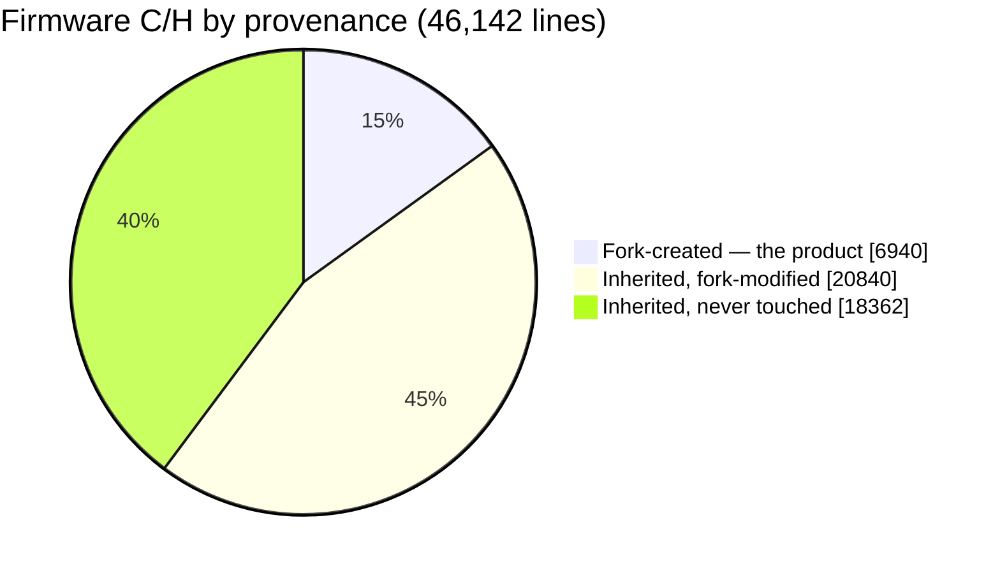
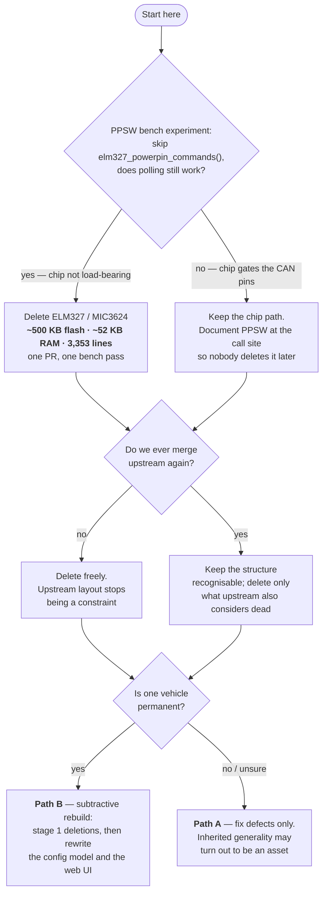

# Keep, trim, or rebuild? — a decision brief

**Dated 2026-07-26. Measured against `chore/28-architecture-map` (v1.17.0 build).**
Read [architecture.md](architecture.md) first for how the system works, and
[audit-2026-07.md](audit-2026-07.md) for the defect ledger. This document answers a
different question: **is the right next move to keep evolving this tree, or to design
v2 from scratch now that we know what the product actually is?**

This is a brief, not a verdict. It ends with a recommendation and — more usefully — a
list of the specific facts that would change that recommendation.

---

## 0. The short version

The instinct behind "maybe rebuild" is correct, but it is aimed at the wrong target.

The pain in this codebase is **not** distributed across 46,000 lines. It is
concentrated in three places, and only one of them is inherited:

| Where it hurts | Lines | Who wrote it | Rebuildable in isolation? |
|---|---|---|---|
| The config model (839-line hand-rolled parser, 51 flat keys) | ~900 | inherited, fork-extended | **Yes** |
| The web UI (one 4,359-line `main.js`, no framework, no build step until recently) | ~4,400 | ~59% fork | **Yes** |
| Carrying dead product surface you never use (ELM327, BLE, SLCAN, MQTT, sleep, IMU, multi-board) | ~18,000 | inherited, untouched | **Yes — by deletion** |

None of those three requires a greenfield firmware. All three are *subsystem-scoped*.
Meanwhile, the things a greenfield would force you to re-earn — board bring-up, OTA and
the unbrick paths, the CAN interlock, the external OBD chip — are the parts that are
currently **working and hard-won**, and the parts with the least test coverage to catch
a regression.

**Recommendation: a subtractive rebuild in place** (path B below). Delete the ~18,000
lines of product surface you do not ship, then rewrite the config model and the web UI
as first-class subsystems inside the existing tree. That gets you most of the
greenfield's clarity, keeps every step bench-testable, and never puts you in a state
where the device does not boot.

**One experiment gates a third of that deletion.** The ELM327 / MIC3624 path is the
largest single removal candidate (~500 KB flash, ~52 KB internal RAM, 3,353 lines) and
the datalogger provably does not poll through it — but its boot path sets an
undocumented vendor register (`PPSW`) that may be what connects the CAN pins at all. See
§3. Resolve that on the bench before planning anything else.

The honest counter-argument is in §6. Read it before agreeing with me.

---

## 1. What we actually own — measured, not estimated

Provenance, computed against `upstream/wican-pro` (divergence point `77e1a19`,
2026-04-12; upstream has 4 commits since that we have not taken):

```
180 fork commits    138 Charles Dufresne · 29 NyxOne · 13 Claude
```

Firmware C/H under `main/` + `components/` — **46,142 lines across 133 files**:

| Bucket | Lines | % | Files |
|---|---:|---:|---:|
| **Fork-created** (does not exist upstream) | 6,940 | 15.0% | 22 |
| **Inherited, fork-modified** | 20,840 | 45.2% | 27 |
| **Inherited, never touched** | 18,362 | 39.8% | 84 |



Plus the web UI: `main/web/src/main.js` is 4,359 lines, of which the fork rewrote most
(+2,556 / −3,687 against upstream), and `homepage_full.html` 1,847 lines (+1,335 / −1,719).

### The 6,940 lines that *are* the product

Everything in this list was written for this fork and exists nowhere upstream. It is
also, not coincidentally, the code the Datalogger cannot run without:

```
1,476  components/csv_logger/csv_logger.c    wide-CSV trip logger, fixed-rate grid
1,423  components/fast_log/poll_log.c        POLL_LOG: free-running polling + broadcast capture
  575  components/sd_filemgr/sd_filemgr.c    SD file manager HTTP surface
  573  main/ncflash_fastwrite.c              NC Flash write codec
  538  components/event_log/event_log.c      on-device event log
  419  main/ncflash_fastread.c               NC Flash read codec
  298  main/slcan_port.c                     SLCAN port
  271  main/led_indicator.c                  LED state machine
  263  components/fast_log/fast_log.c        ring buffer behind poll_log
  151  main/datalog_lease_task.c             coexistence lease / dead-man's switch
  145  components/crash_report/crash_report.c panic backtrace over Wi-Fi
  ...  + headers
```

### The "modified" bucket is not homogeneous

"Inherited, fork-modified" spans everything from a two-line tweak to a near-rewrite.
Fork share of current content, by churn:

| File | Now | Fork churn vs upstream | Fork share |
|---|---:|---|---:|
| `main/web/src/main.js` | 4,359 | +2,556 / −3,687 | ~59% |
| `components/autopid/autopid.c` | 3,204 | +1,400 / −2,817 | ~44% |
| `main/can.c` | 700 | +291 / −2 | ~42% |
| `main/config_server.c` | 3,718 | +767 / −1,320 | ~21% |
| `main/main.c` | 1,190 | +238 / −225 | ~20% |

So the practical picture is: **~12,000 lines of firmware are effectively ours**
(fork-created plus the fork-written share of the heavily-modified files), sitting inside
a ~34,000-line general-purpose OBD-dongle firmware we inherited and mostly do not use.

### Where the defects actually live — and why that is a weaker argument than it looks

Attributing every defect in [audit-2026-07.md](audit-2026-07.md) by `git blame` on the
offending line:

| Defect | File | Line authored by |
|---|---|---|
| 2.1 parser NULL panic (#68) | `config_server.c` | upstream |
| 2.2 failed OTA leaves CAN off (#69) | `config_server.c:1698, :1743` | upstream (`92b769e6`, `1878aec3`) |
| 2.4 `ecu_status` always offline | `autopid.c` | upstream |
| 2.5 credentials logged at INFO | `config_server.c` | upstream |
| 2.6 `app_main` returns on alloc failure | `main.c` | upstream |
| 2.7 rollback theatre | `main.c` | upstream |
| §1 SD reformats on FAT corruption (#71) | `sdcard.c:198` | upstream (`b0b4038d`) |
| **2.3 dead-man's switch inoperative (#70)** | `datalog_lease_task.c` | **fork** |
| **#67 sweep predictor assumes uniform PID cost** | `main.js` | **fork** |

Eight of ten in inherited code. That looks like a clean argument for "the inherited code
is the problem" — **and I do not think you should lean on it**, for two reasons.

First, **the audit was not uniformly distributed.** It concentrated on the code that
actually runs. The 18,362 untouched inherited lines score well on defect count mostly
because nobody looked at them, and nobody looked because they never execute. That is a
selection artifact, not a quality signal.

Second, **the two fork-authored defects are the more serious kind.** The upstream ones
are mostly sloppiness — a missing NULL check, a log line with a password in it, an early
return. Each is a local fix. The fork's two are *design* errors: a dead-man's switch
whose triggering condition can never occur on a running engine, and a scheduler
predictor built on an assumption (uniform per-PID cost) that mode 22/23 violates by ~7x.
Those are the failures a rewrite does **not** protect you from, because you would carry
the same reasoning into v2. Writing the code again does not make you think differently
about it.

---

## 2. What the hardware budget says

This matters because "we're running out of room" is the classic reason to rebuild, and
here it is simply **not true**.

From `idf.py size` on the v1.17.0 build:

| Resource | Used | Total | Headroom |
|---|---:|---:|---|
| App image | 2,743,616 B | 5,169,152 B (partition) | **47% free** |
| DIRAM (static) | 227,779 B | 341,760 B | 113,981 B free (66.7% used) |
| Flash code | 1,359,402 B | — | — |
| Flash data | 1,252,548 B | — | — |

Where the flash actually goes:

| Item | Flash | Note |
|---|---:|---|
| `obd_fw/V2.3.22.txt` (MIC3624 chip firmware, embedded) | 494,260 | **18% of the whole image** |
| Web UI (`main.js` 210,571 + `homepage.html` 44,450 + `lucide_icons.js` 14,840) | 269,861 | 10% |
| `libnet80211.a` + `liblwip.a` + `libpp.a` + `libwpa_supplicant.a` | 381,485 | Wi-Fi + TCP/IP, load-bearing |
| `libbt.a` + `libbtdm_app.a` (Bluetooth) | 319,977 | BLE, kept deliberately |
| `libmain.a` flash **code** — *all* of `main/` | 107,247 | see below |
| `libautopid.a` | 51,513 | |
| `libfast_log.a` | 8,442 | but 17,573 B of DIRAM |

**Read that fifth row again.** Every line of C in `main/` — all 31,002 of them —
compiles to 107 KB of flash code. Deleting ELM327, SLCAN, sleep mode, the IMU and the
console would recover a *fraction* of that. **Source deletion is not a flash-budget
argument.** The flash is spent on embedded blobs, and the two biggest blobs are the OBD
chip firmware and the web UI.

The real budget pressure is **internal RAM**: 114 KB of DIRAM free, and the top
consumers are *ours*, not upstream's — `libfast_log.a` alone holds 17,573 B (17,567 of
it `.bss`, the capture ring), `event_log` ~12.9 KB, `ncflash_fastwrite` ~6.2 KB. A
rewrite would not shrink those; they are the product.

**Conclusion: the hardware is not asking for a rewrite.** A rewrite would be for
human reasons — comprehension, maintainability, velocity — not machine ones. That is a
legitimate reason, but it should be named honestly.

---

## 3. What the product actually is

Worth stating plainly, because it is the thing the inherited code disagrees with.

- **One vehicle.** Mazda NC Miata. No vehicle profiles, no car-model dispatch.
- **One protocol on the wire.** POLL_LOG. Not ELM327, not SLCAN, not MQTT.
- **One job.** Log PIDs to CSV on an SD card, fast and without bricking the PCM; plus
  read/write the PCM ROM (NC Flash).
- **One UI.** A web page served off the device.

Against that, the inherited firmware ships: an ELM327 emulator (3,353 lines), a
BLE serial bridge (1,563), an SLCAN bridge (645), a WebSocket/TCP comm server (549),
MQTT, SmartConnect (733), a duplicate serial console (1,166), an IMU driver
(729 + 606 header), sleep-mode voltage management (1,246), and a 3,654-line generic
OBD-II PID table. Most of that has been true dead weight since the product became a
single-vehicle datalogger.

**51 config keys** live in `/littlefs/config.json`. Of those, 20 are live-appliable
(`LIVE_APPLY_WHITELIST`); at least 9 (`batt_alert_*`) are inert because the parser
force-disables the feature; and a large block (`ble_*`, `sta_*`, `ap_*`, `home_*`,
`drive_*`, `periodic_wakeup`, `sleep_*`) describes a multi-protocol dongle rather than a
datalogger.

**25 HTTP endpoints** are registered. Roughly two-thirds serve the datalogger; the rest
are upstream's dongle-configuration surface.

**The UI is in better shape than the ledger suggests.** Of 11 elements marked
`display:none` in `homepage_full.html`, nine are ordinary runtime-conditional UI. Only
**two** are permanently hidden dead surface: `ble_section` and `wakeup_every_row`, with
zero references in `main.js`. Whatever else is wrong with a 4,359-line `main.js`, it is
not carrying a graveyard — which weakens the "the UI has accreted beyond saving" version
of the rewrite argument. Its problem is structure, not dead weight.

### The one that is not dead: the MIC3624 / ELM327 path

I went in expecting to find this deletable. It is the single largest deletion candidate
in the tree — and it is the one place where "unused by the product" and "safe to remove"
come apart. Worth its own subsection, because it dominates the cleanup arithmetic.

**The datalogger does not use it.** `poll_log` polls over the ESP32's own TWAI
controller — `can_send()` / `can_receive()` throughout `poll_log.c` — and so do the NC
Flash codecs. TWAI has its own transceiver on its own pins (`TX_GPIO_NUM`,
`RX_GPIO_NUM`, `CAN_STDBY_GPIO_NUM`, `hw_config.h:57-63`). The external chip serves the
ELM327 emulation for third-party apps, which this product does not ship.

**But it initialises unconditionally on every boot** — `elm327_init()` is called from
`app_main` on `HARDWARE_VER == WICAN_PRO` (`main.c:898`), outside any protocol check —
and the measured cost is not small:

| Cost | Amount | Where |
|---|---:|---|
| UART1 RX + TX ring buffers (`UART_BUF_SIZE` = 18 KB each) | ~36 KB internal RAM | `obd.h:21`, `elm327.c:3270` |
| Two task stacks, explicitly `MALLOC_CAP_INTERNAL` | 16 KB internal RAM | `elm327.c:3310-3313` |
| Embedded chip firmware `V2.3.22.txt` | 494,260 B flash | `main/CMakeLists.txt:100` |
| Boot latency: hard reset, firmware version check, readiness poll | up to ~2 s | `elm327.c:3280-3301` |
| Source | 3,353 lines | `main/elm327.c` |

**~52 KB of internal RAM** — against 114 KB of DIRAM headroom — plus 18% of the flash
image, for a subsystem the product never polls through.

**And yet I cannot tell you it is safe to delete.** `elm327_init()` calls
`elm327_powerpin_commands()`, which sets the chip's **PPSW** ("programmable power
switch") to `10` (`elm327.c:1392-1432`). `PPSW` is a MIC3624 vendor command and it is
**undocumented anywhere in this tree** — seven occurrences, all in that one function, no
comment explaining what it switches. On multi-protocol dongles a programmable pin switch
typically routes OBD-II connector pins to a transceiver. If PPSW=10 is what connects
CAN-H/CAN-L to the TWAI transceiver, then removing this "dead" subsystem silently kills
the datalogger.

This cannot be settled by reading code. **It is a bench experiment** — and it is worth
more to this decision than any further analysis, because it decides ~500 KB of flash,
~52 KB of internal RAM and 3,353 lines of source, and it is a precondition for *both*
path B and path C.

**The protocol** (about an hour, one OTA, fully reversible):

1. Keep the current known-good `.bin` on hand — that is the rollback.
2. Baseline the device first: `GET /poll_status`, record `ok` / `timeout` / `txfail` /
   `pids_unpollable` and `sweep_hz`.
3. Comment out the single line `elm327_powerpin_commands();` at `elm327.c:3287`.
   Change nothing else — leave `elm327_init()` and the chip firmware update in place,
   so the experiment isolates `PPSW` and nothing else.
4. `idf.py build`, then OTA:
   `curl -F "file=@build/wican-fw_obd_pro_<ver>.bin" http://<device>/upload/ota.bin`
   (multipart is mandatory — a raw body fails).
5. After the reboot, `GET /poll_status` again.
   - **`ok` still climbing, `txfail` 0** → `PPSW` is irrelevant to the TWAI path.
     ELM327/MIC3624 becomes deletable in one PR, and it should go first.
   - **`ok` frozen or `txfail` climbing** → `PPSW` gates the CAN pins. Keep the chip
     path, and **add a comment at `elm327.c:3287` saying so**, because the next person
     to read that code will draw exactly the conclusion I did.
6. Either way, restore the previous `.bin` before drawing further conclusions.

Do it with the engine off and, ideally, not on the car — a device that cannot reach the
bus is a non-event on the bench and an annoyance in a driveway.

It is also the perfect illustration of why path C is riskier than it looks: a greenfield
would have to *rediscover* PPSW from scratch, on a device with no serial console, with
the symptom "CAN doesn't work" and no obvious cause.

---

## 4. The three paths

### Path A — Evolve as-is

Work the defect ledger ([audit-2026-07.md](audit-2026-07.md)), leave the structure alone.

- **Cost:** low. Days, incremental, always shippable.
- **Buys:** the security and correctness fixes. Nothing structural.
- **Leaves:** 18,000 lines of dead surface, the 839-line parser, the 4,359-line `main.js`.
- **Failure mode:** every future feature keeps paying the comprehension tax. This is the
  status quo, and the status quo is why the question is being asked.

### Path B — Subtractive rebuild in place *(recommended)*

Same repo, same git history, same device that boots at every step. Three ordered stages:

1. **Delete the product surface you do not ship.** SLCAN, BLE serial bridge,
   comm_server, SmartConnect, `console.c`, IMU, the generic PID table, MQTT, the
   multi-board preprocessor, vehicle profiles — and ELM327/MIC3624 **if and only if the
   PPSW experiment (§3) clears it**, in which case it is by far the biggest win and
   should go first. Each deletion is independently
   bench-testable; if a deletion breaks the device you revert *that* commit, not the
   project. Target: **~46,000 → ~20,000 lines.**
2. **Rewrite the config model.** Replace the 839-line hand-rolled parser with a
   table-driven schema — one array of `{key, type, default, live_appliable, validator}`
   and a generic apply loop. This kills issue #68 (the panic-on-non-string bug) as a
   *class*, kills the "keep 5 places in lockstep" recipe, and makes the reboot-vs-live
   decision data instead of a macro list.
3. **Rewrite the web UI as a built artifact.** The build pipeline
   (`tools/build_web.py`, `tools/lint_web.py`, `tools/webtest/`) already exists. The
   remaining work is splitting `main.js` into modules with real boundaries.

- **Cost:** medium. Stage 1 is mostly mechanical and high-confidence. Stages 2 and 3 are
  genuine rewrites, but each is one subsystem with a testable contract at its edge.
- **Buys:** ~55% less code, the two worst subsystems replaced, no bring-up risk.
- **Failure mode:** stage 1 stalls halfway and you end up with a tree that is neither
  the old thing nor the new thing. Mitigate by making each deletion its own PR with its
  own bench pass.

### Path C — Greenfield v2

New ESP-IDF project, port the fork-created components, design the rest fresh.

- **Cost:** high, and the expensive part is not the part you would enjoy.
- **Buys:** total design freedom. A clean task topology, a config model designed for the
  product, a UI designed rather than accreted, and no inherited macro soup.
- **Re-earns from zero** (this is the real bill):

  | Must re-earn | Currently | Risk |
  |---|---|---|
  | Board + platform glue: LED/AW2023, SD/FATFS, LittleFS, RTC, time sync, USB-PD, dev_status — **~3,900 lines measured** (§7) | works, undocumented | **high** — no tests, no console (USB is host-mode) |
  | OTA + partition layout + the SD-card `/wican.bin` unbrick path + safe mode | works | **high** — a bad OTA path on a console-less device is a brick |
  | MIC3624 external OBD chip bring-up + its 494 KB firmware updater | works | **high** — vendor chip, little documentation |
  | Wi-Fi manager: AP+STA, home/drive switching, reconnect | works | medium |
  | TWAI driver config + the CAN interlock (`FLASH_ACTIVE_BIT`, producer-parks contract) | works, now documented | medium — the *knowledge* survives, the implementation does not |
  | SD/FATFS + LittleFS mount, corruption behaviour | works, has known bug #71 | medium |

- **Ports cleanly:** the 6,940 fork-created lines, essentially as-is. That is the good news.
- **Failure mode:** the classic one. Six weeks in, v2 logs PIDs but cannot OTA reliably,
  the LED means nothing, and the bench device is bricked once. Meanwhile v1 is still the
  only thing that drives the car.

---

## 5. Why B and not C

Three arguments, in decreasing order of how much I believe them.

**1. The risk is inverted from where it feels.** It feels like the 46,000 lines are the
risk and a clean 12,000-line v2 is the safe end state. But the 46,000 lines *currently
boot, flash a PCM without bricking it, and survive a power cut*. The riskiest code in a
v2 is the code you would write in week one — bring-up, OTA, partition layout — which is
exactly the code you have never had to write, because you inherited it working.

**2. You cannot test your way out of a big bang here.** The device has no serial console
(USB-C is host-mode at runtime), so every verification is an OTA away. Path B keeps that
loop at "one deletion, one OTA, one `/poll_status` check". Path C makes it "several
thousand lines of new bring-up, then find out."

**3. The flash budget removes the strongest pro-rewrite argument.** 47% free. There is
no forcing function. A rewrite would be chosen, not compelled — which means it must
justify itself purely on maintainability, and deletion buys most of that maintainability
at a fraction of the risk.

## 6. The strongest case *against* my recommendation

I should argue the other side properly, because it is not weak.

- **Deletion is not design.** Path B ends with a smaller version of a structure that was
  never designed for this product. `main.c` still creates 40-odd tasks by hand; the
  config is still a JSON blob in LittleFS; `config_server.c` is still one file doing
  HTTP routing, config parsing, OTA, and business logic. You would have removed the
  noise without ever getting the architecture you would have chosen.
- **Sunk-cost dressed as risk-management.** "It works today" is exactly what every team
  says right before spending three more years in a codebase they hate. And the bring-up
  bill can be paid by *porting verbatim first, cleaning later* — the 3,900 lines in §7
  are lines to **move**, not lines to **invent**. (I counted them expecting to defend
  path C's cheapness and ended up documenting the opposite; the count is the honest
  version, but the porting mitigation is real and I do not want to overstate the risk.)
- **The 18,000 dead lines may already be nearly free.** They cost ~0 flash pressure and
  the compiler already discards most of them. If the real cost is comprehension, a
  greenfield removes that cost *permanently and by construction*, whereas deletion is a
  one-time cleanup that the next inherited merge can partially undo.
- **You have already proven you can build the hard parts.** `poll_log`, `csv_logger`,
  the NC Flash codecs and the coexistence lease are the genuinely difficult pieces, and
  they were written here, from scratch, and they work. That is direct evidence that the
  greenfield estimate should be revised *down*.
- **Path C composes with B.** Nothing stops you doing stage 1 of B and then deciding.
  Deletion makes the v2 port easier either way, because it tells you exactly which
  ~20,000 lines a v2 would have to account for.

## 7. What would change my answer

Concrete, checkable facts — not vibes:

1. ~~**If board bring-up turns out to be small.**~~ **Answered — and the answer does not
   favour path C.** Counted:

   | Group | Lines | v2 needs it? |
   |---|---:|---|
   | LED (`led.c` 355 + `led_indicator.c` 271, AW2023 over I2C) | 626 | yes |
   | SD / FATFS mount (`sdcard.c`) | 460 | yes |
   | OTA multipart parser (`multipart_upload.c`) **[guardrail]** | 770 | yes |
   | Safe-mode recovery AP (`safemode.c`) **[guardrail]** | 350 | yes |
   | LittleFS mount (`filesystem.c`) | 251 | yes |
   | RTC (`rtcm.c`) + time sync (`sync_sys_time.c`) | 584 | yes |
   | `dev_status.c`, `wc_uart.c`, `wc_timer.c`, `hw_config`, `vehicle.c`, `config_mode.c` | 775 | yes |
   | USB-PD (`wusb3801.c`) | 88 | yes |
   | **Subtotal — unavoidable** | **3,904** | |
   | IMU (`icm42670.c` 728 + `imu.c` 373) | 1,101 | optional |
   | Sleep / ADC voltage thresholds (`sleep_mode.c`) | 1,245 | optional (issue #4) |
   | **Total** | **6,250** | |

   So a v2 must account for **~3,900 lines minimum** of board and platform glue before
   it logs a single PID — roughly 2.6x the 1,500-line threshold I set. The mitigation is
   real (most of it *ports* rather than gets rewritten), but "port 3,900 lines of
   undocumented driver and recovery code onto a console-less device" is the honest
   description of path C's first milestone, and two of those files are marked
   **guardrail** precisely because breaking them costs you the device.
2. **If the MIC3624 chip's `PPSW` setting is not load-bearing for the TWAI path.**
   Answered halfway in §3: the datalogger provably does *not* poll through the chip, but
   `elm327_init()` still runs every boot and sets an undocumented vendor power-switch
   register. Resolve it with **one bench experiment** (skip `elm327_powerpin_commands()`,
   flash, confirm `/poll_status` still counts). If PPSW turns out to be irrelevant to
   CAN, ~500 KB of flash, ~52 KB of internal RAM and 3,353 lines become deletable in a
   single PR, and path B's stage 1 pays for itself immediately.
3. **If upstream is now genuinely abandoned for our purposes.** We are 4 commits behind
   `upstream/wican-pro` and have taken nothing since 2026-04-12. If the intent is never
   to merge upstream again, the "deletion can be undone by a merge" objection to B
   disappears, and so does most of the reason to preserve upstream's structure at all.
4. **If a second vehicle or a second product ever appears.** Then the inherited
   generality stops being dead weight and a rewrite that assumes one car is the wrong
   bet in the other direction.
5. **If DIRAM headroom drops below ~60 KB.** Then memory *does* become a forcing
   function and the calculus changes.

**Item 1 is now answered and it moved the needle toward B.** Item 2 is the one that
still matters and it is an experiment, not an analysis. Items 3–5 are yours to decide.
**Do not commit either way until item 2 is run.**

## 8. The decision the owner has to make



Not "rewrite or not". These, in order:

1. **Run the PPSW bench experiment.** Not a judgement call — an experiment, and the
   cheapest high-value thing on this list. It gates ~500 KB of image, ~52 KB of internal
   RAM, and a third of the "dead weight" list. Everything else waits on it.
2. **Do we ever merge upstream again?** Yes ⇒ keep the structure recognisable. No ⇒
   delete freely and stop treating upstream's layout as a constraint.
3. **Is one vehicle a permanent product decision or a current simplification?**
4. **Then**, and only then: stage 1 of path B as a series of bench-tested PRs, with the
   config model and web UI rewrites scheduled as their own projects — inside this repo,
   or as the seed of a v2, depending on how 1–3 land.

---

*Companion documents: [architecture.md](architecture.md) (how it works),
[audit-2026-07.md](audit-2026-07.md) (what is broken). This brief supersedes nothing;
it is the input to a decision, and it should be re-dated when that decision is made.*
