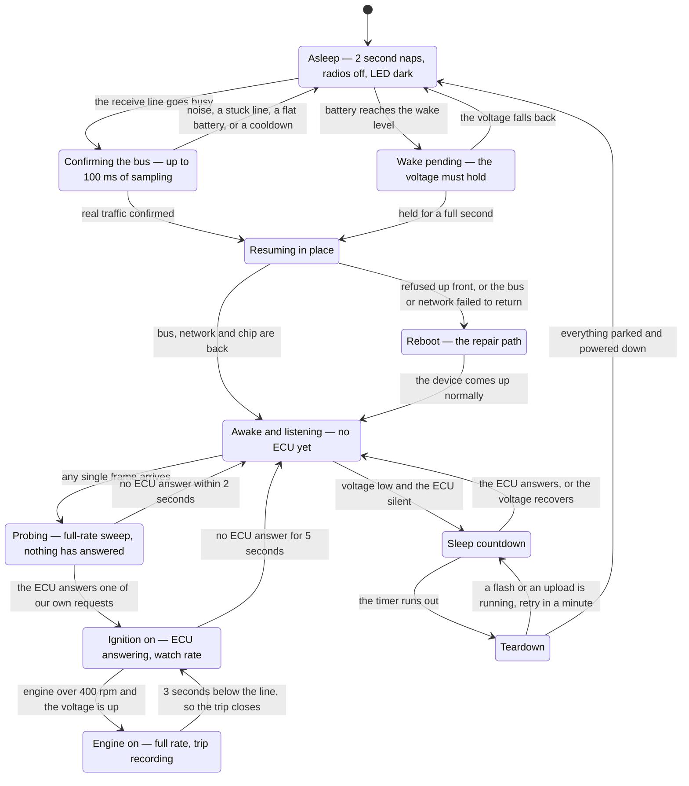
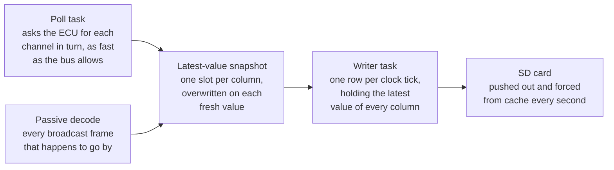

# The sleep / wake cycle

What actually happens between a parked car and a recorded trip, and back again — written in
plain words, with no code names in it. It is the companion to the symbol-level docs:
[poll_log.md](poll_log.md) for the polling protocol, [csv_logger.md](csv_logger.md) for the
trip files, [architecture.md](architecture.md) for the whole-system map. When you need to know
*which* function does a step, go there; the last section here says which files to open.

Everything below describes one continuous loop. The device never really "boots" for a drive
any more — a wake resumes in place, and a reboot is now the repair path rather than the normal
one.

## The whole cycle at a glance

## Thresholds and timers at a glance

Voltages. Two of these are separate stored settings that are easy to confuse: the **sleep
level** decides when the device may go to sleep, the **engine-running level** decides when a
trip is worth recording.

| What | Value | What it decides |
|---|---|---|
| Sleep level | stored setting, falls back to 13.1 V | Below it, the sleep countdown may arm |
| Wake level | sleep level + 0.1 V | Above it for 1 second, wake up |
| Engine-running level | stored setting, falls back to 13.0 V | The recording gate, and the trip logger's own idea of "ignition on" |
| Hysteresis band | 0.3 V | Only the *off* edge uses it, so a voltage sitting on the line cannot flap the gate |
| Critical | 11.9 V | Never wake into a crank dip or a flat battery |
| Boot-loop guard | 12.1 V | With three unexpected resets on record, force sleep instead of looping |

Times.

| What | Value |
|---|---|
| Battery reading | 8 samples averaged, every 500 ms awake, every 2 s asleep |
| Wake-pending dwell | 1 s above the wake level |
| Voltage-recovery dwell during a countdown | 2 s, i.e. 4 consecutive readings |
| Sleep countdown | stored setting in minutes, falls back to 2 minutes |
| Bus-wake confirmation | up to 100 ms; needs 20 or more line changes and 2 or more returns to idle |
| Stuck line | 3 strikes to stop arming, 2 clean readings to recover |
| Fruitless wakes before throttling | 3, then bus wakes are ignored for an hour |
| ECU silence before quiescing | 5 s |
| Probe window after a resume | 2 s |
| Minimum dwell between bus mode flips | 2 s |
| Self-heal out of listen-only | 10 min |
| Watch sweep | one pass per second |
| Fast sweep ceiling | 100 passes per second |
| Engine on | first sweep over 400 rpm |
| Engine off | 3 s held under 400 rpm, or the ECU silent for 5 s |
| Engine speed goes stale | 2 s without a fresh reading |
| Trip logger's ignition-off debounce | 3 s |
| Trip file pushed to the card | every 1 s |
| Trip file rotation | 1 GB, roughly 150 hours |

## A. Parked — the two-second sleep loop

The device is in light sleep: radios off, LED dark, CAN transceiver in standby. This block
repeats every two seconds, all night.

1. **Wake from the nap.** Two things can end it: the 2-second timer, or the CAN receive line
   going busy. Either way, switch the wake-on-bus trigger off immediately — a line that stays
   busy would otherwise re-trigger us forever.
2. **Read the battery.** Eight quick readings, averaged, corrected with the chip's own
   calibration. This is the only number the sleep decisions use.
3. **Check it against the wake level.** Still low: carry on. At or above it: start a 1-second
   confidence timer. If the voltage falls back before the timer ends, forget it; if it holds,
   the alternator really is running, so go to block C.
4. **Was it the bus that woke us?**
   - Plain timer wake, line idle: arm the wake-on-bus trigger again and sleep another two
     seconds.
   - The line is *already* busy when we try to arm: do not arm, because a trigger on an
     already-asserted level fires the instant we sleep, forever. Decide right now instead.
   - The line going busy is what woke us: run the confirmation below.
5. **Confirm the bus is really alive.** Sample the line hard for up to 100 milliseconds and
   count how often it changes state, and how often it returns to idle.
   - 20 or more changes *and* 2 or more returns to idle: real traffic.
   - Changes but never returns to idle: the line is held down. Three such readings in a row
     and we stop arming the bus wake entirely — it would only fire forever. Two clean readings
     later, arming resumes by itself.
   - Almost nothing: noise. Back to sleep.
6. **Two objections can still veto a confirmed wake.**
   - Battery at or below 11.9 V: this is a crank dip or a flat battery, so do not wake. Try
     again in two seconds against a fresh reading.
   - We are inside the fruitless-wake cooldown: three wakes in a row where the bus chirped but
     the engine never started means bus wakes are ignored for an hour.
7. **Otherwise, open a wake window** — it gets scored at the next sleep entry — and go to
   block C.

**Also on every sleeping pass: the interpreter-chip babysitter.** The OBD chip's ready pin
lags by about four seconds after being told to sleep, so the first two passes are grace passes
and no conclusion is drawn. Still awake after that, reset it and tell it to sleep again — at
most twice per sleep session, and it **never** escalates to a reboot. A reboot cannot fix any
of the plausible causes, so it would just repeat all night, which is exactly the battery drain
sleeping exists to prevent. If the shared serial lock is held by another task, that spends a
separate budget of two tries and the log names the task holding it, rather than blaming a chip
that was never actually asked.

## B. Key on — the bus wakes first

The driver turns the key. The car's own modules power up and start talking on the powertrain
bus, and this happens *before* the starter turns and before the alternator raises the voltage.
So the receive line starts toggling, which is the trigger caught in step A.4.

That ordering is the whole reason wake-on-bus exists: it is earlier and unambiguous, where
voltage alone has to wait for the alternator.

## C. Waking up — resume in place

The whole sequence takes a few hundred milliseconds. No reboot.

0. **Refusals are checked first, before anything is touched.** If any of these holds, do
   nothing here and reboot instead — reboot is the repair channel, not the slow path:
   - some subsystem is flagged "skipped, waiting for a fresh boot to retry" (the data logger,
     the fast logger, the trip logger, the event log)
   - the device is in the roaming/home-wifi mode, which has no safe restart in place
   - Bluetooth was actually running when we went to sleep

   Doing the checks up front means a refusal costs nothing and leaves no half-restored state
   behind.
1. **Release the pin hold** that pins the OBD interpreter chip asleep. Nothing can talk to that
   chip until this is undone.
2. **Hand the LED back to its own task.** It does not light yet — the LED stays dark until the
   final step of this block.
3. **Bus first.** Re-install the CAN controller and take the transceiver out of standby. This
   is the whole point of resuming rather than rebooting: the data logger drives the bus
   directly and needs nothing else, so logging restarts in milliseconds. If the bus does not
   come back, give up and reboot.
4. **Drop the sleep fence**, releasing every parked task, and tell the trip logger it may open
   a new file again. Bus first, fence second, never the reverse — otherwise a released task
   could transmit into a disabled controller.
5. **Network back up.** Re-create the access point and re-join the home network. This is
   deliberately ahead of the OBD chip: the owner's way of asking "is it alive?" is to reach the
   device over wifi, so that must not queue behind a chip nobody is waiting on. If wifi fails
   to come up — after long uptimes, memory fragmentation is the realistic cause — give up and
   reboot. A device that logs happily but cannot be reached is the worst outcome available.
6. **Wake the OBD interpreter chip** with a hard reset, waiting at most one second for the
   shared serial lock. If the chip does not answer, log it and carry on: the data logger does
   not use it, so this is never fatal. An unbounded wait here used to cost 20 seconds of dark
   LED and dead network on every single wake.
7. **Publish "awake" — and this stays last, always.** It is the gate that lets the serial task
   talk to the chip again, lets the LED task paint (**solid blue**), and lets everything else
   consider itself running. Setting it any earlier re-opens a window where the first command
   after every wake is silently dropped. Finally, record how close this task came to running
   out of stack and how the memory looks — both are otherwise silent failures.

## D. Ignition confirmed — the logger finds the ECU

The bus was left in listen-only mode when the car went to sleep, so the device can hear but
cannot speak.

1. **A single received frame of any kind means the car is awake.** Switch the bus back to
   normal, send-capable mode and start probing. Nothing is announced yet — a stray wind-down
   frame must never be logged as a start.
2. **Sweep the whole configured channel list at full rate**, asking the ECU for each value. No
   slowdown and no per-channel divisors: this probe has to be as fast as possible. If nothing
   answers within two seconds, go straight back to listen-only. That is what stops the device
   shouting at a dead bus forever after a false wake.
3. **The ECU replies to one of our own requests** → log **ignition on**. This is the only hard
   proof the key is on. Note carefully what it does *not* mean: a car sitting at key-on with
   the engine not turning answers every request too.
4. Two things follow immediately:
   - **The sleep veto goes up.** From now on the countdown cannot start, and any countdown
     already running is cancelled, regardless of what the battery reads. This exists because a
     car whose alternator sits below the configured sleep level would otherwise fall asleep in
     the middle of a drive — which really happened.
   - **The wake is scored as useful**, clearing the fruitless-wake counter, so the one-hour
     throttle can never build up on a car that starts normally.
5. **The recording gate is still shut**, so run in *watch* mode: the same full sweep, held to
   one pass per second instead of up to a hundred. Every channel stays warm and the engine
   speed stays fresh, but the ECU is not hammered for samples nobody is keeping.

## E. Engine starts

The starter cranks, the engine catches, the alternator comes up. Two signals rise together:
engine speed climbs past **400 rpm** (above cranking noise, below any real idle), and the
battery voltage passes the engine-running level.

1. **Log engine on**, with the rpm and the voltage. This is announced on the *first* sweep that
   sees it, with no confirmation delay, on purpose: the line has to land in the log before the
   file-opened line it causes.
2. **The recording gate opens.** Both signals must agree — voltage high enough *and* engine
   turning — and either one dropping closes it again. The sweep switches from once-a-second
   watch to full rate, capped at 100 sweeps per second.
3. **The trip logger, meanwhile, is making its own decision on its own evidence:** ignition
   judged from battery voltage alone with a 3-second delay before it will believe an *off*,
   plus — if "require engine running" is switched on — the recording gate above. A manual Start
   or Stop from the web page overrides both.
4. **The first value arrives and a file is opened:** snapshot the row-rate setting for this
   whole file, build the column list from the configured channels, create the file, write the
   header row, mark the session live.
5. **Log datalog open**, with the filename and column count. The LED changes from solid blue to
   **blinking blue** — blinked by the LED chip itself, with no internal bus traffic at all,
   because software blinking used to starve the SD write path badly enough to reset the device.

## F. Driving — the logger is recording

Values that did not update inside a tick simply repeat on the row, so every row is complete and
the grid stays at a fixed rate whatever the bus is doing. Rows are written *only* by the clock
tick — arriving values just refresh the snapshot.

Housekeeping while this runs:

- **Every second**, push the file to the card and force it out of the cache, so a power cut
  loses at most about a second of data.
- **At 1 GB**, close the file and open the next one with an identical header, with no gap in
  the data.
- **If the SD card is pulled**, close the session, record why, and retry opening later.

Two things interrupt recording without ending the trip:

- **An ECU flash or a firmware upload starts** — every bus producer parks itself so no stray
  request is injected into the middle of a write. The LED flashes **red**.
- **A host tool claims the bus** — the same parking, but on a lease with a deadline, so a tool
  that dies cannot keep the logger parked forever.

And through all of it the sleep task keeps sampling the battery twice a second. Because the ECU
is answering, the countdown stays vetoed and the reported state stays honestly "normal" for the
whole drive.

## G. Engine off

The key goes off, or the engine stops. Engine speed drops under 400 rpm and *stays* there for
three seconds, and the voltage falls below the engine-running level minus the hysteresis band.

1. **Log engine off**, with how long it ran and the evidence ("0 rpm", or "the ECU stopped
   answering"). All the patience lives on this edge rather than the start edge. Only a real
   reading counts: engine speed simply going *missing* is never treated as zero, so a starved
   channel can never invent an engine stop mid-drive.
2. **The recording gate closes** after its 3-second debounce, and the sweep drops back to watch
   rate.
3. **The trip logger sees its own gate close and ends the trip:** push the last rows out, close
   the file, free the column table, and record *why*. The reasons are kept distinct on purpose:
   - *ignition off* — the voltage says the key is off
   - *engine off* — the key may still be on, but the engine is not turning
   - *manual stop* — someone pressed Stop on the web page
   - *sd removed* — the card was pulled
4. **Log datalog close**, with the filename, the reason and the file size. The LED goes back to
   solid blue.
5. A manual Stop, if one was pressed, quietly clears itself here — so one press stops the
   current trip only, and the next key-on records normally again. One press used to silently
   disable every later key-on until someone rebooted, and a customer lost most of a drive to
   exactly that.

## H. Ignition off — stop talking to the car

The poller keeps sweeping at watch rate and keeps getting nothing back. After **five seconds**
with no answer:

1. Take the bus down, switch to **listen-only**, bring it back up. From here the device can
   only listen, so it stops holding the vehicle's own bus awake.
2. Clear the "ECU answering" flag, which **drops the sleep veto**.
3. Clear the recording gate.
4. Drop the engine-running latch if it is somehow still up — an engine cannot run with its ECU
   off the bus. This is the stop path that normally fires, because at key-off the engine speed
   readings dry up before the 3-second debounce in block G can finish.
5. **Log ignition off**, saying plainly that no ECU reply arrived for five seconds and we have
   stopped sending requests.

While quiet, drain anything that arrives every 20 milliseconds. A single frame means the car
woke again, so go back to block D. After ten minutes of total silence, flip back to normal once
anyway as a self-heal, so a stuck detector can never permanently strand the logger.

## I. The sleep countdown

The battery, sampled twice a second, drops below the sleep level.

1. **Is the ECU still answering?** If yes, do nothing at all — no countdown starts. Say so once
   in the log, not once per sample. If no, arm the countdown for the configured number of
   minutes.
2. **The countdown is announced only once it has survived five seconds.** Every boot arms and
   cancels a throwaway countdown within about two seconds (the ECU has not answered yet, and the
   battery sits under the sleep level whenever the engine is not turning), and announcing those
   was burying the real ones.
3. **Three ways it ends:**
   - **The ECU starts answering** — cancel, and log that the ignition is on. Re-entering later
     re-arms the *full* time, counted from ECU silence rather than from the voltage dipping.
     This line is the only proof in the log that the veto stopped a sleep mid-drive.
   - **The voltage recovers** above the wake level and *holds* for two full seconds, i.e. four
     consecutive readings. One spike is deliberately not enough: a car resting exactly on the
     threshold would otherwise reset the countdown forever and never sleep at all.
   - **It runs out** — go to block J.

## J. Going to sleep — the teardown

The order matters and every step earns its place.

0. **The interlock, before anything else.** Is an ECU flash on the bus, or a firmware upload in
   flight? If so, **do not sleep**: ask again in 60 seconds and say so once in the log. Cutting
   the bus mid-flash leaves the engine computer in its bootloader, which means the car will not
   start and a recovery flash is needed; cutting an upload crashes the device instead of failing
   cleanly. If it is *still* refusing after 30 minutes, assume the flag is stuck and sleep
   anyway — a transfer frozen for half an hour is already dead, but the battery is not.
1. **Raise the sleep fence and wait 300 milliseconds**, giving any task already halfway through
   a bus operation time to reach its own check and park. Without the wait, such a task could
   re-enable the transceiver *after* we disable it, leaving the car's bus awake all night.
2. **Put the transceiver in standby** and mark the device as no longer awake.
3. **Wait up to 20 seconds** for the polling side to report itself idle.
4. **Note whether Bluetooth was actually running**, so the resume restores exactly what was
   taken down and nothing more.
5. **Score the wake window**, if one is open. Sleep entry is the single point every wake passes
   through exactly once, whichever way it came back, so this is where a wake is judged: the
   engine ran or the ECU answered means useful and the streak clears; neither ever happened
   means fruitless, and three in a row throttle bus wakes off for an hour.
6. **Ask the trip logger to close any open file** and wait up to 400 milliseconds for it.
   Normally the trip closed long ago; this covers a manual Start left running, which would
   otherwise keep one file open across the whole sleep and come back with its timers jumped by
   hours.
7. **Tell the OBD interpreter chip to sleep**, and record the result — including "the serial
   lock was held by another task, so the chip was never actually told", which is a completely
   different story from "the chip refused".
8. **Log entering sleep**, with the voltage. This is the one permanent marker that a sleep
   happened; without it a sleep is invisible in the record and can only be guessed at from the
   device going quiet on the network.
9. **Take the CAN controller down**, and set the now-free receive pin to exactly the state the
   wake sampler needs — no pull-up, no pull-down — while we still know nothing else owns it.
10. **Wifi down. Bluetooth down.**
11. **Publish "sleeping".** This is the gate that stops anything writing to the OBD chip over
    the shared serial port.
12. **LED off.**
13. **Reset the babysitter budgets** for the new session — two chip nudges, two lock-failed
    attempts, two settle grace passes — then arm the 2-second nap timer and go back to block A.

## Side paths

**Periodic wake-up**, if switched on. While asleep and above 11.9 V, a configurable timer
expires and the device takes a full **reboot** rather than a resume, coming up normally.

**Resume fails.** Any failure in block C logs the reason, waits 1.5 seconds so the line actually
reaches the SD card, then reboots. Resume is the optimisation; reboot is the repair, and it must
always stay reachable on a device with no serial console and no network.

**Boot-loop guard.** Three unexpected resets on record *and* the battery under 12.1 V forces the
full teardown immediately — skipping only the flash interlock — and parks the device with a slow
red breathing LED, rather than crash-looping the battery flat.

**A subsystem is waiting for a boot.** Several subsystems guard their own start-up by arming a
flag before the risky work and clearing it once stable; a boot that finds the flag still armed
skips that subsystem once and disarms it, "so the next boot retries". That worked while every
wake was a reboot. Now that a wake resumes in place there *is* no next boot, so a skipped
subsystem would stay skipped for the whole uptime — observed live, a crash disarmed the data
logger and the device ran for hours answering HTTP with the logger silently dead. Hence the
refusal in block C step 0: if anything is waiting on a boot, the wake reboots to repair it.

## Where this lives in the code

| Block | File |
|---|---|
| A, C, I, J — the sleep state machine, battery sampling, teardown and resume | `main/sleep_mode.c` |
| A.5 – A.7 — arming, confirming and scoring a bus wake | `main/can_wake.c` |
| D, E, G, H — probing, the recording gate, the engine and ignition edges, quiesce | `components/fast_log/poll_log.c` |
| E, F, G — trip files, the fixed-rate grid, close reasons | `components/csv_logger/csv_logger.c` |
| The parking fence every bus producer obeys | `main/can.c` |
| The event lines quoted throughout | `components/event_log/event_log.c` |
